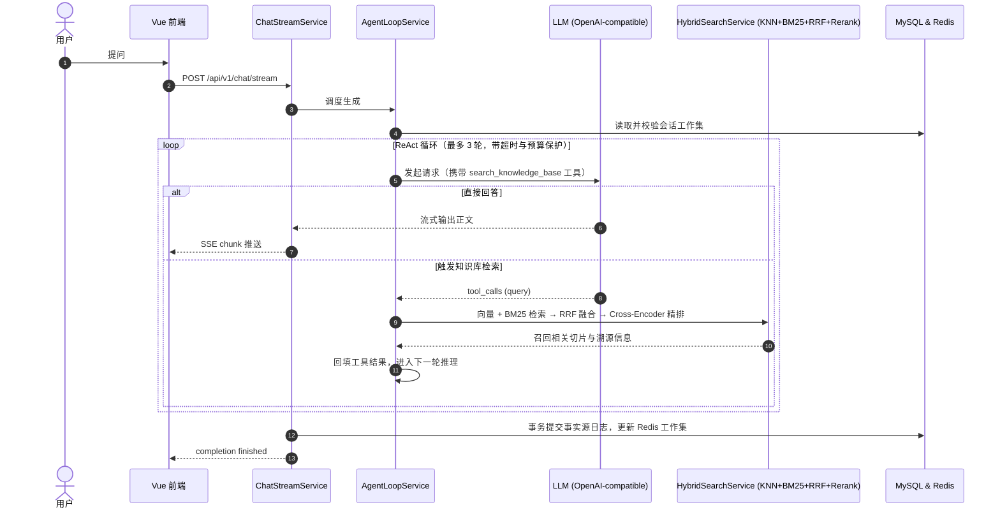

# ShadowRAG

ShadowRAG 是一个面向企业级场景的高性能 **Agentic RAG（检索增强生成）知识库问答系统**。系统基于 ReAct 智能体范式，具备多格式文档深度解析、多路混合检索与精排重塑、长对话记忆工程以及端到端可观测性评测能力。

---

## 核心特性

- **文档智能解析流水线**：支持 PDF、Word、Markdown、TXT 等格式；前端支持切片断点续传与拖拽上传；采用 MinerU（GPU 深度解析，支持复杂排版与表格）与 Apache Tika 自动容灾兜底；基于 Kafka 实现异步削峰与重试。
- **多路混合检索与精排 (Hybrid Search & Reranking)**：Elasticsearch KNN 向量检索 (1024 维 BGE-M3) + BM25 全文检索 (IK 分词) → 原生 RRF 倒数排名融合 → Cross-Encoder 精排模型 (bge-reranker-v2-m3)。
- **自主智能体决策 (Agentic RAG / ReAct)**：LLM 基于 Function Calling 自主规划检索时机、重写查询与多步检索；内建最大轮次控制与超时兜底，通用对话可零检索直接应答。
- **双层长记忆与上下文治理**：MySQL 作为只追加事实源日志，Redis 维护当前压缩工作集；Lua 脚本与版本 CAS 防止并发冲突；基于 Token 软硬双阈值自动触发异步增量摘要与窗口截断。
- **轻量稳定流式传输 (POST SSE)**：基于 Spring MVC `SseEmitter` 构建轻量流式链路；支持前端主动 HTTP 取消、心跳保活及检索推理过程实时展示。
- **端到端可观测性与评测**：原生打通 OpenTelemetry 与 Langfuse，全链路追踪 Token、耗时与 Tool 执行；内建检索召回率（Hit@K / MRR@K）与意图路由离线评测工具。
- **多租户与权限隔离**：基于组织标签（OrganizationTag）进行数据物理与逻辑隔离，支持文档级公开/私有访问控制。

---

## 技术栈

| 模块 | 核心技术选型 |
|------|--------------|
| **后端框架** | Java 17+ / Spring Boot 3.4.2 / Spring Data JPA |
| **存储 & 缓存** | MySQL 8.0 / Redis 7.0 / MinIO |
| **检索 & 向量** | Elasticsearch 8.10 (IK 分词) / Ollama (bge-m3 1024维) |
| **重排 & 解析** | HuggingFace TEI (bge-reranker-v2-m3) / MinerU (GPU) / Apache Tika |
| **消息队列** | Apache Kafka 3.2 |
| **大模型支持** | OpenAI 兼容接口（火山引擎 GLM-5、DeepSeek-V3/R1、本地 Ollama 等） |
| **可观测性** | OpenTelemetry 1.66 / Langfuse |
| **前端工程** | Vue 3.5 / TypeScript 5.8 / Vite 6 / Naive UI / Pinia / UnoCSS |

---

## 核心架构流程

### Agentic RAG 对话时序



---

## 项目结构

```text
ShadowRAG/
├── src/main/java/com/yizhaoqi/smartpai/   # 后端工程核心源码
│   ├── client/                             # 模型与服务适配器 (LLM / Embedding / Reranker / MinerU)
│   ├── config/                             # 基础设施与安全配置 (Security / ES / Kafka / Redis / SSE)
│   ├── consumer/                           # 异步消息驱动 (文档解析流水线 / 死信容灾)
│   ├── controller/                         # HTTP API 与 POST SSE 流式通信端点
│   ├── observability/                      # 链路可观测性 (OpenTelemetry / Langfuse Tracing)
│   ├── service/                            # 业务编排核心 (ReAct 循环 / 混合检索 / 长记忆治理)
│   └── utils/                              # 基础工具库 (Token 估算 / JWT / 密码散列)
├── frontend/                               # 前端工程 (Vue 3 + Vite)
│   ├── src/views/                          # 核心页面视图 (AI 对话工作台 / 知识库管理)
│   ├── src/service/                        # 接口请求封装与 SSE 流式驱动引擎
│   └── src/store/                          # 响应式状态管理 (会话上下文 / 上传状态)
├── docs/                                   # 运维与交付资产
│   ├── docker-compose.yaml                 # 基础设施容器编排 (MySQL / ES / Redis / Kafka 等)
│   ├── init-db.sql                         # 数据库初始化建表脚本
│   └── nginx.conf                          # 生产 Nginx 反向代理与流式传输配置参考
├── scripts/                                # 评测与自动化运维工具
│   ├── langfuse/                           # 自动化评测套件 (检索召回评测 / 意图路由评测)
│   └── benchmarks/                         # 离线性能与 Token 预算分析
└── pom.xml                                 # 后端 Maven 依赖定义
```

---

## 快速开始

### 1. 启动基础设施

```bash
cd docs
docker-compose up -d
```
启动服务：MySQL (`33060`)、Redis (`6379`)、Elasticsearch (`9200`)、Kafka (`9092`)、MinIO (`19000`)、MinerU (`8000`)、Ollama (`11434`)、TEI Reranker (`8082`)。

### 2. 配置本地凭据

复制项目根目录下的配置模板：
```bash
# Windows PowerShell
Copy-Item application-local.yml.example application-local.yml

# Linux / macOS
cp application-local.yml.example application-local.yml
```
在 `application-local.yml` 中填入你的本地凭据（该文件已被 `.gitignore` 排除，不会被提交）：
```yaml
deepseek:
  api:
    # 替换为实际的大模型 API Key（支持火山引擎 Ark / DeepSeek / 智谱等）
    key: "${YOUR_LLM_API_KEY}"

jwt:
  # JWT 签名密钥（Base64 编码，解码后长度不低于 32 字节）
  secret-key: "${YOUR_JWT_SECRET_KEY}"

elasticsearch:
  # 与 docs/docker-compose.yaml 中配置的 ELASTIC_PASSWORD 保持一致
  password: "${YOUR_ELASTIC_PASSWORD}"
```

### 3. 启动后端

```bash
mvn spring-boot:run
```
*(可选) 结合 Langfuse 监控启动：*
```powershell
.\scripts\langfuse\run-with-langfuse.ps1
```
后端服务运行于 `http://localhost:8081`。

### 4. 启动前端

```bash
cd frontend
pnpm install
pnpm dev
```
前端服务运行于 `http://localhost:9527`。

### 5. 登录系统

- **默认账号**：`admin`
- **默认密码**：`123456`（可在 `application.yml` 中修改）

---

## 关键配置说明

配置文件位于 `src/main/resources/application.yml`：

| 配置项 | 环境变量 | 默认值 / 示例 | 说明 |
|--------|----------|---------------|------|
| `deepseek.api.url` | - | `https://ark.cn-beijing.volces.com/api/coding/v3` | OpenAI 兼容模型端点 |
| `deepseek.api.model` | - | `glm-5-3-flash` | 对话与推理主模型 |
| `deepseek.api.key` | `DEEPSEEK_API_KEY` | - | 模型 API Key |
| `embedding.api.url` | - | `http://localhost:11434/v1` | Ollama 向量模型服务地址 |
| `embedding.api.model` | - | `bge-m3` | 1024 维多语言向量模型 |
| `reranker.api.url` | - | `http://localhost:8082` | HuggingFace TEI 精排服务 |
| `mineru.api.url` | - | `http://localhost:8000` | MinerU 深度解析服务 |
| `ai.agent.max-tool-rounds` | `AI_AGENT_MAX_TOOL_ROUNDS` | `3` | 最大 ReAct 检索轮次 |
| `langfuse.enabled` | `LANGFUSE_ENABLED` | `false` | 是否启用 Langfuse 链路追踪 |

---

## 可观测性与评测

- **链路追踪**：启动 Langfuse 后，可在控制台实时观察 Chat 请求、LLM 首字延迟 (TTFT)、Tool 检索耗时及 ES 检索分步性能。
- **检索召回评测**：运行自动化评估脚本测试测试集上的 `Hit@K` 与 `MRR@K`：
  ```powershell
  .\scripts\langfuse\run-retrieval-experiment.ps1 -Username admin -Limit 20
  ```
- **意图路由评测**：测试模型对事实型检索 vs 直接回答的路由准确率：
  ```powershell
  .\scripts\langfuse\run-routing-evaluation.ps1 -Limit 50
  ```

---

## 生产部署建议

若使用 Nginx 作为前端静态托管与反向代理，需注意为 SSE 流式端点**关闭响应缓冲**：

```nginx
location = /api/v1/chat/stream {
    proxy_pass http://127.0.0.1:8081;
    proxy_http_version 1.1;
    proxy_set_header Connection "";
    proxy_buffering off;
    proxy_cache off;
    gzip off;
    proxy_read_timeout 90s;
}
```
完整 Nginx 示例参见 [docs/nginx.conf](docs/nginx.conf)。自动化测试规范参见 [docs/ci.md](docs/ci.md)。

---

## 开源协议

本项目仅供学习与技术交流使用。
