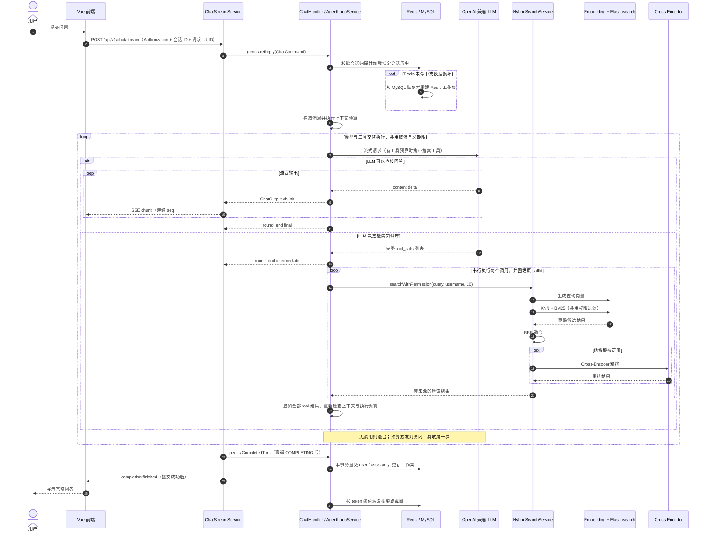
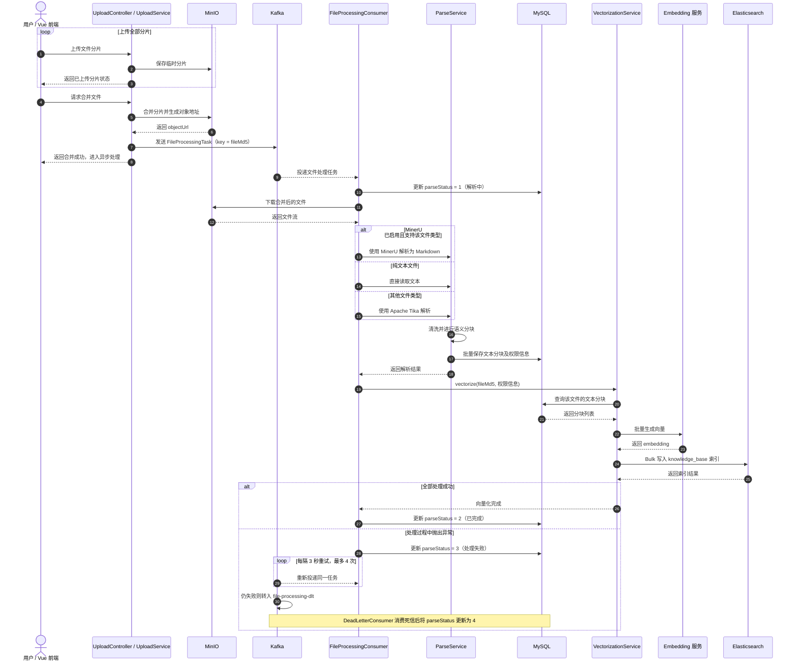

# ShadowRAG

ShadowRAG 是一个企业级 AI 知识管理系统，基于 RAG（检索增强生成）技术构建，提供智能文档处理与语义检索能力。

用户上传文档后，系统自动完成解析、分块、向量化并存入 Elasticsearch，随后可通过自然语言对话精准检索文档内容，获得基于文档的 AI 生成回答。

[TOC]

## 功能特性

- **文档管理**：支持多种格式文档上传，自动解析与索引，支持分片上传和断点续传
- **Agentic RAG / ReAct**：LLM 通过 Function Calling 自主决定是否搜索知识库，支持改写查询、连续检索和同轮多次搜索，有界循环后生成最终答案
- **混合检索 + 精排**：KNN 向量检索 + BM25 全文检索 → Java 端 RRF 融合 → Cross-Encoder 精排
- **可恢复的长记忆压缩**：MySQL 追加式原始消息日志作为事实源，Redis 保存可丢弃的压缩工作集；Lua 原子追加与版本 CAS 防止并发覆盖，token 软硬阈值负责后台治理，每次模型调用前再做独立预算兜底
- **AI 对话**：支持 OpenAI 兼容的 LLM 接口（GLM、DeepSeek 或本地 Ollama），通过 POST SSE 实时流式输出回答
- **多租户隔离**：基于组织标签的数据隔离，支持公开/私有文档权限控制
- **异步处理**：Kafka 驱动的文档异步解析与向量化流水线
- **文档解析**：MinerU 优先解析（支持 PDF/图片等复杂排版），Tika 自动回退

## 技术栈

### 后端

| 类别 | 技术 |
|------|------|
| 框架 | Spring Boot 3.4.2 (Java 17+) |
| 数据库 | MySQL 8.0 + Spring Data JPA |
| 缓存 | Redis 7.0.11 |
| 搜索引擎 | Elasticsearch 8.10.0 |
| 消息队列 | Apache Kafka 3.2.1 |
| 文件存储 | MinIO 8.5.12 |
| 文档解析 | MinerU / Apache Tika 2.9.1 |
| 安全认证 | Spring Security + JWT |
| LLM | OpenAI 兼容接口（GLM / DeepSeek / 本地 Ollama） |
| Embedding | Ollama bge-m3（1024 维） |
| Reranker | HuggingFace TEI bge-reranker-v2-m3 |
| 实时通信 | POST SSE + 独立 HTTP 取消 |
| 聊天流式输出 | Spring MVC SseEmitter + 普通 Java HTTP 读取 |
| 中文处理 | HanLP 1.8.6 |

### 前端

| 类别 | 技术 |
|------|------|
| 框架 | Vue 3 + TypeScript 5.8 |
| 构建工具 | Vite 6.3 |
| UI 组件 | Naive UI 2.41 |
| 状态管理 | Pinia 3.0 |
| 路由 | Vue Router 4.5 |
| 样式 | UnoCSS + SCSS |
| 图表 | ECharts 5.6 |
| 图标 | Iconify |
| Markdown 渲染 | Markdown-it + KaTeX |

## 系统架构

浏览器聊天使用同源 HTTP API：开发环境的主 API 地址为 `http://localhost:8081/api/v1`，生产为 `/api/v1`。JWT 放在 `Authorization` 请求头中。每轮提交显式会话 ID 和新的请求 UUID，服务端按认证用户与会话隔离，并限制每个会话同时一个生成请求。响应没有断点续传或自动重放。

```sh
# 先使用已有登录流程取得 CHAT_TOKEN，并创建或选择自己拥有的 CONVERSATION_ID。
curl -N -X POST http://localhost:8081/api/v1/chat/stream \
  -H "Authorization: Bearer $CHAT_TOKEN" \
  -H 'Content-Type: application/json' \
  -d '{"conversationId":"<CONVERSATION_ID>","requestId":"<NEW_REQUEST_UUID>","message":"你好"}'

curl -X POST http://localhost:8081/api/v1/chat/requests/<NEW_REQUEST_UUID>/cancel \
  -H "Authorization: Bearer $CHAT_TOKEN"
```

流依次发送 `meta`、各轮 `chunk` / `round_end` / `tool_progress` 和一次 `completion`；JSON envelope 包含 `type`、`requestId`、`conversationId`、连续的 `seq` 和 `data`，SSE `event` 与 `type` 相同、`id` 为 `seq`。`chunk` 带递增的 `roundId`；`round_end.kind=intermediate` 将当前正文归入检索说明，`kind=final` 确认最终答案；工具进度用 `roundId`、`callId` 区分调用。前端实时显示当前正文，在“查看检索过程”中保留中间说明；数据库只保存 final 正文。失败时发送 `error` 再发送终态。只有 `completion.data.status=finished` 表示完整回答已保存；`cancelled`、`failed`、`timed_out` 和缺少 completion 的 EOF 不表示已保存。流开始前的鉴权、参数或容量错误返回普通 HTTP JSON。`New-Token` 仅更新同一个仍有效的登录会话，生成 POST 不重放。

聊天编排与 DeepSeek 模型/摘要客户端使用普通 Java 方法：生成线程通过 JDK HttpClient 的输入流逐段读取模型 SSE，增量回调进入有界队列，由独立发送线程按顺序写入 SseEmitter。取消同时撤销请求、关闭模型响应流和取消生成任务；全部轮次与排队共享总期限。正文、工具参数、模型 SSE 行/帧及摘要 JSON 都有限额。模型缺少 `[DONE]`、截断或流损坏时，不继续检索，也不保存半截答案。

聊天已接入普通 Java ReAct 循环：`ChatHandler` 准备历史，`AgentLoopService` 交替请求模型与执行 `KnowledgeBaseSearchTool`。搜索身份来自服务端认证用户，每轮携带完整的 assistant/tool 消息配对；旧历史按完整回合删除，各工具正文共同截断并保留来源索引。默认最多 3 轮工具、6 次实际搜索，连续相同调用第 3 次拦截，预留 10 秒收尾；触发预算后关闭工具，只请求一次带“部分完成”标记的答案，默认最多 4 次模型请求。`ai.agent` 可通过 `AI_AGENT_MAX_TOOL_ROUNDS`、`AI_AGENT_MAX_TOOL_CALLS`、`AI_AGENT_REPEATED_CALL_LIMIT`、`AI_AGENT_FINALIZATION_RESERVE_MS`、`AI_AGENT_MAX_TOOL_RESULT_CHARS` 覆盖；工具结果默认 16384 字符，非法预算在启动时拒绝。验收见 [ReAct R1～R3](docs/eval/chat_stream/knowledge-base-react-acceptance.md)。Embedding、Reranker、MinerU 客户端仍使用 WebClient，WebFlux/Reactor 依赖仍保留，MCP 暂未实施。此前聊天去除 Flux 的记录见 [阶段3验收](docs/eval/chat_stream/remove-flux-phase-3-acceptance.md)。

停止请求返回当前用户命名空间中的实际状态；`cancelled` 后关闭本地流，`completing` / `finished` 继续读取现有流至终态。取消失败时关闭本地连接并提示停止结果未确认。已经进入 `COMPLETING` 的数据库提交不会因断线撤销，提交成功但完成通知丢失时可以从历史恢复。

部署使用 [Nginx 示例](docs/nginx.conf)，修改静态目录与后端地址。独立 stream location 关闭响应缓冲、缓存与 gzip，90 秒超时是两次读写之间的空闲期限；15 秒注释心跳维持工具等待，不能代替 300000 ms 总生成期限。emitter 为 320000 ms，为最多 10 秒数据库事务留出余量。`application.yml` 的 `chat.streaming` 可通过 `CHAT_*` 环境变量覆盖：活跃请求 100、总记录 10000、每用户记录 200、发送池 16 个线程/1024 个排队任务、生成池 16 个线程/64 个排队任务、每请求 64 个待发送事件、终态保留 300000 ms；零、负数和冲突的期限在启动时拒绝。关闭应用停止新请求、取消运行中的生成，已进入提交的请求最多等待事务期限。

首版只能部署为单个后端实例。随机分发到多实例前必须实现请求归属与取消路由、会话并发控制，或明确的请求亲和。浏览器 SSE 与未来 MCP 自身的 Streamable HTTP 是两条链路，本次不提供 MCP 功能。

发布时配套更新前端、后端与代理，并刷新静态资源；发布前停止接收旧请求，正在进行的旧连接会断开。回滚必须一起回滚这三部分到同一版本，数据库结构不变。旧版本的鉴权与停止问题也会随回滚恢复。两份源码测试页共用 `/chat-stream.mjs`，提供登录、显式会话 ID、Authorization、问答、停止和原有历史查询；后端默认提供 `/test.html` 与 `/static/test.html`，源码根目录的旧测试页可单独用同源静态别名提供。

### RAG 核心流程

文档上传后，会先经 Kafka 异步流水线完成 MinerU/Tika 解析、文本分块、向量化，并写入 Elasticsearch。下图聚焦一次用户提问的 Agentic RAG 调用过程：



关键点：是否继续检索由模型完整响应中的 `tool_calls` 决定，通用问题可以零搜索直接回答。中间正文实时显示但不拼入最终答案；工具执行与消息配对完成后，才发起下一次模型请求。所有轮次共用同一份取消上下文和总期限。

### 长记忆压缩流程


普通聊天读取会先访问 Redis；工作集 miss 或 JSON 损坏时，会自动从 `conversation_messages` 按消息序号回源，
并通过 version CAS Lua 重建 Redis。显式切换会话也复用同一恢复流程，并与升级前的
`conversations.messages` 只读快照合并。旧 JSON 字段不再接收压缩结果回写。

### 项目结构

```
ShadowRAG/
├── src/main/java/com/yizhaoqi/smartpai/   # 后端
│   ├── SmartPaiApplication.java            # 应用入口
│   ├── client/                             # 外部 API 客户端（DeepSeek, Embedding, MinerU）
│   ├── config/                             # 配置类（Security, JWT, ES, Kafka, MinIO, Redis, SSE）
│   ├── consumer/                           # Kafka 消费者（异步文档处理）
│   ├── controller/                         # REST API 控制器
│   ├── entity/                             # JPA 实体
│   ├── exception/                          # 自定义异常
│   ├── model/                              # 领域模型 / DTO
│   ├── repository/                         # 数据访问层
│   ├── service/                            # 业务逻辑层
│   └── utils/                              # 工具类
├── frontend/                               # 前端
│   ├── src/
│   │   ├── assets/                         # 静态资源
│   │   ├── components/                     # Vue 组件（common/advanced/custom）
│   │   ├── layouts/                        # 页面布局
│   │   ├── router/                         # 路由配置
│   │   ├── service/                        # API 集成
│   │   ├── store/                          # Pinia 状态管理
│   │   ├── views/                          # 页面组件
│   │   ├── hooks/                          # Composition API Hooks
│   │   ├── enum/                           # TypeScript 枚举
│   │   └── constants/                      # 常量
│   └── ...
├── docs/                                   # Docker Compose 部署配置
│   ├── docker-compose.yaml                 # 服务编排
│   ├── Dockerfile.mineru                    # MinerU 自定义镜像
│   └── init-db.sql                          # MySQL 首次启动自动建库
├── pom.xml                                 # Maven 依赖
└── README.md
```

## 快速开始

### 前置条件

- Java 17+（推荐 Java 21）
- Maven 3.8.6+
- Node.js 18.20.0+
- pnpm 8.7.0+
- Docker & Docker Compose（用于运行基础设施服务）
- NVIDIA GPU + 驱动（用于 MinerU 解析和 Ollama Embedding）

### 1. 启动基础设施服务

```bash
cd docs && docker-compose up -d
```

这将启动以下服务：

| 服务 | 端口 | 说明 |
|------|------|------|
| MySQL | 33060（容器内 3306） | 主数据库，密码 `123456`，首次启动自动建库 |
| Redis | 6379 | 缓存 |
| Elasticsearch | 9200 | 搜索与向量存储 |
| Kafka | 9092 | 消息队列 |
| MinIO | 19000 / 19001 | 文件存储（API / 控制台） |
| MinerU | 8000 | 文档解析（需 GPU） |
| Ollama | 11434 | Embedding 服务（自动拉取 bge-m3，需 GPU） |
| TEI Reranker | 8082 | Cross-Encoder 精排 |

### 2. 配置本地凭据

启动后端前至少需要配置以下变量：

| 环境变量 | 说明 |
|----------|------|
| `DEEPSEEK_API_KEY` | 当前 LLM 服务的 API Key；变量名为兼容现有配置而保留 |
| `JWT_SECRET_KEY` | JWT 签名密钥，建议使用足够长的随机字符串 |
| `ES_PASSWORD` | Elasticsearch 密码，须与 `docs/docker-compose.yaml` 中的 `ELASTIC_PASSWORD` 一致 |

也可以在项目根目录创建不会被 Git 跟踪的 `application-local.yml`：

```yaml
deepseek:
  api:
    key: "替换为你的 LLM API Key"

jwt:
  secret-key: "替换为足够长的随机字符串"

elasticsearch:
  password: "替换为 Docker Compose 中配置的 Elasticsearch 密码"
```

该文件已被 `.gitignore` 排除，请勿把真实密钥写入其他受 Git 跟踪的配置文件。

### 3. 启动后端

```bash
mvn spring-boot:run
```

后端运行在 `http://localhost:8081`。

### 4. 启动前端

```bash
cd frontend && pnpm install && pnpm dev
```

### 5. 访问应用

浏览器打开 `http://localhost:9527`，使用默认管理员账号登录：

- 用户名：`admin`
- 密码：`123456`

> `docker-compose.yaml` 和默认配置中的 MySQL、Redis、MinIO、Elasticsearch 及管理员密码仅用于本地开发。对外部署前必须全部替换，并避免将真实凭据提交到 Git。

## 配置说明

主要配置文件为 `src/main/resources/application.yml`，关键配置项：

| 配置项 | 说明 |
|--------|------|
| `deepseek.api.url` | OpenAI 兼容的 LLM API 地址，支持 GLM、DeepSeek 或本地 Ollama |
| `deepseek.api.model` | 模型名称，如 `glm-5`、`deepseek-chat` 或 `deepseek-r1:7b` |
| `deepseek.api.key` | LLM API Key，建议通过 `DEEPSEEK_API_KEY` 或 `application-local.yml` 提供 |
| `deepseek.api.proxy-url` | 可选 HTTP CONNECT 代理，如 `http://127.0.0.1:7890`，也可通过 `LLM_HTTP_PROXY` 设置；仅影响 LLM 请求，留空时直连 |
| `embedding.api.url` | Embedding 服务地址（Ollama） |
| `embedding.api.model` | Embedding 模型名称，默认 `bge-m3` |
| `jwt.secret-key` | JWT 签名密钥，建议通过 `JWT_SECRET_KEY` 或 `application-local.yml` 提供 |
| `elasticsearch.password` | Elasticsearch 密码，建议通过 `ES_PASSWORD` 或 `application-local.yml` 提供 |
| `mineru.api.url` | MinerU 文档解析服务地址 |
| `mineru.api.enabled` | 是否启用 MinerU，`false` 时回退到 Tika |
| `file.parsing.chunk-size` | 文本分块大小，默认 512 字符 |
| `ai.compression.soft-threshold-token` | 压缩软阈值，默认 20000 Token 触发异步压缩 |
| `ai.compression.hard-threshold-token` | 压缩硬阈值，默认 50000 Token 触发同步截断 |
| `ai.compression.keep-rounds` | 压缩时保留最近对话轮数，默认 6 轮 |
| `reranker.api.enabled` | 是否启用 Cross-Encoder 精排 |

## 架构设计

### 分层架构

系统采用经典的分层架构，职责清晰：

- **Controller 层**：处理 HTTP 请求，参数校验，委托给 Service 层
- **Service 层**：业务逻辑核心，事务管理，协调多个 Repository 和外部服务
- **Repository 层**：Spring Data JPA 数据访问，支持自定义查询
- **Entity 层**：JPA 实体映射数据库表

### 多租户设计

通过组织标签（OrganizationTag）实现租户隔离：

- 每个用户可属于多个组织
- 每个组织拥有独立的知识库
- 文档支持公开或绑定到特定组织
- 查询时自动过滤用户可见的文档范围

### 异步处理流程

文档上传后的处理流程通过 Kafka 异步执行：



关键点：上传接口只负责合并文件并投递任务，耗时的解析、分块、向量化和索引均由 Kafka 消费者异步完成；`fileMd5` 既是消息 Key，也是各处理阶段关联同一文档的标识。

## 构建部署

自动测试和构建使用 GitHub Actions，触发条件、测试范围及本地复现步骤见 [CI 说明](docs/ci.md)。

### 构建

```bash
# 后端打包
mvn clean package

# 前端构建
cd frontend && pnpm build
```

### Docker 部署

```bash
# 启动所有服务
cd docs && docker-compose up -d

# 查看服务状态
docker-compose ps

# 停止所有服务
docker-compose down
```

## License

本项目仅供学习和研究使用。
