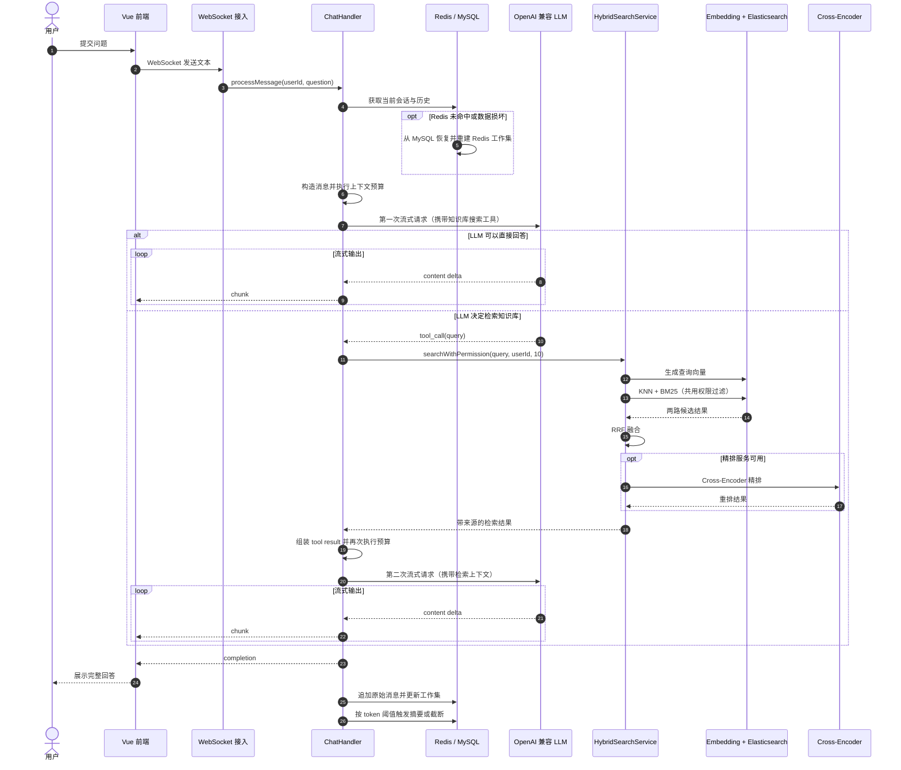
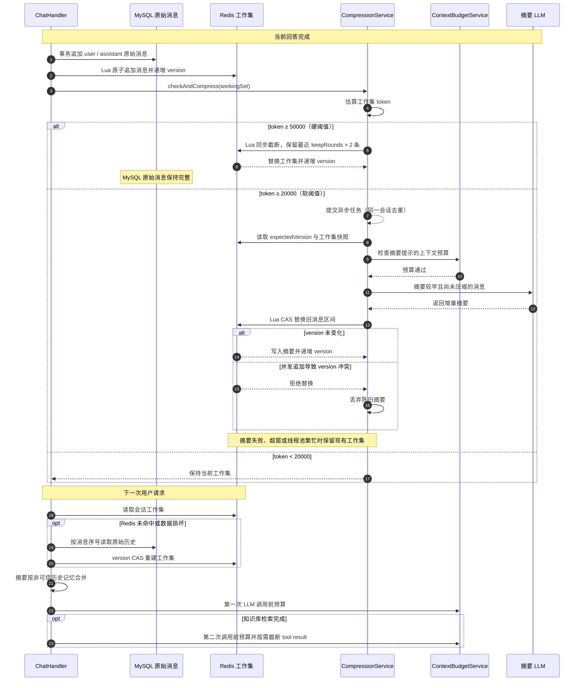

# ShadowRAG

ShadowRAG 是一个企业级 AI 知识管理系统，基于 RAG（检索增强生成）技术构建，提供智能文档处理与语义检索能力。

用户上传文档后，系统自动完成解析、分块、向量化并存入 Elasticsearch，随后可通过自然语言对话精准检索文档内容，获得基于文档的 AI 生成回答。

## 功能特性

- **文档管理**：支持多种格式文档上传，自动解析与索引，支持分片上传和断点续传
- **Agentic RAG**：LLM 通过 Function Calling 自主决定是否搜索知识库，两阶段工具调用流程
- **混合检索 + 精排**：KNN 向量检索 + BM25 全文检索 → Java 端 RRF 融合 → Cross-Encoder 精排
- **可恢复的长记忆压缩**：MySQL 追加式原始消息日志作为事实源，Redis 保存可丢弃的压缩工作集；Lua 原子追加与版本 CAS 防止并发覆盖，token 软硬阈值负责后台治理，每次模型调用前再做独立预算兜底
- **AI 对话**：支持 OpenAI 兼容的 LLM 接口（GLM、DeepSeek 或本地 Ollama），通过 WebSocket 实时流式输出回答
- **多租户隔离**：基于组织标签的数据隔离，支持公开/私有文档权限控制
- **异步处理**：Kafka 驱动的文档异步解析与向量化流水线
- **文档解析**：MinerU 优先解析（支持 PDF/图片等复杂排版），Tika 自动回退

## 技术栈

### 后端

| 类别 | 技术 |
|------|------|
| 框架 | Spring Boot 3.4.2 (Java 17+) |
| 数据库 | MySQL 8.0 + Spring Data JPA |
| 缓存 | Redis 7.0.11 |
| 搜索引擎 | Elasticsearch 8.10.0 |
| 消息队列 | Apache Kafka 3.2.1 |
| 文件存储 | MinIO 8.5.12 |
| 文档解析 | MinerU / Apache Tika 2.9.1 |
| 安全认证 | Spring Security + JWT |
| LLM | OpenAI 兼容接口（GLM / DeepSeek / 本地 Ollama） |
| Embedding | Ollama bge-m3（1024 维） |
| Reranker | HuggingFace TEI bge-reranker-v2-m3 |
| 实时通信 | WebSocket |
| 响应式 | Spring WebFlux |
| 中文处理 | HanLP 1.8.6 |

### 前端

| 类别 | 技术 |
|------|------|
| 框架 | Vue 3 + TypeScript 5.8 |
| 构建工具 | Vite 6.3 |
| UI 组件 | Naive UI 2.41 |
| 状态管理 | Pinia 3.0 |
| 路由 | Vue Router 4.5 |
| 样式 | UnoCSS + SCSS |
| 图表 | ECharts 5.6 |
| 图标 | Iconify |
| Markdown 渲染 | Markdown-it + KaTeX |

## 系统架构

### RAG 核心流程

文档上传后，会先经 Kafka 异步流水线完成 MinerU/Tika 解析、文本分块、向量化，并写入 Elasticsearch。下图聚焦一次用户提问的 Agentic RAG 调用过程：



关键点：只有当第一次 LLM 调用返回 `search_knowledge_base` 工具调用时，系统才会执行权限过滤后的混合检索和第二次 LLM 调用；否则模型直接流式回答。

### 长记忆压缩流程



普通聊天读取会先访问 Redis；工作集 miss 或 JSON 损坏时，会自动从 `conversation_messages` 按消息序号回源，
并通过 version CAS Lua 重建 Redis。显式切换会话也复用同一恢复流程，并与升级前的
`conversations.messages` 只读快照合并。旧 JSON 字段不再接收压缩结果回写。

### 项目结构

```
ShadowRAG/
├── src/main/java/com/yizhaoqi/smartpai/   # 后端
│   ├── SmartPaiApplication.java            # 应用入口
│   ├── client/                             # 外部 API 客户端（DeepSeek, Embedding, MinerU）
│   ├── config/                             # 配置类（Security, JWT, ES, Kafka, MinIO, Redis, WS）
│   ├── consumer/                           # Kafka 消费者（异步文档处理）
│   ├── controller/                         # REST API 控制器
│   ├── entity/                             # JPA 实体
│   ├── exception/                          # 自定义异常
│   ├── handler/                            # WebSocket 处理器（AI 对话）
│   ├── model/                              # 领域模型 / DTO
│   ├── repository/                         # 数据访问层
│   ├── service/                            # 业务逻辑层
│   └── utils/                              # 工具类
├── frontend/                               # 前端
│   ├── src/
│   │   ├── assets/                         # 静态资源
│   │   ├── components/                     # Vue 组件（common/advanced/custom）
│   │   ├── layouts/                        # 页面布局
│   │   ├── router/                         # 路由配置
│   │   ├── service/                        # API 集成
│   │   ├── store/                          # Pinia 状态管理
│   │   ├── views/                          # 页面组件
│   │   ├── hooks/                          # Composition API Hooks
│   │   ├── enum/                           # TypeScript 枚举
│   │   └── constants/                      # 常量
│   └── ...
├── docs/                                   # Docker Compose 部署配置
│   ├── docker-compose.yaml                 # 服务编排
│   ├── Dockerfile.mineru                    # MinerU 自定义镜像
│   └── init-db.sql                          # MySQL 首次启动自动建库
├── pom.xml                                 # Maven 依赖
└── README.md
```

## 快速开始

### 前置条件

- Java 17+（推荐 Java 21）
- Maven 3.8.6+
- Node.js 18.20.0+
- pnpm 8.7.0+
- Docker & Docker Compose（用于运行基础设施服务）
- NVIDIA GPU + 驱动（用于 MinerU 解析和 Ollama Embedding）

### 1. 启动基础设施服务

```bash
cd docs && docker-compose up -d
```

这将启动以下服务：

| 服务 | 端口 | 说明 |
|------|------|------|
| MySQL | 33060（容器内 3306） | 主数据库，密码 `123456`，首次启动自动建库 |
| Redis | 6379 | 缓存 |
| Elasticsearch | 9200 | 搜索与向量存储 |
| Kafka | 9092 | 消息队列 |
| MinIO | 19000 / 19001 | 文件存储（API / 控制台） |
| MinerU | 8000 | 文档解析（需 GPU） |
| Ollama | 11434 | Embedding 服务（自动拉取 bge-m3，需 GPU） |
| TEI Reranker | 8082 | Cross-Encoder 精排 |

### 2. 配置本地凭据

启动后端前至少需要配置以下变量：

| 环境变量 | 说明 |
|----------|------|
| `DEEPSEEK_API_KEY` | 当前 LLM 服务的 API Key；变量名为兼容现有配置而保留 |
| `JWT_SECRET_KEY` | JWT 签名密钥，建议使用足够长的随机字符串 |
| `ES_PASSWORD` | Elasticsearch 密码，须与 `docs/docker-compose.yaml` 中的 `ELASTIC_PASSWORD` 一致 |

也可以在项目根目录创建不会被 Git 跟踪的 `application-local.yml`：

```yaml
deepseek:
  api:
    key: "替换为你的 LLM API Key"

jwt:
  secret-key: "替换为足够长的随机字符串"

elasticsearch:
  password: "替换为 Docker Compose 中配置的 Elasticsearch 密码"
```

该文件已被 `.gitignore` 排除，请勿把真实密钥写入其他受 Git 跟踪的配置文件。

### 3. 启动后端

```bash
mvn spring-boot:run
```

后端运行在 `http://localhost:8081`。

### 4. 启动前端

```bash
cd frontend && pnpm install && pnpm dev
```

### 5. 访问应用

浏览器打开 `http://localhost:9527`，使用默认管理员账号登录：

- 用户名：`admin`
- 密码：`123456`

> `docker-compose.yaml` 和默认配置中的 MySQL、Redis、MinIO、Elasticsearch 及管理员密码仅用于本地开发。对外部署前必须全部替换，并避免将真实凭据提交到 Git。

## 配置说明

主要配置文件为 `src/main/resources/application.yml`，关键配置项：

| 配置项 | 说明 |
|--------|------|
| `deepseek.api.url` | OpenAI 兼容的 LLM API 地址，支持 GLM、DeepSeek 或本地 Ollama |
| `deepseek.api.model` | 模型名称，如 `glm-5`、`deepseek-chat` 或 `deepseek-r1:7b` |
| `deepseek.api.key` | LLM API Key，建议通过 `DEEPSEEK_API_KEY` 或 `application-local.yml` 提供 |
| `embedding.api.url` | Embedding 服务地址（Ollama） |
| `embedding.api.model` | Embedding 模型名称，默认 `bge-m3` |
| `jwt.secret-key` | JWT 签名密钥，建议通过 `JWT_SECRET_KEY` 或 `application-local.yml` 提供 |
| `elasticsearch.password` | Elasticsearch 密码，建议通过 `ES_PASSWORD` 或 `application-local.yml` 提供 |
| `mineru.api.url` | MinerU 文档解析服务地址 |
| `mineru.api.enabled` | 是否启用 MinerU，`false` 时回退到 Tika |
| `file.parsing.chunk-size` | 文本分块大小，默认 512 字符 |
| `ai.compression.soft-threshold-token` | 压缩软阈值，默认 20000 Token 触发异步压缩 |
| `ai.compression.hard-threshold-token` | 压缩硬阈值，默认 50000 Token 触发同步截断 |
| `ai.compression.keep-rounds` | 压缩时保留最近对话轮数，默认 6 轮 |
| `reranker.api.enabled` | 是否启用 Cross-Encoder 精排 |

## 架构设计

### 分层架构

系统采用经典的分层架构，职责清晰：

- **Controller 层**：处理 HTTP 请求，参数校验，委托给 Service 层
- **Service 层**：业务逻辑核心，事务管理，协调多个 Repository 和外部服务
- **Repository 层**：Spring Data JPA 数据访问，支持自定义查询
- **Entity 层**：JPA 实体映射数据库表

### 多租户设计

通过组织标签（OrganizationTag）实现租户隔离：

- 每个用户可属于多个组织
- 每个组织拥有独立的知识库
- 文档支持公开或绑定到特定组织
- 查询时自动过滤用户可见的文档范围

### 异步处理流程

文档上传后的处理流程通过 Kafka 异步执行：

```
文件上传 → Kafka 消息 → 消费者接收 → MinerU/Tika 解析 → 文本分块 → 向量化 → ES 索引
```

## 构建部署

### 构建

```bash
# 后端打包
mvn clean package

# 前端构建
cd frontend && pnpm build
```

### Docker 部署

```bash
# 启动所有服务
cd docs && docker-compose up -d

# 查看服务状态
docker-compose ps

# 停止所有服务
docker-compose down
```

## License

本项目仅供学习和研究使用。
