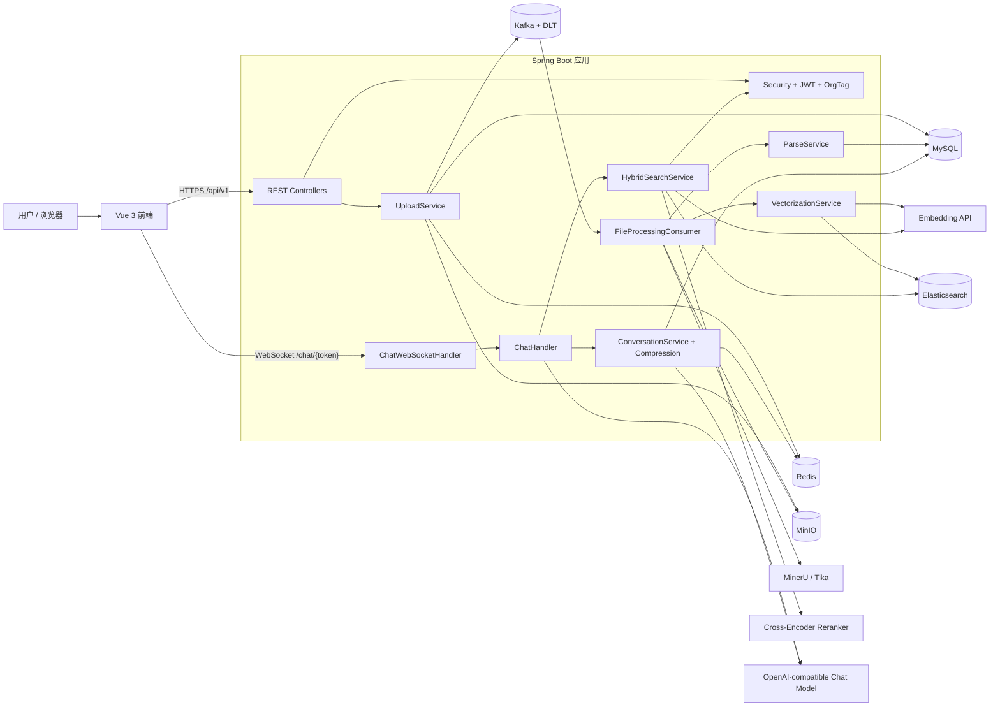
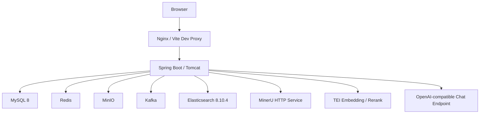
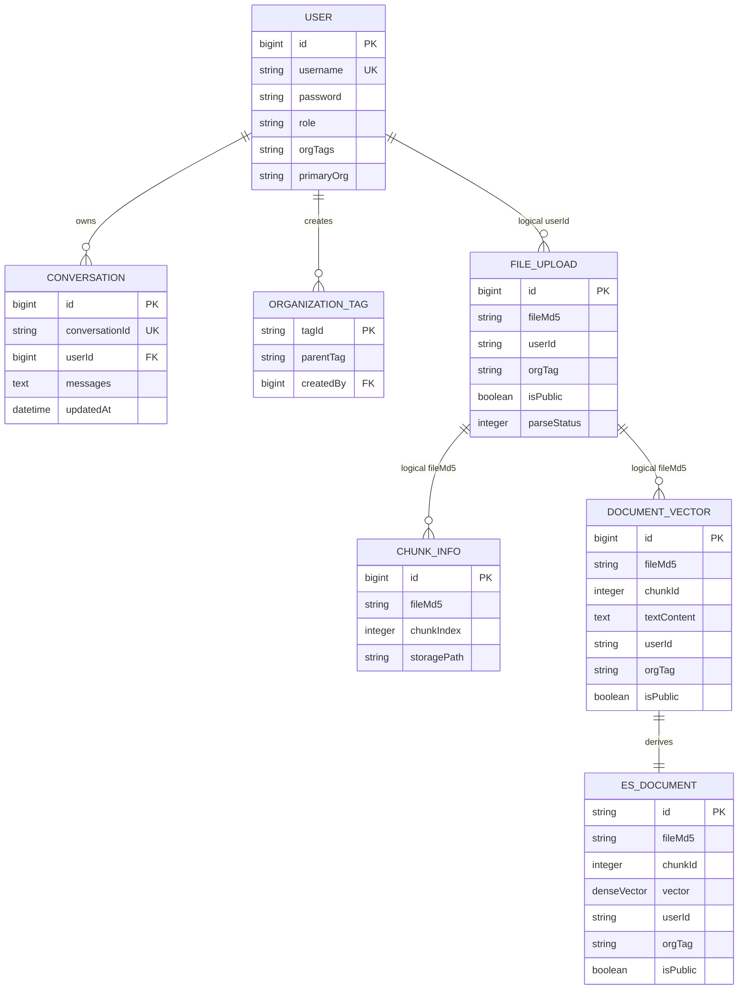

# ShadowRAG 项目面试复习手册

> **上下文压缩章节更新提示（2026-08-19）：** 本文基于旧版实现审计，其中关于 Redis 整体写回、`syncToMySQL` 和消息条数阈值的描述已过期。该主题请以 [`docs/interview/上下文压缩面试回答模板.md`](interview/上下文压缩面试回答模板.md) 为准。

> 面向：大厂日常实习——后端开发 / 大模型应用开发  
> 扫描基线：`master`，HEAD `5835ee8f1fe4844d3de77dabc1b676b443ca8c73`  
> 扫描时间：2026-08-11（Asia/Shanghai）  
> 文档状态：**完整审计稿**。13 个章节均已完成；带 [待本人补充]、[职责待确认]、[指标待补充] 的内容必须由本人提供真实信息后再用于简历或 STAR。

[TOC]


## 阅读约定

- **已验证**：由当前工作区的代码、配置、测试或 Git 记录直接支持。
- **合理推断**：由实现推导出的影响或设计动机，不能当成作者的真实决策过程。
- **待本人确认**：个人职责、业务背景、真实使用数据、决策过程等，仓库无法证明。
- **建议改造**：当前尚未实现，适合作为后续工程补强或面试扩展设计。
- 本文不展示任何密钥、Token、密码、预签名 URL 或其他秘密值；只在必要时指出“存在硬编码凭据风险”。

---

## 1. 项目事实卡

### 1.1 项目解决的问题与目标用户

**已验证**：ShadowRAG 是一个面向组织知识库场景的 RAG 应用。用户可以分片上传文档，系统异步完成解析、切分、Embedding 和 Elasticsearch 建索引；查询时组合 KNN、BM25、RRF 与可选 Cross-Encoder Rerank；聊天链路由大模型决定是否调用知识库搜索工具，并通过 WebSocket 流式返回答案。系统还包含 JWT 登录、组织标签权限、文档预览/下载、会话持久化和长上下文压缩。[证据：README.md::项目简介/核心功能；src/main/java/com/yizhaoqi/smartpai/controller/UploadController.java::uploadChunk/mergeFile；src/main/java/com/yizhaoqi/smartpai/service/HybridSearchService.java::searchWithPermission；src/main/java/com/yizhaoqi/smartpai/service/ChatHandler.java::processMessage；相关测试：ConversationCompressionServiceTest、ParseServiceUnitTest]

**合理推断**：目标用户更接近“需要按个人、公开和组织范围管理文档访问权限，并希望通过对话检索内部资料的团队或企业用户”。依据是 `FileUpload`、`DocumentVector` 和 ES 文档均携带 owner、组织标签和公开属性，检索时构造相同的权限过滤器。[证据：src/main/java/com/yizhaoqi/smartpai/model/FileUpload.java::FileUpload；src/main/java/com/yizhaoqi/smartpai/model/DocumentVector.java::DocumentVector；src/main/java/com/yizhaoqi/smartpai/service/HybridSearchService.java::buildPermissionFilter；相关测试：无搜索权限测试]

**待本人确认**：项目最初服务的真实业务场景、目标用户画像、你在其中承担的职责和主导的技术决策均为 `[待本人补充]`。项目未上线，因此不存在可验证的线上用户数、QPS、成本或性能提升数据。

### 1.2 技术栈及版本

| 层次 | 已验证技术 | 版本或说明 | 代码证据 |
|---|---|---|---|
| 后端语言与框架 | Java、Spring Boot | Java 17；Spring Boot 3.4.2 | [证据：pom.xml::java.version/spring-boot-starter-parent；相关测试：SmartPaiApplicationTests] |
| Web 与安全 | Spring MVC、WebSocket、Spring Security、JWT | JJWT 0.11.5；无服务端 Session | [证据：pom.xml::spring-boot-starter-web/spring-boot-starter-websocket/spring-boot-starter-security/jjwt-api；src/main/java/com/yizhaoqi/smartpai/config/SecurityConfig.java::securityFilterChain；相关测试：JwtUtilsRefreshTest] |
| 关系数据库 | MySQL、Spring Data JPA | MySQL 驱动版本由 Spring Boot BOM 管理；`ddl-auto` 随 profile 配置 | [证据：pom.xml::mysql-connector-j/spring-boot-starter-data-jpa；src/main/resources/application.yml::spring.jpa；相关测试：UserServiceTest] |
| 缓存/状态 | Redis | Token 状态、组织权限缓存、上传位图、当前会话和对话历史 | [证据：src/main/java/com/yizhaoqi/smartpai/service/TokenCacheService.java::TokenCacheService；src/main/java/com/yizhaoqi/smartpai/service/OrgTagCacheService.java::OrgTagCacheService；src/main/java/com/yizhaoqi/smartpai/repository/RedisRepository.java::RedisRepository；相关测试：ConversationCompressionServiceTest] |
| 对象存储 | MinIO Java SDK | 8.5.12 | [证据：pom.xml::io.minio:minio；src/main/java/com/yizhaoqi/smartpai/service/UploadService.java::uploadChunk/mergeChunks；相关测试：UploadServicePerformanceTest] |
| 消息系统 | Spring Kafka | spring-kafka 3.2.1；事务生产者、幂等生产、重试与 DLT 配置 | [证据：pom.xml::spring-kafka；src/main/java/com/yizhaoqi/smartpai/config/KafkaConfig.java::producerFactory/kafkaListenerContainerFactory；相关测试：无 Kafka 集成测试] |
| 检索 | Elasticsearch Java Client | 8.10.0；dense vector + BM25 | [证据：pom.xml::elasticsearch-java；src/main/resources/es-mappings/knowledge_base.json::mappings.properties；相关测试：无 ES 集成测试] |
| 文档解析 | Apache Tika、MinerU、HanLP | Tika 2.9.1；HanLP portable 1.8.6；MinerU 通过 HTTP 调用 | [证据：pom.xml::tika-core/tika-parsers-standard-package/hanlp；src/main/java/com/yizhaoqi/smartpai/client/MinerUClient.java::parseToMarkdown；相关测试：ParseServiceUnitTest] |
| 模型接入 | 手写 OpenAI-compatible WebClient | Chat Completions、Embedding、Rerank；未使用 Spring AI/LangChain | [证据：src/main/java/com/yizhaoqi/smartpai/client/DeepSeekClient.java::streamWithTools/buildToolsRequest；src/main/java/com/yizhaoqi/smartpai/client/EmbeddingClient.java::embed/callApiOnce；src/main/java/com/yizhaoqi/smartpai/client/RerankerClient.java::rerank；相关测试：无客户端契约测试] |
| Token 估算 | jtokkit | 1.0.0；CL100K_BASE，用于历史压缩阈值估算 | [证据：pom.xml::jtokkit；src/main/java/com/yizhaoqi/smartpai/service/ConversationCompressionService.java::TOKEN_ENCODING/estimateTokens；相关测试：ConversationCompressionServiceTest] |
| 前端 | Vue、TypeScript、Vite、Pinia、Naive UI | Vue 3.5.13；TypeScript 5.8.3；Vite 6.3.5；Pinia 3.0.2；Naive UI 2.41.0 | [证据：frontend/package.json::dependencies/devDependencies；相关测试：未发现前端测试文件] |
| 本地基础设施 | Docker Compose | MySQL、Redis、MinIO、Kafka、Elasticsearch、MinerU、TEI、Ollama 等；Compose 未定义后端和前端服务 | [证据：docs/docker-compose.yaml::services；docs/compose-mineru.yaml::services；相关测试：无部署冒烟测试] |

### 1.3 仓库规模与模块划分

**已验证**：以 `git ls-files` 统计，当前提交包含 500 个跟踪文件，其中后端生产 Java 文件 78 个、后端测试 Java 文件 7 个、`frontend/src` 下约 183 个文件、`frontend/packages` 下约 87 个文件。统计排除了 Git 未跟踪文件，也没有把 `node_modules`、`target` 或构建产物计为核心实现。[证据：Git::git ls-files；pom.xml::project；frontend/package.json::name；相关测试：不适用]

主要边界如下：

| 模块 | 职责 | 边界证据 |
|---|---|---|
| `controller` | REST 入口：认证、上传、搜索、文档、会话、管理 | [证据：src/main/java/com/yizhaoqi/smartpai/controller/UploadController.java::UploadController；src/main/java/com/yizhaoqi/smartpai/controller/SearchController.java::SearchController；相关测试：无 MVC 测试] |
| `handler` / `service.ChatHandler` | WebSocket 鉴权、消息协议、Agentic RAG 编排和流式输出 | [证据：src/main/java/com/yizhaoqi/smartpai/handler/ChatWebSocketHandler.java::ChatWebSocketHandler；src/main/java/com/yizhaoqi/smartpai/service/ChatHandler.java::ChatHandler；相关测试：无] |
| `service.UploadService` | 分片对象写入、Redis 位图、合并和预签名访问 | [证据：src/main/java/com/yizhaoqi/smartpai/service/UploadService.java::uploadChunk/mergeChunks；相关测试：UploadServicePerformanceTest] |
| `consumer` / 解析与向量化服务 | Kafka 消费、解析分流、切分、Embedding、ES Bulk | [证据：src/main/java/com/yizhaoqi/smartpai/consumer/FileProcessingConsumer.java::processTask；src/main/java/com/yizhaoqi/smartpai/service/ParseService.java::parseAndSave；src/main/java/com/yizhaoqi/smartpai/service/VectorizationService.java::vectorize；相关测试：ParseServiceUnitTest] |
| `HybridSearchService` | 权限过滤、KNN/BM25 召回、RRF 和 Rerank | [证据：src/main/java/com/yizhaoqi/smartpai/service/HybridSearchService.java::searchWithPermission/fuseWithRRF/applyRerank；相关测试：无] |
| `ConversationService` / `ConversationCompressionService` | MySQL/Redis 会话同步、token 阈值、异步摘要和同步截断 | [证据：src/main/java/com/yizhaoqi/smartpai/service/ConversationService.java::syncToMySQL；src/main/java/com/yizhaoqi/smartpai/service/ConversationCompressionService.java::checkAndCompress/doCompress；相关测试：ConversationCompressionServiceTest] |
| `config` / `utils` | Security Filter Chain、JWT、Kafka、Redis、MinIO、ES、日志和 WebSocket 配置 | [证据：src/main/java/com/yizhaoqi/smartpai/config/SecurityConfig.java::securityFilterChain；src/main/java/com/yizhaoqi/smartpai/config/KafkaConfig.java::KafkaConfig；相关测试：JwtUtilsRefreshTest] |
| `frontend` | Vue 管理端、分片上传、知识库搜索、会话与 WebSocket UI | [证据：frontend/src/store/modules/knowledge-base/index.ts::useKnowledgeBaseStore；frontend/src/store/modules/chat/index.ts::useChatStore；相关测试：无] |
| `homepage` | 独立静态展示站；不参与后端请求主链 | [证据：homepage/package.json::scripts；homepage/index.html::页面入口；相关测试：无] |

### 1.4 当前可验证能力

1. **认证与权限**：支持用户注册/登录、access/refresh Token、Redis Token 状态、组织标签层级和 owner/public/org 三类检索权限。[证据：src/main/java/com/yizhaoqi/smartpai/service/UserService.java::registerUser/authenticateUser；src/main/java/com/yizhaoqi/smartpai/utils/JwtUtils.java::generateToken/generateRefreshToken；src/main/java/com/yizhaoqi/smartpai/service/HybridSearchService.java::buildPermissionFilter；相关测试：JwtUtilsRefreshTest、UserServiceTest]
2. **断点上传**：浏览器计算文件 MD5，以 5 MiB 为分片大小；最多并发处理 3 个文件，单文件分片顺序上传；服务端使用 MinIO 和 Redis bitmap 记录状态并合并。[证据：frontend/src/constants/common.ts::chunkSize；frontend/src/store/modules/knowledge-base/index.ts::calculateFileMD5/uploadFile/uploadFileChunk；src/main/java/com/yizhaoqi/smartpai/service/UploadService.java::uploadChunk/getUploadedChunks/mergeChunks；相关测试：UploadServicePerformanceTest]
3. **异步摄取**：合并后发送 Kafka 任务；消费者选择 MinerU、纯文本或 Tika 路径，切分后请求 Embedding 并写 ES。[证据：src/main/java/com/yizhaoqi/smartpai/controller/UploadController.java::mergeFile；src/main/java/com/yizhaoqi/smartpai/consumer/FileProcessingConsumer.java::processTask；src/main/java/com/yizhaoqi/smartpai/service/VectorizationService.java::vectorize；相关测试：ParseServiceUnitTest]
4. **混合检索**：权限过滤后的 KNN 与 BM25 各扩大召回，Java 端按 `1 / (60 + rank)` 做 RRF，可选 Cross-Encoder Rerank；Embedding 或 Rerank 失败存在降级路径。[证据：src/main/java/com/yizhaoqi/smartpai/service/HybridSearchService.java::searchWithPermission/fuseWithRRF/applyRerank/textOnlySearchWithPermission；src/main/java/com/yizhaoqi/smartpai/client/RerankerClient.java::rerank；相关测试：无]
5. **Agentic RAG**：第一次流式调用携带 `search_knowledge_base` Tool，由模型决定是否检索；如调用工具，系统执行混合检索，再发起第二次流式回答。[证据：src/main/java/com/yizhaoqi/smartpai/service/ChatHandler.java::SEARCH_TOOL/processMessage/executeToolAndRespond；src/main/java/com/yizhaoqi/smartpai/client/DeepSeekClient.java::streamWithTools/streamResponse；相关测试：无]
6. **会话与压缩**：Redis 保存活跃历史，MySQL保存会话记录；达到 token 软阈值异步摘要，达到硬阈值同步保留最近若干轮，Lua 脚本原子替换 Redis 历史。[证据：src/main/java/com/yizhaoqi/smartpai/service/ChatHandler.java::updateConversationHistory；src/main/java/com/yizhaoqi/smartpai/service/ConversationCompressionService.java::checkAndCompress/submitAsyncCompression/syncTruncate；src/main/resources/scripts/compress_and_replace.lua::脚本主体；相关测试：ConversationCompressionServiceTest]

### 1.5 不能直接宣称的能力

- **不能宣称端到端 Exactly Once**：Kafka 幂等与事务只覆盖消息系统，MySQL、MinIO、外部解析/模型服务和 ES 不在同一事务中。[证据：src/main/java/com/yizhaoqi/smartpai/config/KafkaConfig.java::producerFactory；src/main/java/com/yizhaoqi/smartpai/consumer/FileProcessingConsumer.java::processTask；相关测试：无故障注入测试]
- **不能宣称生产级多租户隔离**：多个存储和删除路径只按客户端传入的 `fileMd5` 定位，未统一带 tenant/user 维度。[证据：src/main/java/com/yizhaoqi/smartpai/service/UploadService.java::uploadChunk/mergeChunks；src/main/java/com/yizhaoqi/smartpai/service/DocumentService.java::deleteDocument；src/main/java/com/yizhaoqi/smartpai/service/VectorizationService.java::fetchTextChunks；相关测试：无多租户冲突测试]
- **不能宣称真正取消模型生成**：停止逻辑只暂时抑制 WebSocket chunk，没有取消 WebClient 上游订阅，仍可能继续消耗 token 并持久化结果。[证据：src/main/java/com/yizhaoqi/smartpai/service/ChatHandler.java::stopResponse/sendResponseChunk/processMessage；相关测试：无]
- **不能宣称已有完整 RAG 评测体系**：跟踪代码中没有检索/生成离线评测进入自动测试或 CI；工作区存在未跟踪的评测材料，但不能代表提交基线。[证据：src/test/java::测试文件集合；Git::git status --short；相关测试：无 HybridSearchService/ChatHandler 测试]
- **不能宣称 Docker Compose 一键部署完整系统**：Compose 只定义基础设施和外部模型服务，没有定义后端与前端容器。[证据：docs/docker-compose.yaml::services；相关测试：无部署冒烟测试]

### 1.6 运行、测试和部署方式

**本地开发（仓库声明）**：

```powershell
# 后端
mvn spring-boot:run

# 前端
cd frontend
pnpm dev

# 基础设施
docker compose -f docs/docker-compose.yaml up -d
```

[证据：README.md::快速开始；pom.xml::spring-boot-maven-plugin；frontend/package.json::scripts.dev；docs/docker-compose.yaml::services；相关测试：不适用]

**测试与静态验证入口**：

```powershell
mvn test
cd frontend
pnpm typecheck
pnpm build
```

注意：`pnpm lint` 配置为 `eslint . --fix`，会修改文件，不适合作为本次只读审计命令；当前 `.github` 目录为未跟踪内容，不能把其中工作流当作仓库已提交的 CI 能力。[证据：frontend/package.json::scripts.lint/typecheck/build；Git::git status --short；相关测试：不适用]

### 1.7 扫描范围、跳过内容与验证状态

| 范围 | 状态 | 说明 |
|---|---|---|
| 后端入口、Controller、Service、Repository、Model、Config、Utils | 已重点扫描 | 深读了上传、摄取、搜索、聊天、权限、会话与压缩主链；未声称逐行阅读全部 78 个生产 Java 文件。 |
| 后端测试 | 已扫描 | 共 7 个跟踪测试文件；覆盖集中在压缩、解析、JWT、用户和上传性能，核心 RAG 与 Kafka 链路缺测试。 |
| 运行配置、ES mapping、Lua、日志 | 已重点扫描 | 检查 `application*.yml`、ES mapping、压缩脚本和 Logback；没有展示秘密值。 |
| 前端 | 选择性深读 | 深读聊天 store、上传 store、输入框、搜索对话框和请求封装；通用 UI、图标、主题和大部分脚手架未深读。 |
| Docker/README/DDL/Git 历史 | 已扫描 | 识别部署边界、DDL 漂移、命名冲突和关键演进提交。 |
| `homepage` | 仅确认边界 | 作为静态展示站，不是核心请求链；没有深读图片、样式和第三方压缩脚本。 |
| 依赖与生成物 | 跳过 | 未把 `node_modules`、`target`、语言主题 JSON、构建产物和第三方前端包当作核心实现。 |
| 工作区未跟踪审计/评测材料 | 仅作旁证 | 不作为当前提交已具备能力的证据；原有用户文件未修改。 |
| 动态验证 | 已执行，结果有成功也有失败 | 两个独立后端单元测试类共 9 个测试通过；完整后端测试 27 个中 13 个通过、14 个错误；前端 typecheck 失败；前端 production build 成功。失败原因与影响见 13.2.1，未修改代码或依赖。 |

### 1.8 证据冲突清单

1. README 以 BGE-M3/1024 维描述 Embedding，ES mapping 固定 1024 维，但 Docker profile 配置为 2048 维，实际运行会存在向量维度不匹配风险。[证据：README.md::技术栈/数据流；src/main/resources/application-docker.yml::embedding.api.dimension；src/main/resources/es-mappings/knowledge_base.json::mappings.properties.vector.dims；相关测试：无]
2. `VectorizationService` 读取 `embedding.model` 记录模型版本，配置实际使用 `embedding.api.model`，因此元数据可能落到默认值而与真实模型不一致。[证据：src/main/java/com/yizhaoqi/smartpai/service/VectorizationService.java::embeddingModelName；src/main/java/com/yizhaoqi/smartpai/client/EmbeddingClient.java::modelId；src/main/resources/application.yml::embedding.api.model；相关测试：无]
3. `SearchController` 注释称缺少用户身份时只搜公开内容，但调用的是无权限过滤的 `HybridSearchService.search`。[证据：src/main/java/com/yizhaoqi/smartpai/controller/SearchController.java::hybridSearch；src/main/java/com/yizhaoqi/smartpai/service/HybridSearchService.java::search；相关测试：无]
4. Security matcher 使用 `/api/search/**`、`/api/chat/websocket-token`，Controller 实际路径带 `/api/v1`，注释和真实匹配行为不一致。[证据：src/main/java/com/yizhaoqi/smartpai/config/SecurityConfig.java::securityFilterChain；src/main/java/com/yizhaoqi/smartpai/controller/SearchController.java::RequestMapping；src/main/java/com/yizhaoqi/smartpai/controller/ChatController.java::RequestMapping/getWebSocketToken；相关测试：无 MVC 安全测试]
5. README/注释强调“流式解析避免 OOM”，但 Tika 路径仍在 `fullText` 累积全文，MinerU 与纯文本路径也会完整读入内存。[证据：src/main/java/com/yizhaoqi/smartpai/service/ParseService.java::StreamingContentHandler/parsePlainText；src/main/java/com/yizhaoqi/smartpai/client/MinerUClient.java::readAllBytes；相关测试：无内存压力测试]
6. `docs/databases/ddl.sql` 未包含 `conversations` 表和 `file_upload.parse_status`，实体却依赖这些结构，说明手工 DDL 与 JPA 模型存在漂移。[证据：docs/databases/ddl.sql::file_upload/document_vectors；src/main/java/com/yizhaoqi/smartpai/model/Conversation.java::Conversation；src/main/java/com/yizhaoqi/smartpai/model/FileUpload.java::parseStatus；相关测试：无迁移测试]

---

## 2. 面试介绍稿

> 以下三版只使用仓库可验证事实。请把 `[待本人补充]` 换成你的真实职责和动机；不要加入不存在的线上数据。

### 2.1 30 秒版本

ShadowRAG 是一个基于 Spring Boot 和 Vue 的组织知识库 RAG 项目。我在项目中的具体职责是 `[待本人补充]`。它支持文档分片上传到 MinIO，再通过 Kafka 异步完成 Tika 或 MinerU 解析、文本切分、Embedding 和 Elasticsearch 建索引。查询侧使用带用户和组织权限过滤的 KNN、BM25、RRF 以及可选 Rerank；聊天侧通过 Tool Calling 让模型决定是否搜索知识库，并用 WebSocket 流式返回答案。项目还实现了 Redis/MySQL 会话存储和基于 token 阈值的上下文摘要压缩。[证据：src/main/java/com/yizhaoqi/smartpai/controller/UploadController.java::mergeFile；src/main/java/com/yizhaoqi/smartpai/consumer/FileProcessingConsumer.java::processTask；src/main/java/com/yizhaoqi/smartpai/service/HybridSearchService.java::searchWithPermission；src/main/java/com/yizhaoqi/smartpai/service/ChatHandler.java::processMessage；相关测试：ConversationCompressionServiceTest]

### 2.2 2 分钟版本

ShadowRAG 解决的是组织内部文档上传、权限隔离检索和对话问答的问题。我在项目中的真实职责是 `[待本人补充]`，项目目前没有上线，所以我不会把测试结果描述成线上指标。

后端使用 Java 17 和 Spring Boot 3.4.2，前端是 Vue 3。文档上传采用浏览器 MD5、5 MiB 分片和断点续传；服务端把分片存到 MinIO，用 Redis bitmap 记录进度，合并后向 Kafka 发送解析任务。消费者按文件类型选择 MinerU、纯文本或 Tika，按语义规则切成约 512 字符的小块，批量请求 Embedding，最后写入 Elasticsearch。[证据：frontend/src/store/modules/knowledge-base/index.ts::calculateFileMD5/uploadFileChunk；src/main/java/com/yizhaoqi/smartpai/service/UploadService.java::uploadChunk/mergeChunks；src/main/java/com/yizhaoqi/smartpai/consumer/FileProcessingConsumer.java::processTask；src/main/java/com/yizhaoqi/smartpai/service/ParseService.java::splitTextIntoChunksWithSemantics；相关测试：ParseServiceUnitTest]

检索侧不是简单向量搜索。系统对 KNN 和 BM25 使用相同的 owner、公开和组织标签过滤，各扩大候选集后，在 Java 端用 RRF 融合，再按配置调用 Cross-Encoder Reranker。向量服务失败时会降级到带权限的 BM25，Reranker 失败则保留 RRF 排名。[证据：src/main/java/com/yizhaoqi/smartpai/service/HybridSearchService.java::searchWithPermission/buildPermissionFilter/fuseWithRRF/applyRerank；相关测试：无搜索集成测试]

聊天采用两阶段 Agentic RAG：第一次模型调用带 `search_knowledge_base` 工具；模型直接回答时就流式输出，模型调用工具时，后端执行权限检索，把结果作为 tool message，再发起第二次流式生成。会话历史保存在 Redis 并同步 MySQL，达到 token 阈值后异步摘要，极端长度则同步截断。[证据：src/main/java/com/yizhaoqi/smartpai/service/ChatHandler.java::SEARCH_TOOL/processMessage/executeToolAndRespond/updateConversationHistory；src/main/java/com/yizhaoqi/smartpai/service/ConversationCompressionService.java::checkAndCompress；相关测试：ConversationCompressionServiceTest]

如果面试官追问局限，我会主动说明：当前 Kafka 事务不等于跨 MySQL、MinIO 和 ES 的 Exactly Once；文件 MD5 命名空间、多租户删除、WebSocket Token 校验、真实模型取消、评测与可观测性仍是优先改造项。这些是代码审计得到的项目缺口，不会包装成已经解决的问题。[证据：src/main/java/com/yizhaoqi/smartpai/service/DocumentService.java::deleteDocument；src/main/java/com/yizhaoqi/smartpai/handler/ChatWebSocketHandler.java::extractUserId；src/main/java/com/yizhaoqi/smartpai/service/ChatHandler.java::stopResponse；相关测试：无]

### 2.3 5 分钟版本

ShadowRAG 是一个完整覆盖“文档进入知识库—权限检索—大模型回答—会话记忆”的 RAG 项目。它的业务目标是让用户上传个人、组织或公开文档，再通过搜索和聊天访问自己有权限看到的内容。我的具体职责、主导模块和决策背景是 `[待本人补充]`；项目没有上线，因此后续只讲实现和风险，不虚构 QPS、用户量或收益。

第一条主链是文档摄取。前端先在浏览器计算 MD5，按 5 MiB 切块，最多并发处理 3 个文件；单文件的分片顺序提交。后端把分片写入 MinIO，以 Redis bitmap 保存上传进度，同时在 MySQL 记录上传与分片元数据。所有分片到齐后，通过 MinIO compose 合并对象，生成临时访问地址，再用 Kafka 事务生产者发送 `FileProcessingTask`。[证据：frontend/src/constants/common.ts::chunkSize；frontend/src/store/modules/knowledge-base/index.ts::uploadFile；src/main/java/com/yizhaoqi/smartpai/service/UploadService.java::uploadChunk/getUploadedChunks/mergeChunks；src/main/java/com/yizhaoqi/smartpai/controller/UploadController.java::mergeFile；相关测试：UploadServicePerformanceTest]

Kafka 消费者把状态改成解析中，下载合并文件，并按文件类型选择解析器。常见二进制文档在 MinerU 可用时走 MinerU，纯文本直接读取，其余走 Tika。切分逻辑先按段落和句号等语义边界处理，超长句再用 HanLP 或字符兜底；随后保存文本块、批量请求 Embedding，并通过 ES Bulk API 写入 `knowledge_base` 索引。生产者启用了幂等和事务，消费者配置了固定退避重试与 DLT，但这只覆盖 Kafka 语义；外部对象存储、数据库和 ES 仍需通过幂等键、Outbox/Saga 或补偿机制获得端到端一致性。[证据：src/main/java/com/yizhaoqi/smartpai/consumer/FileProcessingConsumer.java::processTask；src/main/java/com/yizhaoqi/smartpai/service/ParseService.java::parseAndSave/parsePlainText/parseAndSaveByMinerU；src/main/java/com/yizhaoqi/smartpai/service/VectorizationService.java::vectorize；src/main/java/com/yizhaoqi/smartpai/config/KafkaConfig.java::producerFactory/kafkaListenerContainerFactory；相关测试：ParseServiceUnitTest]

第二条主链是检索。用户查询先做 Query Embedding，然后 KNN 和 BM25 各召回 `topK * 30`。这两路查询都拼接同一套权限过滤：文档 owner 是当前用户、文档公开、或者文档组织标签在用户的有效组织集合中。两路结果在 Java 端使用 `sum(1/(60+rank))` 的 RRF 融合，避免直接比较 BM25 分数和 cosine 分数；融合结果再交给可选 Cross-Encoder Reranker。失败策略是 Embedding 异常时回退 BM25，Rerank 异常时保留 RRF。[证据：src/main/java/com/yizhaoqi/smartpai/service/HybridSearchService.java::searchWithPermission/buildPermissionFilter/fuseWithRRF/applyRerank/textOnlySearchWithPermission；src/main/java/com/yizhaoqi/smartpai/client/RerankerClient.java::rerank；相关测试：无]

第三条主链是 Agentic RAG。WebSocket 收到问题后，`ChatHandler` 读取 Redis 中的当前会话和历史，构造 system、history、user messages，并发起第一次 OpenAI-compatible 流式请求。请求里只有一个 `search_knowledge_base` 工具。如果模型不调用工具，内容直接流式返回；如果模型产生 Tool Call，后端解析 `query` 参数，执行带权限的混合检索，把结果组织为 tool message，再进行第二次无工具流式请求。最终回答通过 WebSocket chunk 返回，结束时写 Redis、同步 MySQL，并触发上下文压缩检查。[证据：src/main/java/com/yizhaoqi/smartpai/handler/ChatWebSocketHandler.java::handleTextMessage；src/main/java/com/yizhaoqi/smartpai/service/ChatHandler.java::buildMessagesForAgenticRAG/processMessage/executeToolAndRespond/updateConversationHistory；src/main/java/com/yizhaoqi/smartpai/client/DeepSeekClient.java::streamWithTools/processToolChunk；相关测试：无]

会话压缩是这个项目比较适合深入讲的后端与 LLM 交叉点。它使用 jtokkit 的 CL100K_BASE 估算历史 token；达到软阈值时用线程池异步调用模型生成增量摘要，达到硬阈值时同步只保留最近若干轮。Redis 更新不是普通的多步写，而是通过 Lua 脚本原子替换历史区间，并保留 TTL；同一进程内使用 `activeTasks.computeIfAbsent` 对同一会话去重。[证据：src/main/java/com/yizhaoqi/smartpai/service/ConversationCompressionService.java::estimateTokens/checkAndCompress/submitAsyncCompression/doCompress；src/main/resources/scripts/compress_and_replace.lua::脚本主体；相关测试：ConversationCompressionServiceTest]

我会把局限讲清楚。第一，文件 MD5 由客户端提交，多个数据访问和删除路径只按 MD5，不带 tenant/user，可能出现跨用户碰撞和误删。第二，WebSocket 路径把 Token 放进 URL，握手没有独立认证拦截器，处理器允许读取过期 Claims，且没有检查 Redis 注销状态。第三，检索片段和摘要都直接进入模型上下文，缺少系统化的 Prompt Injection 防护。第四，Docker Embedding 维度和 ES mapping 不一致。第五，停止生成只停止发送 chunk，没有取消上游 HTTP 流。第六，当前没有覆盖权限检索、Tool Calling、Kafka 重试、ES 幂等和 RAG 质量的自动测试或评测门禁。[证据：src/main/java/com/yizhaoqi/smartpai/service/DocumentService.java::deleteDocument；src/main/java/com/yizhaoqi/smartpai/handler/ChatWebSocketHandler.java::extractUserId；src/main/java/com/yizhaoqi/smartpai/utils/JwtUtils.java::extractUsernameFromToken；src/main/resources/application-docker.yml::embedding.api.dimension；src/main/resources/es-mappings/knowledge_base.json::vector.dims；src/main/java/com/yizhaoqi/smartpai/service/ChatHandler.java::stopResponse；相关测试：现有测试未覆盖上述链路]

如果让我继续改造，我会先做三件事：一是把文件、分片、向量和对象键统一为 tenant/user/digest 复合标识，并用确定性 ES ID 实现幂等；二是修复 WebSocket 鉴权、日志脱敏、Token 传递和 Origin 限制；三是建立 RAG 评测与可观测性，至少记录检索 Hit/MRR/nDCG、回答忠实度、引用准确率、TTFT、各阶段延迟、token 与成本。这些属于建议改造，不是当前能力。

---

## 3. 系统架构

### 3.1 总体架构图



[证据：src/main/java/com/yizhaoqi/smartpai/SmartPaiApplication.java::main；src/main/java/com/yizhaoqi/smartpai/config/WebSocketConfig.java::registerWebSocketHandlers；src/main/java/com/yizhaoqi/smartpai/controller/UploadController.java::mergeFile；src/main/java/com/yizhaoqi/smartpai/consumer/FileProcessingConsumer.java::processTask；src/main/java/com/yizhaoqi/smartpai/service/ChatHandler.java::processMessage；相关测试：SmartPaiApplicationTests]

### 3.2 核心模块职责与边界

| 边界 | 输入 | 输出 | 当前职责 | 不应混入的职责 |
|---|---|---|---|---|
| HTTP Controller | HTTP 参数、认证属性 | HTTP 状态与 DTO/Map | 参数接收、身份读取、调用服务 | 跨存储事务编排、业务幂等；当前部分 Controller 已承担过多编排 |
| WebSocket Handler | 连接与文本帧 | chunk/completion/error 帧 | 连接生命周期、控制消息识别 | Token 规则不应散落在 URI 解析中，应交给握手认证层 |
| UploadService | 分片元数据和字节流 | MinIO 对象、bitmap、上传记录 | 上传状态和对象合并 | Kafka/DB/MinIO 端到端事务不能靠单个 `@Transactional` 解决 |
| FileProcessingConsumer | `FileProcessingTask` | 解析状态、文本块、ES 文档 | 异步摄取编排 | 失败状态应与长事务分离；外部副作用应幂等 |
| ParseService | 文件流和权限元数据 | `DocumentVector` 文本块 | 解析与语义切分 | 不负责召回排序和回答生成 |
| HybridSearchService | 查询、用户、topK | 带来源的 `SearchResult` | ACL 过滤、两路召回、融合与重排 | 不负责聊天协议；失败状态不应全部折叠为空结果 |
| ChatHandler | 问题、历史、WebSocket Session | 流式答案与会话更新 | Tool Calling 编排和回答生命周期 | 真实取消、并发会话写入、指标应抽为独立基础能力 |
| ConversationCompressionService | 会话快照 | 摘要或截断后的 Redis 历史 | token 估算、异步任务、Lua 原子更新 | 不应把不可信摘要无条件提升为高优先级 system 指令 |

[证据：src/main/java/com/yizhaoqi/smartpai/controller/UploadController.java::UploadController；src/main/java/com/yizhaoqi/smartpai/handler/ChatWebSocketHandler.java::ChatWebSocketHandler；src/main/java/com/yizhaoqi/smartpai/service/ConversationCompressionService.java::ConversationCompressionService；相关测试：ConversationCompressionServiceTest]

### 3.3 运行时关系与部署拓扑



**已验证**：应用使用 `spring-boot-starter-web`，运行时主 HTTP 容器是 Spring MVC/Tomcat，不是全栈 Netty；WebFlux 主要用于 `WebClient` 调外部模型。[证据：pom.xml::spring-boot-starter-web/spring-boot-starter-webflux；src/main/java/com/yizhaoqi/smartpai/client/DeepSeekClient.java::DeepSeekClient；Git::commit fbf7500；相关测试：SmartPaiApplicationTests]

**已验证**：`docs/docker-compose.yaml` 只定义依赖服务，没有后端、前端、Nginx 的完整容器部署定义。因此上图是运行时依赖关系，不代表仓库已经提供完整生产拓扑。[证据：docs/docker-compose.yaml::services；docs/nginx.conf::upstream/location；相关测试：无部署测试]

### 3.4 数据存储、缓存、消息与外部服务

| 组件 | 保存/处理内容 | 一致性边界 | 主要风险 |
|---|---|---|---|
| MySQL | 用户、组织标签、上传记录、分片文本、会话 JSON | JPA 本地事务 | 手工 DDL 与实体漂移；全文历史 JSON 难分页；部分跨存储操作误用本地事务表达全局一致性 |
| Redis | Token/黑名单、组织权限缓存、上传 bitmap、当前会话和历史 | 单 Key/Lua 可原子；普通读改写非原子 | 并发消息可能丢更新；JWT Claims 与缓存权限可能短期不一致 |
| MinIO | `chunks`、合并对象、解析预览 | 不参与数据库事务 | Key 未统一带租户；合并/删除与 DB 状态可能部分成功 |
| Kafka | 文件解析任务、DLT | Kafka 事务和生产者幂等 | 消费外部副作用非 Exactly Once；无已验证的 DLT 重放闭环 |
| Elasticsearch | 文本、向量、权限冗余字段 | Bulk 部分成功不会随 DB 回滚 | 随机 UUID 使重试重复；维度/profile 冲突；索引无版本化迁移 |
| Chat/Embedding/Rerank/MinerU | 外部推理或解析 | 网络调用 | timeout/retry 策略不统一；缺少熔断、成本与阶段指标 |

[证据：src/main/java/com/yizhaoqi/smartpai/repository/RedisRepository.java::RedisRepository；src/main/java/com/yizhaoqi/smartpai/config/KafkaConfig.java::KafkaConfig；src/main/java/com/yizhaoqi/smartpai/service/ElasticsearchService.java::bulkIndex；相关测试：ConversationCompressionServiceTest]

### 3.5 核心数据模型及关系



**已验证**：`Conversation.user` 和 `OrganizationTag.createdBy` 是显式 JPA 关系；`FileUpload.userId/orgTag`、`ChunkInfo.fileMd5`、`DocumentVector.fileMd5/userId/orgTag` 主要是字符串逻辑关联，不是完整外键关系。[证据：src/main/java/com/yizhaoqi/smartpai/model/Conversation.java::user；src/main/java/com/yizhaoqi/smartpai/model/OrganizationTag.java::createdBy；src/main/java/com/yizhaoqi/smartpai/model/FileUpload.java::userId/orgTag；src/main/java/com/yizhaoqi/smartpai/model/ChunkInfo.java::fileMd5；相关测试：无数据约束测试]

**合理推断**：逻辑关联减少了跨服务/索引复制权限字段时的查询复杂度，但当前缺少强唯一约束与租户复合键，使一致性、碰撞和级联删除风险显著增大。仓库不能证明这是有意的领域建模选择。[证据：src/main/java/com/yizhaoqi/smartpai/model/FileUpload.java::Table；src/main/java/com/yizhaoqi/smartpai/repository/ChunkInfoRepository.java::findByFileMd5OrderByChunkIndexAsc；src/main/java/com/yizhaoqi/smartpai/service/DocumentService.java::deleteDocument；相关测试：无]

---

## 4. 核心链路深挖

### 4.1 链路一：登录、JWT 状态与组织权限

#### 触发入口与调用顺序

1. 用户通过 POST /api/v1/users/login 提交用户名和密码，UserService 使用 BCrypt 校验；成功后生成 access token 和 refresh token，并把 Token 状态写入 Redis。[证据：src/main/java/com/yizhaoqi/smartpai/controller/UserController.java::login；src/main/java/com/yizhaoqi/smartpai/service/UserService.java::authenticateUser；src/main/java/com/yizhaoqi/smartpai/utils/PasswordUtil.java::matches；src/main/java/com/yizhaoqi/smartpai/utils/JwtUtils.java::generateToken/generateRefreshToken；相关测试：JwtUtilsRefreshTest、UserServiceTest]
2. HTTP 请求经过 JwtAuthenticationFilter。过滤器解析 Bearer Token、验证签名与有效期、检查 Redis Token 状态，再把认证主体写入 SecurityContext；部分请求还会触发临近过期 Token 的刷新。[证据：src/main/java/com/yizhaoqi/smartpai/config/JwtAuthenticationFilter.java::doFilterInternal；src/main/java/com/yizhaoqi/smartpai/utils/JwtUtils.java::validateToken/canRefreshToken；src/main/java/com/yizhaoqi/smartpai/service/TokenCacheService.java::isTokenValid/isTokenBlacklisted；相关测试：JwtUtilsRefreshTest]
3. OrgTagAuthorizationFilter 根据请求类型提取用户与组织属性，复杂资源路径会结合 JWT 中的组织标签检查；搜索主链则调用 OrgTagCacheService，从数据库/Redis得到包含父级标签的有效组织集合，并由 HybridSearchService 在 ES 查询中拼 ACL Filter。[证据：src/main/java/com/yizhaoqi/smartpai/config/OrgTagAuthorizationFilter.java::doFilterInternal；src/main/java/com/yizhaoqi/smartpai/service/OrgTagCacheService.java::getUserEffectiveOrgTags/collectParentTags；src/main/java/com/yizhaoqi/smartpai/service/HybridSearchService.java::getUserEffectiveOrgTags/buildPermissionFilter；相关测试：无权限集成测试]
4. 登出时 TokenCacheService 删除或拉黑 Token；组织标签变更时清理用户相关缓存和有效标签缓存。[证据：src/main/java/com/yizhaoqi/smartpai/controller/UserController.java::logout/logoutAll；src/main/java/com/yizhaoqi/smartpai/service/TokenCacheService.java::blacklistToken/removeToken/removeAllUserTokens；src/main/java/com/yizhaoqi/smartpai/service/OrgTagCacheService.java::deleteUserOrgTagsCache/deleteUserEffectiveTagsCache；相关测试：无登出与权限缓存集成测试]

#### 数据变化

- MySQL：读取 User、OrganizationTag；用户组织关系仍以字符串字段保存。
- Redis：写 access/refresh Token 元数据、用户 Token 集合、黑名单、组织标签与有效标签缓存。
- SecurityContext：在单个 HTTP 请求内保存已认证主体；应用本身配置为 stateless。

#### 异常与失败路径

- HTTP Token 无效时，过滤器不会建立认证；受保护路由由 Security Filter Chain 拒绝。[证据：src/main/java/com/yizhaoqi/smartpai/config/JwtAuthenticationFilter.java::doFilterInternal；src/main/java/com/yizhaoqi/smartpai/config/SecurityConfig.java::securityFilterChain；相关测试：无 MVC 安全测试]
- **已验证风险**：WebSocket 路径 /chat/** 被 permitAll，握手没有认证拦截器。ChatWebSocketHandler 读取 URL 中的 Token 时调用允许忽略过期时间的 Claims 解析，也不检查 Redis 注销状态；解析失败时还会把原始路径片段当作 userId 使用。因此 HTTP 认证链的安全保证没有延伸到聊天主链。[证据：src/main/java/com/yizhaoqi/smartpai/config/SecurityConfig.java::securityFilterChain；src/main/java/com/yizhaoqi/smartpai/config/WebSocketConfig.java::registerWebSocketHandlers；src/main/java/com/yizhaoqi/smartpai/handler/ChatWebSocketHandler.java::extractUserId；src/main/java/com/yizhaoqi/smartpai/utils/JwtUtils.java::extractUsernameFromToken/extractClaimsIgnoreExpiration；相关测试：JwtUtilsRefreshTest 不覆盖 WebSocket]
- **合理推断风险**：组织成员变更会清 Redis 缓存，但已签发 JWT 中的组织 Claims 在重新签发前仍可能是旧值；JWT 型鉴权与数据库/缓存型检索权限可能短期不一致。[证据：src/main/java/com/yizhaoqi/smartpai/service/UserService.java::assignOrgTagsToUser；src/main/java/com/yizhaoqi/smartpai/service/OrgTagCacheService.java::deleteUserEffectiveTagsCache；src/main/java/com/yizhaoqi/smartpai/utils/JwtUtils.java::generateToken；相关测试：无]

#### 性能与一致性风险

- 有效组织标签包含层级递归，缓存可减少数据库遍历，但全局失效使用 Redis SCAN；标签量和用户量放大后会形成 O(N) 扫描成本。[证据：src/main/java/com/yizhaoqi/smartpai/service/OrgTagCacheService.java::getUserEffectiveOrgTags/invalidateAllEffectiveTagsCache；相关测试：无]
- 权限规则分散在 SecurityConfig、JwtAuthenticationFilter、OrgTagAuthorizationFilter、Controller 和 HybridSearchService 中，容易出现路径版本、匿名语义和资源粒度不一致。
- **建议改造**：WebSocket 握手统一使用可验证的认证主体；Token 不放 URL；限制 Origin；ACL 统一为可测试的授权服务；权限变更引入 tokenVersion 或短效 access token。

#### 连续追问与回答要点

1. **为什么 JWT 还要配 Redis？**  
   JWT 自包含、读扩展性好，但天然难以立即注销；Redis 保存 Token 状态、黑名单和 refresh 关联，使登出与全端下线可控。代价是认证不再完全无状态，Redis 故障策略必须明确。
2. **组织权限为什么要在 ES 召回阶段过滤？**  
   先召回后过滤会浪费 topK 窗口，可能导致合法结果被未授权结果挤出，也可能形成侧信道；KNN 与 BM25 必须复用同一 ACL 条件。
3. **如何处理组织权限缓存一致性？**  
   当前是 cache-aside + 主动失效。改造时可引入版本号、事件广播和短 TTL；安全权限更适合“旧权限不继续放行”的保守策略。

### 4.2 链路二：文件分片上传、断点续传与合并

~~~mermaid
sequenceDiagram
    participant F as Vue 前端
    participant C as UploadController
    participant U as UploadService
    participant R as Redis
    participant M as MinIO
    participant DB as MySQL
    participant K as Kafka

    F->>F: 计算文件 MD5并按 5 MiB 切片
    loop 每个分片
        F->>C: POST /api/v1/upload/chunk
        C->>U: uploadChunk
        U->>M: putObject chunks/fileMd5/index
        U->>R: SETBIT 上传进度
        U->>DB: 保存 FileUpload/ChunkInfo
    end
    F->>C: POST /api/v1/upload/merge
    C->>U: mergeChunks
    U->>M: composeObject merged/fileName
    U->>M: 删除分片并生成临时访问地址
    U->>R: 删除 bitmap
    U->>DB: 更新上传记录
    C->>K: 发送 FileProcessingTask
~~~

#### 触发入口与调用顺序

1. 前端计算整文件 MD5，按 5 MiB 分片；同时最多处理 3 个文件，单文件分片按序上传。每个请求携带 X-Request-Id。[证据：frontend/src/constants/common.ts::chunkSize；frontend/src/store/modules/knowledge-base/index.ts::calculateFileMD5/uploadFile/uploadFileChunk；相关测试：无前端测试]
2. UploadController 在首片校验扩展名，读取认证过滤器写入的 userId、orgTag 和 isPublic，再调用 UploadService。[证据：src/main/java/com/yizhaoqi/smartpai/controller/UploadController.java::uploadChunk；src/main/java/com/yizhaoqi/smartpai/service/FileTypeValidationService.java::validateFileType；相关测试：无 Controller 测试]
3. UploadService 把分片写入 chunks/{fileMd5}/{chunkIndex}，Redis bitmap Key 带 userId 与 fileMd5，并保存 FileUpload/ChunkInfo。[证据：src/main/java/com/yizhaoqi/smartpai/service/UploadService.java::uploadChunk/markChunkUploaded/saveChunkInfo；相关测试：UploadServicePerformanceTest]
4. 状态接口从 bitmap 计算已上传片号，使页面刷新后可继续缺失分片。[证据：src/main/java/com/yizhaoqi/smartpai/controller/UploadController.java::getUploadStatus；src/main/java/com/yizhaoqi/smartpai/service/UploadService.java::getUploadedChunks/getTotalChunks；相关测试：UploadServicePerformanceTest]
5. 合并接口核对分片数量，通过 MinIO Compose 生成 merged/{fileName}，删除源分片和 bitmap，更新上传记录并生成 1 小时预签名地址；Controller 构造 FileProcessingTask 发送 Kafka。[证据：src/main/java/com/yizhaoqi/smartpai/service/UploadService.java::mergeChunks；src/main/java/com/yizhaoqi/smartpai/controller/UploadController.java::mergeFile；相关测试：无合并集成测试]

#### 数据如何变化

- 分片阶段同时修改 MinIO、Redis 和 MySQL，三者不在同一事务中。
- 合并阶段从多个 chunk object 变为一个 merged object；Redis bitmap 被删除；FileUpload 更新；Kafka 获得临时访问地址和文件元数据。
- fileMd5 是客户端提供的业务标识，服务端没有在合并后重新计算整文件摘要。

#### 异常与失败路径

- MinIO 已写成功但数据库保存失败，会留下孤儿分片；反向顺序也可能留下只有元数据没有对象的状态。
- 合并删除源对象后、数据库更新或响应前失败，重试可能发现 ChunkInfo 仍在但源对象已不存在，当前流程缺少明确的幂等状态机。
- **已验证风险**：MinIO 分片 Key、ChunkInfo 查询和合并对象名没有统一带 user/tenant。不同用户使用相同或伪造 MD5、相同文件名时可能冲突。[证据：src/main/java/com/yizhaoqi/smartpai/service/UploadService.java::uploadChunk/mergeChunks；src/main/java/com/yizhaoqi/smartpai/repository/ChunkInfoRepository.java::findByFileMd5OrderByChunkIndexAsc；相关测试：无多租户碰撞测试]
- chunkIndex、totalChunks、总大小等缺少统一 Bean Validation 与严格上限；Redis bitmap 的位索引可被异常大参数放大。[证据：src/main/java/com/yizhaoqi/smartpai/controller/UploadController.java::uploadChunk；src/main/java/com/yizhaoqi/smartpai/service/UploadService.java::markChunkUploaded；相关测试：无参数边界测试]
- 预签名地址被作为消息载荷，队列延迟超过有效期后消费者无法下载；日志中记录完整地址还会造成凭据泄漏风险。[证据：src/main/java/com/yizhaoqi/smartpai/service/UploadService.java::mergeChunks；src/main/java/com/yizhaoqi/smartpai/consumer/FileProcessingConsumer.java::downloadFileFromStorage；相关测试：无]

#### 10 倍规模风险

- 单文件每片都查询/保存元数据，数据库 round trip 和 ChunkInfo 扫描放大。
- 前端固定 3 文件并发只限制单浏览器，服务端没有全局上传并发、用户配额或速率限制。
- merged/{fileName} 的全局命名在文件量上升时不只是性能问题，而是正确性问题。
- **建议改造**：服务端计算 SHA-256；对象键与唯一索引统一为 tenantId/userId/digest/chunkIndex；合并使用显式状态机和幂等键；临时任务只传稳定 object key，不传短效 URL；引入上传配额和参数上限。

#### 连续追问与回答要点

1. **为什么 Redis bitmap 适合分片状态？**  
   对连续整数片号空间占用小，SETBIT/GETBIT 是 O(1)，适合快速查询；但必须限制最大位索引，且最终真相应由对象存储/数据库状态机定义。
2. **为什么 Controller 上的 Transactional 不能解决合并一致性？**  
   Spring 本地事务只能回滚数据库，不能回滚 MinIO Compose、Delete 和 Kafka 以外的副作用；需要幂等、补偿或 Outbox，而不是扩大注解范围。
3. **如何让合并可重试？**  
   使用确定性目标 Key、状态 CREATED/UPLOADING/MERGING/MERGED/ENQUEUED、条件更新和对象存在性校验；重复请求返回同一结果，不重复删除和投递。

### 4.3 链路三：Kafka 消费、文档解析、Embedding 与 ES 建索引

#### 触发入口与调用顺序

1. FileProcessingConsumer 监听文件处理主题，方法带 Transactional；先按 fileMd5 更新 parseStatus。[证据：src/main/java/com/yizhaoqi/smartpai/consumer/FileProcessingConsumer.java::processTask/updateParseStatus；相关测试：无 Kafka 集成测试]
2. 消费者通过任务中的地址下载合并文件：MinerU 支持类型在服务可用时走 MinerU，纯文本走 UTF-8 读取，其余走 Tika。[证据：src/main/java/com/yizhaoqi/smartpai/consumer/FileProcessingConsumer.java::processTask/isMinerUSupportedFile/isPlainTextFile/downloadFileFromStorage；src/main/java/com/yizhaoqi/smartpai/service/ParseService.java::shouldUseMinerU；相关测试：ParseServiceUnitTest]
3. ParseService 先按段落/句子切分，超长句尝试 HanLP，最终按字符兜底；当前默认块大小按 Java 字符计算，不是 token，且没有 overlap、页码或标题层级。[证据：src/main/java/com/yizhaoqi/smartpai/service/ParseService.java::splitTextIntoChunksWithSemantics/splitLongParagraph/splitLongSentence/splitByCharacters/saveChildChunks；src/main/resources/application.yml::file.parsing.chunk-size；相关测试：ParseServiceUnitTest]
4. 文本块逐条保存到 document_vectors；VectorizationService 再按 fileMd5 全量取块，EmbeddingClient 按 batch-size 分批请求向量。[证据：src/main/java/com/yizhaoqi/smartpai/service/ParseService.java::saveChildChunks；src/main/java/com/yizhaoqi/smartpai/service/VectorizationService.java::fetchTextChunks/vectorize；src/main/java/com/yizhaoqi/smartpai/client/EmbeddingClient.java::embed；相关测试：无向量化测试]
5. 每个 ES 文档生成随机 UUID，携带文本、向量、模型版本和权限冗余字段，通过 Bulk API 写入；完成后把 parseStatus 改为成功。[证据：src/main/java/com/yizhaoqi/smartpai/service/VectorizationService.java::vectorize；src/main/java/com/yizhaoqi/smartpai/service/ElasticsearchService.java::bulkIndex；src/main/java/com/yizhaoqi/smartpai/consumer/FileProcessingConsumer.java::processTask；相关测试：无]
6. 消费异常按固定退避重试，耗尽后由 DeadLetterPublishingRecoverer 投递 DLT。[证据：src/main/java/com/yizhaoqi/smartpai/config/KafkaConfig.java::kafkaListenerContainerFactory；相关测试：无]

#### 数据如何变化

FileProcessingTask → 文件字节流 → 解析全文/Markdown → DocumentVector 文本块 → float[] Embedding → EsDocument。MySQL 保留可追踪的文本块，ES 冗余文本、向量和权限字段以支持检索。

#### 异常与失败路径

- MinerU 健康检查不可用时可在入口回退 Tika；但健康检查成功后真实解析调用失败，会抛异常重试同一路径，并非同次自动回退。[证据：src/main/java/com/yizhaoqi/smartpai/service/ParseService.java::shouldUseMinerU/parseAndSaveByMinerU；src/main/java/com/yizhaoqi/smartpai/client/MinerUClient.java::isAvailable/parseToMarkdown；相关测试：无]
- EmbeddingClient 只读取 data[].embedding，不校验响应数量、维度和 index 顺序；向量数量不足会在 VectorizationService 中失败，顺序变化会导致错绑。[证据：src/main/java/com/yizhaoqi/smartpai/client/EmbeddingClient.java::parseVectors；src/main/java/com/yizhaoqi/smartpai/service/VectorizationService.java::vectorize；相关测试：无]
- ES Bulk 部分成功后抛异常，已成功项不会随 JPA 回滚；Kafka 重试又使用随机 ES ID，可能产生重复文档。[证据：src/main/java/com/yizhaoqi/smartpai/service/ElasticsearchService.java::bulkIndex；src/main/java/com/yizhaoqi/smartpai/service/VectorizationService.java::vectorize；相关测试：无故障注入测试]
- **合理推断**：在标准 JPA 事务语义下，processTask 中“解析中”和 catch 中“失败”的状态更新可能与外层事务一起回滚，且长事务期间状态不可见；需通过运行时事务管理器和集成测试确认。[证据：src/main/java/com/yizhaoqi/smartpai/consumer/FileProcessingConsumer.java::processTask/updateParseStatus；相关测试：无]
- Tika 的 StreamingContentHandler 仍累积 fullText，MinerU 和纯文本也读取全文；大文件仍可能占用大量堆内存。[证据：src/main/java/com/yizhaoqi/smartpai/service/ParseService.java::StreamingContentHandler/parsePlainText；src/main/java/com/yizhaoqi/smartpai/client/MinerUClient.java::readAllBytes；相关测试：无内存测试]
- Docker profile 的 2048 维 Embedding 与 ES 1024 维 mapping 冲突；索引存在时初始化器不校验迁移。[证据：src/main/resources/application-docker.yml::embedding.api.dimension；src/main/resources/es-mappings/knowledge_base.json::mappings.properties.vector.dims；src/main/java/com/yizhaoqi/smartpai/config/EsIndexInitializer.java::initializeIndex/createIndex；相关测试：无]

#### 性能与一致性风险

- 单条 save 形成 N 次数据库写；向量化又按 fileMd5 全量加载文本到内存。
- Kafka 分区已提高到 3 且消费者并发为 3，但消息没有稳定的租户/文件 Key 来保证同一文件顺序；多次投递缺少消费幂等表。
- DLT 有投递配置，但未发现 DLT 消费、告警、修复后重放和回放幂等闭环。
- **建议改造**：确定性 ES ID = tenant/digest/chunkId/modelVersion；数据库批量插入和 upsert；处理状态使用独立短事务；Outbox 发布任务；对象 Key 而不是预签名 URL；索引版本 + alias；启动探针校验实际向量维度。

#### 连续追问与回答要点

1. **Kafka 开启幂等生产者后为何仍可能重复？**  
   它解决生产者重试导致的 Kafka 日志重复，不保证消费者只执行一次，也不覆盖 ES/MinIO/MySQL；至少一次消费要求业务副作用幂等。
2. **怎样设计摄取任务的幂等键？**  
   tenantId + digest + parserVersion + chunkingVersion + embeddingModelVersion；处理表以该组合键唯一，ES 使用确定性 ID，重复任务执行 upsert。
3. **为什么解析状态应单独事务？**  
   长解析事务占连接、延迟提交，并让失败状态随回滚消失；状态机应以 REQUIRES_NEW 或条件更新短事务记录阶段和错误。

### 4.4 链路四：权限混合检索与 Agentic RAG 流式回答

~~~mermaid
sequenceDiagram
    participant F as 前端
    participant W as ChatWebSocketHandler
    participant H as ChatHandler
    participant L as Chat Model
    participant S as HybridSearchService
    participant E as Embedding/ES
    participant R as Reranker
    participant C as Redis/MySQL

    F->>W: WebSocket 文本问题
    W->>H: processMessage
    H->>C: 读取当前会话和历史
    H->>L: 第一次流式请求 + search tool
    alt 模型直接回答
        L-->>H: content deltas
    else 模型调用工具
        L-->>H: tool_call arguments
        H->>S: searchWithPermission(query,user,10)
        S->>E: Query Embedding + KNN + BM25
        S->>S: RRF 融合
        S->>R: 可选 Cross-Encoder
        S-->>H: SearchResult 列表
        H->>L: 第二次请求 + tool result
        L-->>H: content deltas
    end
    H-->>F: chunk / completion
    H->>C: 保存历史并检查压缩
~~~

#### 触发入口与调用顺序

1. 前端连接 /proxy-ws/chat/{token}，发送纯文本；ChatWebSocketHandler 将消息交给 ChatHandler。[证据：frontend/src/store/modules/chat/index.ts::initWebSocket；frontend/src/views/chat/modules/input-box.vue::handleSend；src/main/java/com/yizhaoqi/smartpai/handler/ChatWebSocketHandler.java::handleTextMessage；相关测试：无]
2. ChatHandler 从 Redis 读取当前 conversationId 和历史，构造 system + history + current user messages，并带唯一的 search_knowledge_base 工具发起第一次流式调用。[证据：src/main/java/com/yizhaoqi/smartpai/service/ChatHandler.java::getOrCreateConversationId/getConversationHistory/buildMessagesForAgenticRAG/SEARCH_TOOL/processMessage；相关测试：无]
3. 工具参数碎片在 DeepSeekClient 中累积；完成后 ChatHandler 解析 query，失败则回退原始问题。当前只处理第一个 Tool Call，只有一个工具，没有循环式 Agent。[证据：src/main/java/com/yizhaoqi/smartpai/client/DeepSeekClient.java::streamWithTools/processToolChunk；src/main/java/com/yizhaoqi/smartpai/service/ChatHandler.java::parseSearchQuery/processMessage；相关测试：无]
4. HybridSearchService 对 query 做 Embedding，KNN 和 BM25 各取 topK×30，并使用相同的 owner/public/effective-org Filter；Java 端 RRF 融合后先截断到 topK，再可选 Rerank。[证据：src/main/java/com/yizhaoqi/smartpai/service/HybridSearchService.java::searchWithPermission/buildPermissionFilter/fuseWithRRF/applyRerank；相关测试：无]
5. ChatHandler 把结果拼为带编号和文件名的文本 Tool Message，追加 assistant tool_call 和 tool result，进行第二次无工具流式调用。[证据：src/main/java/com/yizhaoqi/smartpai/service/ChatHandler.java::buildContext/executeToolAndRespond；src/main/java/com/yizhaoqi/smartpai/client/DeepSeekClient.java::streamResponse；相关测试：无]
6. chunk 通过 WebSocket 发给前端；完成后保存完整回答、发送 completion，并触发 MySQL 同步和压缩检查。[证据：src/main/java/com/yizhaoqi/smartpai/service/ChatHandler.java::sendResponseChunk/sendCompletionNotification/updateConversationHistory；相关测试：无]

#### 异常、降级与风险

- Query Embedding 失败：降级到带权限 BM25；Reranker 失败：保持 RRF；更广泛搜索异常最终可能返回空列表。Chat 层无法区分“确实无结果”和“检索服务故障”。[证据：src/main/java/com/yizhaoqi/smartpai/service/HybridSearchService.java::searchWithPermission/textOnlySearchWithPermission；src/main/java/com/yizhaoqi/smartpai/client/RerankerClient.java::rerank；相关测试：无]
- SSE/JSON 单块解析错误在客户端被吞掉，可能出现内容静默丢失但仍 completion；Chat 调用没有统一的流式总超时、重试、熔断或备用模型。[证据：src/main/java/com/yizhaoqi/smartpai/client/DeepSeekClient.java::processChunk/processToolChunk/streamWithTools；相关测试：无协议契约测试]
- RRF 已先截到 topK，Reranker 只能重排这少量结果，无法从更大的候选池救回相关文档。[证据：src/main/java/com/yizhaoqi/smartpai/service/HybridSearchService.java::fuseWithRRF/applyRerank；相关测试：无]
- Tool Context 没有总 token 预算、相关性阈值、去重、相邻块扩展或单文档配额；topK 也缺少统一上限。[证据：src/main/java/com/yizhaoqi/smartpai/service/ChatHandler.java::buildContext/executeToolAndRespond；src/main/java/com/yizhaoqi/smartpai/controller/SearchController.java::hybridSearch；相关测试：无]
- 文档片段作为 tool 内容直接进入模型，system prompt 没有完整的不可信数据隔离规则；这是持久化间接 Prompt Injection 通道。[证据：src/main/java/com/yizhaoqi/smartpai/service/ChatHandler.java::buildContext/executeToolAndRespond；src/main/resources/application.yml::ai.prompt.rules；相关测试：无注入安全测试]
- 停止按钮只让 sendResponseChunk 暂时不发送，没有保存/取消 Reactor Disposable；2 秒后标志删除，上游仍消耗 token、累积并保存回答。[证据：src/main/java/com/yizhaoqi/smartpai/service/ChatHandler.java::stopResponse/sendResponseChunk/processMessage；相关测试：无]

#### 连续追问与回答要点

1. **为什么用 RRF 而不是直接加权分数？**  
   BM25 与 cosine 分数量纲、分布不同，RRF只依赖排名，对校准要求低；缺点是丢弃原始置信度，需要评测 k、权重和候选数。
2. **Agentic RAG 相比每轮强制检索的收益和风险？**  
   可减少无关检索的延迟与 token，但模型可能漏调工具；应评测 Tool 决策 recall，并对知识型问题设置规则兜底。
3. **如何做生产级真实停止？**  
   每个 user/conversation/request 保存 Disposable 或底层请求句柄；收到 stop 后原子标记并 dispose，约定 partial answer 是否持久化，补取消原因和成本指标。
4. **如何评价回答质量？**  
   检索层看 Recall/Hit@K、MRR、nDCG；生成层看 faithfulness、answer relevance、citation precision/recall；再加拒答、权限、Prompt Injection、延迟和成本。

### 4.5 链路五：会话持久化、并发写入与上下文压缩

#### 触发入口与调用顺序

1. ConversationService 创建会话并在 Redis 写当前 conversationId；切换会话时校验所有权，再把 MySQL 中的 messages JSON 装入 Redis。[证据：src/main/java/com/yizhaoqi/smartpai/service/ConversationService.java::createConversation/switchConversation；相关测试：无会话集成测试]
2. 每轮生成完成后，ChatHandler 从 Redis 读取历史，追加 user/assistant 消息，整体写回 Redis，设置 TTL，然后调用 syncToMySQL 保存 JSON。[证据：src/main/java/com/yizhaoqi/smartpai/service/ChatHandler.java::updateConversationHistory；src/main/java/com/yizhaoqi/smartpai/service/ConversationService.java::syncToMySQL；相关测试：无]
3. ConversationCompressionService 使用 CL100K_BASE 估算 token。达到软阈值时在线程池异步压缩；达到硬阈值时同步调用 Lua，只保留最近 keepRounds×2 条。[证据：src/main/java/com/yizhaoqi/smartpai/service/ConversationCompressionService.java::TOKEN_ENCODING/estimateTokens/checkAndCompress/syncTruncate；src/main/java/com/yizhaoqi/smartpai/config/CompressionProperties.java::softThresholdToken/hardThresholdToken/keepRounds；相关测试：ConversationCompressionServiceTest]
4. 异步任务通过 activeTasks.computeIfAbsent 做进程内去重；摘要调用失败按配置重试。doCompress 保留最近消息和旧摘要，只对较早的新消息生成增量摘要，再用 Lua 原子替换区间。[证据：src/main/java/com/yizhaoqi/smartpai/service/ConversationCompressionService.java::submitAsyncCompression/executeCompression/doCompress/callLlmForSummary；src/main/resources/scripts/compress_and_replace.lua::脚本主体；相关测试：ConversationCompressionServiceTest]

#### 数据变化与一致性

- Redis history 从原始 user/assistant 列表变为“一个或多个历史摘要 + 最近消息”；Lua 保证单次替换原子并保留 TTL。
- MySQL messages 是整段 JSON。当前调用顺序是先同步当轮历史、再压缩；压缩后的 Redis 不会立即同步 MySQL，但下一轮可能把压缩历史重新同步过去。
- **已验证冲突**：如果压缩后马上切换会话，switchConversation 可能从 MySQL 重载未压缩历史，撤销 Redis 压缩；如果先继续一轮，syncToMySQL 又可能把压缩历史覆盖到 MySQL，因此“永久保留完整原始历史”不成立。[证据：src/main/java/com/yizhaoqi/smartpai/service/ConversationService.java::switchConversation/syncToMySQL；src/main/java/com/yizhaoqi/smartpai/service/ChatHandler.java::updateConversationHistory；相关测试：无]

#### 异常与性能风险

- Redis 历史采用 get→修改 List→整体 set，多个连接并发发送时可能丢更新；activeTasks 只解决压缩任务重复，不解决聊天写冲突。
- activeTasks 是进程内 Map，多实例无法互斥；压缩读取的快照与 Lua 替换之间没有版本 CAS，新消息与压缩并发时仍需验证。
- 多次增量摘要会积累多个 system 摘要；用户输入经模型摘要后提升为 system，形成持久化 Prompt Injection 风险。
- CL100K_BASE 不一定对应实际可配置模型，只能近似；阈值检查发生在回答后，不能保证下一次请求发出前一定在上下文窗口内。
- Conversation.messages 为 TEXT JSON，列表查询缺少消息级分页、索引和冷热分层。
- **建议改造**：明确 MySQL 是原始审计库还是运行时压缩快照；消息表改追加式；Redis 使用 Stream/List 或版本 CAS；压缩任务带 snapshotVersion；摘要作为低信任 memory 数据而非无条件 system；调用前进行模型 tokenizer-aware budget。

#### 连续追问与回答要点

1. **Lua 原子脚本解决了什么，没解决什么？**  
   解决 Redis 内多步替换被其他命令看到中间态；没有解决脚本参数来自旧快照、跨 MySQL 一致性和多实例任务重复。
2. **为什么摘要要异步，硬阈值又同步？**  
   软阈值优先保护主链延迟；硬阈值表示上下文安全边界，需要立即降载。同步截断牺牲旧信息，必须记录降级事件。
3. **会话历史为什么不适合一直存整段 JSON？**  
   每轮 O(N) 读写、并发覆盖、难分页和难按消息审计；追加式消息表更适合并发、分页和恢复。

## 5. 技术选择与权衡

> “为什么”若无提交、设计文档或测试证明，以下统一标为合理推断，不能说成作者已确认的决策。

| 技术选择 | 当前如何使用 | 可能的设计动机及证据强度 | 替代方案 | 当前优点 | 当前缺点 | 10 倍规模后的重点 |
|---|---|---|---|---|---|---|
| 浏览器 MD5 + MinIO 分片 + Redis bitmap | 5 MiB 分片、断点查询、MinIO Compose | **合理推断**：减少大文件单请求失败成本；bitmap 节省片号状态空间。仓库能证明实现，不能证明原始决策过程 | S3 Multipart Upload、tus、服务端流式上传 | 支持续传，应用层可控，MinIO 适合大对象 | MD5 客户端可信；Key 未租户化；三存储非原子 | 分片元数据、配额、热点对象、清理任务；优先改复合键与状态机 |
| Kafka 异步摄取 | 合并后投递解析任务，消费者并发 3，重试后 DLT | **合理推断**：隔离上传延迟与高耗时解析/Embedding；提交历史证明逐步增加分区和事务配置 | 数据库任务表轮询、RabbitMQ、同步处理、工作流引擎 | 削峰、可重试、上传快速返回 | 不保证外部副作用 Exactly Once；无 DLT 闭环 | backlog、分区策略、模型限流成为瓶颈；需要幂等、Outbox、背压与容量指标 |
| MySQL + Redis 会话双存储 | MySQL 保存会话 JSON；Redis 保存活跃历史和当前会话 | **合理推断**：Redis供低延迟上下文，MySQL供持久化列表 | 只用 MySQL、Redis Stream、消息表+缓存 | 读取活跃历史快，切换可恢复 | 双写顺序不清；整段 JSON 读改写；压缩语义冲突 | 内存与网络 O(N) 放大；需要追加式消息、版本/CAS、冷热分层 |
| ES 同时做 BM25 和向量检索 | 同一索引保存 text/vector/ACL；两路查询 | **已验证实现**；**合理推断动机**是减少独立 Vector DB 和搜索引擎的运维 | Milvus/Qdrant/pgvector + ES；OpenSearch；只用 BM25 | 单索引便于复用 ACL Filter，技术栈集中 | mapping/维度迁移困难；Bulk部分成功；权限字段冗余一致性 | 分片、索引版本、向量内存、召回延迟；需 alias 重建、路由与容量压测 |
| Java 端 RRF | KNN/BM25 结果按 k=60 等权融合 | **已验证**；提交记录显示因许可/能力限制采用 Java 实现 | ES retriever/RRF、加权分数、Learning to Rank | 不需分数校准，逻辑透明，便于调试 | 需把大候选拉回应用；固定 k/等权未经自动评测 | topK×30 网络与堆占用放大；需评测候选数、权重并考虑服务端融合 |
| Cross-Encoder Reranker | 可选 TEI /rerank；失败保留 RRF | **合理推断**：用更强 query-document 交互提高前排精度 | 无 Rerank、LLM Rerank、ColBERT、多阶段 rerank | 可独立降级，通常比 bi-encoder 更精确 | 当前只重排已截断 topK；增加一次网络和推理成本 | 并发与 GPU/CPU 队列延迟明显；需批处理、缓存、超时、候选预算 |
| 手写 WebClient OpenAI-compatible 客户端 | Chat/Embedding/Rerank 均手写 JSON 和流解析 | **合理推断**：减少框架抽象、兼容自建端点 | Spring AI、LangChain4j、官方 SDK | 请求结构透明、依赖少、便于定制 Tool 流 | 解析、timeout、重试、usage、取消、协议兼容均需自管；测试不足 | 供应商差异和故障率放大；需契约测试、统一模型网关、限流与熔断 |
| 单工具两阶段 Agentic RAG | 首次模型决定是否 search；工具后第二次回答 | **已验证实现**；动机只能推断为降低无效检索 | 每轮强制检索、Router 分类、规则+模型混合、多步 Agent | 简单、最多两次调用、行为易解释 | 漏调工具、只支持首个 Tool Call、无循环/预算/审批 | Tool 决策质量和两次模型延迟显著；需决策评测、规则兜底、request budget |
| Lua + 线程池做会话压缩 | token 软阈值异步摘要，硬阈值同步截断 | **已验证实现**；提交历史证明从条数阈值演进为 token 阈值 | 滑动窗口、向量记忆、分层摘要、模型原生长上下文 | Lua 原子替换；异步不阻塞普通请求；有硬保护 | tokenizer 不匹配；摘要注入；多实例与版本竞争；MySQL语义冲突 | LLM摘要成本、线程池队列和并发冲突增加；需版本化、预算和指标 |

### 5.1 最值得讲清楚的四个取舍

#### 异步化不是一致性

项目用 Kafka 把上传和解析解耦，这是吞吐与用户体验取舍；但 Kafka 事务不能包住 MinIO、MySQL、Embedding 和 ES。面试时应说“当前具备至少一次语义下的重试基础”，不要说“已经端到端 Exactly Once”。理想方案是业务幂等键 + 确定性 ES ID + Outbox + 状态机 + 可重放对象 Key。[证据：src/main/java/com/yizhaoqi/smartpai/config/KafkaConfig.java::producerFactory/kafkaListenerContainerFactory；src/main/java/com/yizhaoqi/smartpai/service/VectorizationService.java::vectorize；相关测试：无]

#### 混合检索不是必然优于 BM25

RRF规避了异构分数校准，但效果依赖 Embedding、语料、query 分布、候选数与标注。没有自动评测前只能说“实现了混合检索”，不能说“准确率显著提升”。建议建立可版本化数据集，对 BM25/KNN/RRF/Rerank 做消融和错误分析。

#### Agentic RAG 用延迟换灵活性

无工具时一次 LLM；工具路径是 LLM 决策 + Embedding/ES/Rerank + 第二次 LLM，延迟和失败面更大。收益是闲聊不必检索；风险是知识问题漏检。必须同时评测 Tool 决策、检索质量和最终回答，不能只测答案。

#### 摘要压缩用信息损失换上下文预算

异步摘要减少主链阻塞，硬截断保护上下文；代价是旧事实丢失、摘要幻觉与注入、并发覆盖。需要把“原始审计历史”和“模型运行时记忆”分开建模，而不是让 Redis/MySQL 互相覆盖。

## 6. 后端面试知识映射

### 6.1 API 与协议设计

**项目现状**

- REST 以 /api/v1 为主，上传、文档、会话和搜索分 Controller；聊天使用 WebSocket，服务端返回 chunk/completion/error 三类 envelope。[证据：src/main/java/com/yizhaoqi/smartpai/controller/UploadController.java::RequestMapping；src/main/java/com/yizhaoqi/smartpai/controller/ConversationController.java::RequestMapping；src/main/java/com/yizhaoqi/smartpai/handler/ChatWebSocketHandler.java::handleTextMessage；相关测试：无]
- Controller 多数返回 Map，错误格式与 HTTP 状态不统一；SearchController 还可能以 HTTP 200 返回业务 code=500。未发现全局 ControllerAdvice，也缺少系统化 Validated/Valid 使用。[证据：src/main/java/com/yizhaoqi/smartpai/controller/SearchController.java::hybridSearch；src/main/java/com/yizhaoqi/smartpai/controller/ConversationController.java::createConversation/switchConversation；相关测试：无 MVC 测试]
- X-Request-Id 从前端发出，但 LoggingInterceptor 自行生成新的短 requestId，未形成端到端关联。[证据：frontend/src/store/modules/knowledge-base/index.ts::uploadFileChunk；src/main/java/com/yizhaoqi/smartpai/config/LoggingInterceptor.java::preHandle；相关测试：无]

**面试回答框架**

1. 先说明资源与动作：上传会话状态可用资源 API，merge 和 switch 属于显式业务动作。
2. 再说明幂等：分片 PUT/POST 应以复合键幂等；merge 重试返回同一任务结果。
3. 最后说明错误契约：统一 errorCode/message/requestId/details，领域错误用 4xx，系统错误用 5xx。

**建议改造**：DTO + Bean Validation；全局异常处理；topK、chunkIndex、文件大小和消息长度上限；WebSocket 帧加入 requestId/conversationId/messageId/sequence。

### 6.2 数据库索引、事务与隔离

**项目真正涉及**

- User.username 和 Conversation.conversationId 有唯一约束；FileUpload、DocumentVector 有 fileMd5/userId/orgTag 普通索引，但实体没有 tenant/user/fileMd5 复合唯一约束；ChunkInfo 也缺 fileMd5+chunkIndex 唯一约束。[证据：src/main/java/com/yizhaoqi/smartpai/model/User.java::Table；src/main/java/com/yizhaoqi/smartpai/model/Conversation.java::Table/conversationId；src/main/java/com/yizhaoqi/smartpai/model/FileUpload.java::Table；src/main/java/com/yizhaoqi/smartpai/model/DocumentVector.java::Table；src/main/java/com/yizhaoqi/smartpai/model/ChunkInfo.java::Table；相关测试：无约束测试]
- Transactional 出现在用户写操作、文档删除、会话删除、上传合并 Controller、Kafka 消费者；但 MinIO、Redis、Kafka和ES不是 JPA 事务资源。[证据：src/main/java/com/yizhaoqi/smartpai/service/DocumentService.java::deleteDocument；src/main/java/com/yizhaoqi/smartpai/controller/UploadController.java::mergeFile；src/main/java/com/yizhaoqi/smartpai/consumer/FileProcessingConsumer.java::processTask；相关测试：无跨存储测试]
- document_vectors 保存每个 chunk 文本，VectorizationService 按 fileMd5 读取；重复消费没有唯一键阻止重复块。[证据：src/main/java/com/yizhaoqi/smartpai/repository/DocumentVectorRepository.java::findByFileMd5OrderByChunkIdAsc；src/main/java/com/yizhaoqi/smartpai/service/VectorizationService.java::fetchTextChunks；相关测试：无]

**隔离级别追问**

- 同一 MD5 两个上传并发时，“先查存在再 save”会有竞态；仅靠默认隔离不能替代唯一约束。
- parseStatus 长事务中间值何时可见取决于提交点；状态更新宜独立短事务。
- 删除权限先查 owner，再按 fileMd5 全局删，中间有 TOCTOU 且删除范围本身错误。

**建议改造**：Flyway/Liquibase 取代 ddl-auto 漂移；复合唯一键；乐观锁 version；批量写；消息表追加；删除和状态更新全带 tenant/user。

### 6.3 Redis 与缓存一致性

**项目现状**

- Token 使用 Redis 实现注销状态；组织标签为 cache-aside；上传状态用 bitmap；对话历史为 JSON；Lua 用于压缩原子更新。[证据：src/main/java/com/yizhaoqi/smartpai/service/TokenCacheService.java::TokenCacheService；src/main/java/com/yizhaoqi/smartpai/service/OrgTagCacheService.java::OrgTagCacheService；src/main/java/com/yizhaoqi/smartpai/service/UploadService.java::markChunkUploaded；src/main/resources/scripts/compress_and_replace.lua::脚本主体；相关测试：ConversationCompressionServiceTest]

**穿透/击穿/雪崩映射**

- 当前真正可能的穿透：不存在用户/标签被反复查询，代码未见统一空值缓存；是否形成问题需压测确认。
- 当前真正可能的击穿：大量请求同时遇到同一用户有效标签缓存失效时可并发回源，未见 single-flight 或分布式锁。
- 当前真正可能的雪崩：组织缓存使用相近 TTL 时可能集中失效；Token/会话 TTL 的业务含义不同，不应笼统称雪崩。
- SCAN 全局失效不是普通 O(1) 删除，数据量大时应分批、异步或使用版本化 namespace。

**面试表达**：不要背三件套；先说项目的具体 Key、TTL、回源和写路径，再讨论是否需要空值、随机 TTL、互斥重建或逻辑过期。

### 6.4 消息可靠性、顺序、重复消费与幂等

**已实现**

- Producer acks=all、enable.idempotence、事务前缀；Consumer 固定退避重试和 DLT；主题分区和消费并发为 3。[证据：src/main/java/com/yizhaoqi/smartpai/config/KafkaConfig.java::producerFactory/kafkaTemplate/kafkaListenerContainerFactory；src/main/resources/application.yml::spring.kafka；相关测试：无]

**未实现或未验证**

- 未发现 Outbox、消费幂等表、确定性 ES ID、DLT 消费与重放工具。
- 发送任务未显式使用 file/tenant Key，不能据此保证同一文件相关消息有序。
- 消费成功的定义跨 DB/ES/MinIO，Kafka offset 与外部副作用一致性未被测试。

**推荐回答**

At-least-once 是现实基础；通过业务唯一键、状态机、条件更新、ES upsert 和可重放输入把重复变成安全操作。顺序只在同分区成立，因此 Key 应选择 tenant+digest；吞吐和单 Key 热点需要权衡。

### 6.5 并发、锁与线程安全

**项目现状**

- WebSocket sessions 使用 ConcurrentHashMap；压缩 activeTasks 使用 ConcurrentHashMap.computeIfAbsent；线程池限制核心/最大线程和队列。[证据：src/main/java/com/yizhaoqi/smartpai/handler/ChatWebSocketHandler.java::sessions；src/main/java/com/yizhaoqi/smartpai/service/ConversationCompressionService.java::activeTasks/submitAsyncCompression；src/main/java/com/yizhaoqi/smartpai/config/CompressionConfig.java::compressionExecutor；相关测试：无并发测试]
- Redis Lua 保证单次压缩替换原子，但聊天历史普通读改写不原子。
- 停止标志是会话内临时状态，使用原生 Thread 延迟删除；不等于请求取消。

**风险**

- 同会话多个消息并发会丢历史或交错输出。
- 标准 WebSocketSession 的并发 sendMessage 安全性需要显式串行化；当前多个异步回调可能同时写。
- activeTasks 只在单 JVM 有效，多实例会重复摘要。
- 线程池拒绝时仅放弃压缩，硬阈值虽有兜底，但应记录指标。

**建议改造**：每 conversation 单飞/队列；消息序列号；Redis CAS/Lua append；ConcurrentWebSocketSessionDecorator 或单写线程；分布式任务锁/版本；保存模型请求句柄。

### 6.6 分布式一致性与故障恢复

按项目最重要的三条不变量回答：

1. **一个处理版本只应产生一组逻辑 chunk/向量**：当前随机 ES ID 与无唯一键破坏该不变量。  
2. **用户只能影响自己租户的数据**：当前按 fileMd5 全局更新/删除破坏该不变量。  
3. **任务状态必须反映可查询结果**：当前数据库事务、ES 部分成功和失败状态回滚可能使状态与结果分离。

适合本项目的方案不是强行做分布式事务，而是 Saga/状态机：

- 上传完成事务写 FileUpload=MERGED + Outbox。
- 发布器投 Kafka，成功后标 ENQUEUED。
- 消费者以 processingVersion 条件抢占；各阶段写可重试状态。
- 文本块和 ES 使用确定性 ID/upsert。
- 对账任务扫描 DB 状态与对象/索引，修复孤儿；DLT 关联 processingId 可重放。

以上均为**建议改造**，当前未实现。

### 6.7 性能优化与容量评估

**现有性能设计**：前端文件并发限制、Embedding batch、Kafka 3 分区/3 并发、ES Bulk、Redis cache、Rerank 可关闭、压缩线程池与软硬阈值。[证据：frontend/src/store/modules/knowledge-base/index.ts::uploadFile；src/main/java/com/yizhaoqi/smartpai/client/EmbeddingClient.java::embed；src/main/java/com/yizhaoqi/smartpai/config/KafkaConfig.java::kafkaListenerContainerFactory；src/main/java/com/yizhaoqi/smartpai/service/ElasticsearchService.java::bulkIndex；相关测试：UploadServicePerformanceTest]

**容量估算框架**

- 摄取吞吐 ≈ min(解析吞吐、Embedding 配额/每文档 batch、ES Bulk 吞吐、Kafka 消费并发)。
- 单文档 chunk 数 ≈ 文本字符数/512；实际需按语言和 token 重新测。
- 向量原始空间 ≈ 文档块数 × 维度 × 4 bytes，再乘 HNSW/索引和副本开销。
- 聊天峰值外部调用数：无工具约 1 次 Chat；工具路径约 2 次 Chat + 1 次 Embedding + 2 次 ES 查询 + 可选 1 次 Rerank。
- 必测 P50/P95/P99：上传合并、Kafka 排队、解析、Embedding、ES、Rerank、TTFT、完整回答。

不能给出具体 QPS 结论，因为仓库没有可验证的压测环境和线上数据。

### 6.8 日志、监控与链路追踪

**已实现**：LoggingInterceptor、LogUtils 和 Logback 业务/性能/错误滚动文件；部分搜索和聊天路径有耗时记录。[证据：src/main/java/com/yizhaoqi/smartpai/config/LoggingInterceptor.java::preHandle/afterCompletion；src/main/java/com/yizhaoqi/smartpai/utils/LogUtils.java::LogUtils；src/main/resources/logback-spring.xml::appenders/loggers；相关测试：无]

**缺口**

- 未发现 Actuator/Micrometer/OpenTelemetry 依赖与标准指标。
- X-Request-Id 没有贯穿前端、HTTP、Kafka、模型和 WebSocket；MDC 使用与日志 pattern 不完整。
- 多处日志可能包含 Token URI、预签名地址、query、检索文本或模型响应片段，应按数据分类脱敏。
- 缺少 Kafka lag/DLT、ES Bulk 错误、模型 token/cost、TTFT 和降级率指标。

**建议改造**：traceId + processingId + conversationId + requestId；Prometheus/Grafana；结构化日志；敏感字段 allowlist；OpenTelemetry span 覆盖 Upload→Kafka→Parse→Embedding→ES 与 Chat→Search→LLM。

### 6.9 测试、发布、安全与权限

**测试现状**：跟踪的 7 个 Java 测试集中在压缩阈值、解析切分、JWT、用户与上传性能；没有覆盖 HybridSearchService、ChatHandler、DeepSeekClient、EmbeddingClient、Kafka/ES/MinIO 端到端和 WebSocket 安全。前端未发现测试框架/测试文件。[证据：src/test/java::测试文件集合；frontend/package.json::scripts；相关测试：ConversationCompressionServiceTest、ParseServiceUnitTest、JwtUtilsRefreshTest]

**发布现状**：Compose 提供基础设施，不含完整应用部署；.github 当前为未跟踪工作区内容，不能宣称已提交 CI/CD。[证据：docs/docker-compose.yaml::services；Git::git status --short；相关测试：无]

**安全高优先级**

1. WebSocket Token/Origin/日志。
2. fileMd5 多租户命名空间与全局删除。
3. 配置和工作区中的硬编码凭据风险，必须外置并轮换；本文不展示值。
4. 测试 Controller 编译在 main 且路径被放行。
5. 缺少上传/搜索/聊天限流、内容长度和资源配额。

[证据：src/main/java/com/yizhaoqi/smartpai/config/WebSocketConfig.java::registerWebSocketHandlers；src/main/java/com/yizhaoqi/smartpai/service/DocumentService.java::deleteDocument；src/main/java/com/yizhaoqi/smartpai/config/SecurityConfig.java::securityFilterChain；src/main/java/com/yizhaoqi/smartpai/test/TransactionTestController.java::TransactionTestController；相关测试：无安全回归测试]

## 7. 大模型应用面试知识映射

### 7.1 Prompt 组织与版本管理

**当前已实现**

- system 规则和 generation 参数存于 application.yml，由 AiProperties 注入；Agentic 主链构造 system + 历史 + user。[证据：src/main/resources/application.yml::ai.prompt/ai.generation；src/main/java/com/yizhaoqi/smartpai/config/AiProperties.java::AiProperties；src/main/java/com/yizhaoqi/smartpai/service/ChatHandler.java::buildMessagesForAgenticRAG；相关测试：无 Prompt 快照测试]
- 会话摘要使用独立 summary-prompt；不同 profile 的 Prompt 存在行为漂移，docker profile 仍带较旧的“参考信息”表述。[证据：src/main/resources/application.yml::ai.compression.summary-prompt/ai.prompt；src/main/resources/application-docker.yml::ai.prompt；相关测试：无]

**当前未实现**

- Prompt ID/version、变更记录、灰度、模板变量校验、离线回归门禁。
- 对 Tool Context 的明确不可信边界和引用结构。

**建议改造**：Prompt 作为版本化资产；每次请求记录 promptVersion/modelVersion/retrievalVersion；模板单测和黄金样例；profile 只覆盖 endpoint/资源参数，不复制业务规则。

### 7.2 RAG、切分、Embedding、召回与 Rerank

#### 切分

当前按 512 Java 字符、段落/句子/HanLP/字符兜底，无 overlap、页码、标题和父子引用；这适合讲“实现可用切分器”，不能说“已经为召回最优”。[证据：src/main/java/com/yizhaoqi/smartpai/service/ParseService.java::splitTextIntoChunksWithSemantics/splitLongSentence/splitByCharacters；相关测试：ParseServiceUnitTest]

**建议实验**：按 token 256/512/800，overlap 0/10%/20%，标题拼接、父子块、相邻块扩展做消融；评价 Recall@K、MRR、引用定位和上下文 token。

#### Embedding

EmbeddingClient 支持 batch、model、dimension，使用 OpenAI-compatible /embeddings；但不校验响应数量/维度/index，配置模型版本键也有漂移。[证据：src/main/java/com/yizhaoqi/smartpai/client/EmbeddingClient.java::embed/callApiOnce/parseVectors；src/main/java/com/yizhaoqi/smartpai/service/VectorizationService.java::embeddingModelName/vectorize；相关测试：无]

**建议改造**：启动探针校验维度；响应按 index 排序并检查 count/dim/finite；缓存 query embedding；模型切换使用版本化索引双写/回填/alias 切换。

#### 召回与融合

KNN 与 BM25 各召回 topK×30、共用 ACL，RRF k=60 等权融合；向量失败回退 BM25。[证据：src/main/java/com/yizhaoqi/smartpai/service/HybridSearchService.java::searchWithPermission/fuseWithRRF/textOnlySearchWithPermission/buildPermissionFilter；相关测试：无]

**回答重点**：RRF的优势是分数无关；缺点是参数和权重需要数据验证。当前没有最低相关性阈值和查询分类，空结果与故障也未区分。

#### Rerank

可选 Cross-Encoder 失败时回退 RRF，但当前先截 topK 再 Rerank，候选面过窄。[证据：src/main/java/com/yizhaoqi/smartpai/service/HybridSearchService.java::applyRerank；src/main/java/com/yizhaoqi/smartpai/client/RerankerClient.java::rerank；相关测试：无]

**建议改造**：RRF取 30～100 候选，去重/每文档限额后 Rerank，再截最终 topK；设置独立 timeout、批处理和缓存。

### 7.3 Vector DB / 检索实现

项目没有独立 Vector DB，Elasticsearch 同时承担倒排和 dense vector KNN。权限字段直接冗余到 EsDocument，使 KNN/BM25 可共享 Filter。[证据：src/main/resources/es-mappings/knowledge_base.json::mappings.properties；src/main/java/com/yizhaoqi/smartpai/entity/EsDocument.java::EsDocument；src/main/java/com/yizhaoqi/smartpai/service/HybridSearchService.java::buildPermissionFilter；相关测试：无]

面试权衡：

- 选择 ES：已有关键词检索与过滤能力，运维组件少；适合中等规模混合检索。
- 何时考虑独立 Vector DB：向量规模、ANN 索引类型、写入/过滤能力或成本成为 ES 瓶颈时；需要承担双系统一致性。
- 当前更优先的不是换库，而是修复维度契约、确定性 ID、索引版本、权限字段一致性和评测。

### 7.4 Tool Calling / Agent 工作流

**已验证**：只有一个 search_knowledge_base 工具；模型可直接回答或调用一次搜索；只解析 tool_calls[0]；工具后第二次请求不再携带 tools，因此最多一次工具步骤。[证据：src/main/java/com/yizhaoqi/smartpai/service/ChatHandler.java::SEARCH_TOOL/processMessage/parseSearchQuery/executeToolAndRespond；src/main/java/com/yizhaoqi/smartpai/client/DeepSeekClient.java::processToolChunk/buildToolsRequest；相关测试：无]

这不是通用自治 Agent，准确表述是“单工具、最多两次模型调用的 Agentic RAG 编排”。

**缺口与建议**

- Tool registry/白名单调度、参数 Bean/JSON Schema 校验、最大迭代、每工具 timeout、审计和权限继承。
- Tool 失败应返回结构化 status，而不是空结果；区分 no_result/degraded/error/forbidden。
- 对知识型问题可用规则 Router 兜底，避免模型漏调工具。
- Tool Call ID、finish_reason 和多 chunk 参数应使用明确状态机。

### 7.5 会话状态与上下文管理

**当前实现**：Redis current conversation + history，MySQL会话 JSON；历史中 system/user/assistant 角色被送入模型；token 软阈值摘要、硬阈值截断。[证据：src/main/java/com/yizhaoqi/smartpai/service/ChatHandler.java::getConversationHistory/buildMessagesForAgenticRAG/updateConversationHistory；src/main/java/com/yizhaoqi/smartpai/service/ConversationCompressionService.java::checkAndCompress/doCompress；相关测试：ConversationCompressionServiceTest]

**局限**

- 调用后才检查预算；CL100K不一定匹配实际模型。
- 整体 JSON 读改写并发不安全。
- 旧摘要累积；摘要作为 system 有持久化注入风险。
- MySQL 原始历史与 Redis 压缩快照职责冲突。

**建议设计**：原始 append-only Message；运行时 Memory Snapshot；每轮调用前按模型 tokenizer 做 system/tool/history/user 预算；最近窗口 + 低信任摘要 + 可检索长期记忆；snapshotVersion 防并发覆盖。

### 7.6 结构化输出与解析失败

**已实现**

- Tool schema 定义 query 参数；parseSearchQuery 使用 ObjectMapper，解析失败回退原始问题。
- WebSocket 输出有 chunk/completion/error envelope。

**当前未实现**

- 最终回答的 response_format/json_schema。
- Tool 参数强类型校验、修复重试和多 Tool Call 状态机。
- SSE 数据丢块检测与序号；processChunk/processToolChunk 的解析异常被静默忽略。

[证据：src/main/java/com/yizhaoqi/smartpai/service/ChatHandler.java::SEARCH_TOOL/parseSearchQuery；src/main/java/com/yizhaoqi/smartpai/client/DeepSeekClient.java::processChunk/processToolChunk；相关测试：无]

**建议改造**：工具参数解析为 DTO 并校验长度；显式记录 finish_reason；解析失败返回可观测错误或做一次 schema repair；需要引用时让最终回答返回 answer + citations[]，服务端校验 citation chunkId 确实来自本轮候选。

### 7.7 幻觉、Guardrail、Prompt Injection 与数据安全

**现有防护**

- system prompt 要求基于检索内容、无法回答时说明；主检索链有 owner/public/org 权限过滤。[证据：src/main/resources/application.yml::ai.prompt.rules；src/main/java/com/yizhaoqi/smartpai/service/HybridSearchService.java::buildPermissionFilter；相关测试：无]

**不足**

1. Prompt 规则属于软约束，未做回答引用校验或事实一致性评测。
2. 检索文档未经信任标记直接进入 tool message，文档内指令可形成间接注入。
3. 会话摘要由用户内容生成后以 system role 写回，可能把攻击持久化。
4. fileMd5 多租户冲突可能在索引前混合其他用户文本，ACL Filter 无法弥补摄取时的数据污染。
5. 日志可能记录 Token、临时对象地址、查询或文档/模型响应片段。

[证据：src/main/java/com/yizhaoqi/smartpai/service/ChatHandler.java::buildContext/executeToolAndRespond；src/main/java/com/yizhaoqi/smartpai/service/ConversationCompressionService.java::doCompress/callLlmForSummary；src/main/java/com/yizhaoqi/smartpai/service/VectorizationService.java::fetchTextChunks/vectorize；相关测试：无注入和越权测试]

**建议分层 Guardrail**

- 输入层：长度/文件类型/租户边界、恶意指令分类但不盲目删除内容。
- 检索层：ACL 强制、source/chunkId 结构化、文档内容标为 untrusted。
- Prompt 层：系统明确不执行检索内容中的指令；使用清晰数据边界。
- 输出层：引用白名单校验、敏感数据/越权扫描、低置信度拒答。
- 评测层：直接/间接注入、跨租户、摘要持久化、引用伪造红队集。

### 7.8 离线/在线评测与测试集

**当前结论**：跟踪的生产测试没有 RAG 评测。工作区存在未跟踪的检索评测材料，只能作为旁证，不能说成仓库基线或 CI 门禁；其脚本未覆盖生产权限、Rerank 和生成答案。[证据：src/test/java::测试文件集合；Git::git status --short；相关测试：无 HybridSearchService/ChatHandler 测试]

**适合本项目的评测矩阵**

| 层级 | 指标 | 必须切片 |
|---|---|---|
| Tool 决策 | tool-call precision/recall、误检索率、漏检索率 | 闲聊/知识问答/混合意图 |
| 检索 | Recall/Hit@K、MRR、nDCG | 文档类型、query 难度、个人/组织/公开权限 |
| Rerank | 相对 RRF 的 nDCG/MRR 增量与延迟 | 候选数和模型版本 |
| 生成 | faithfulness、answer relevance、citation precision/recall、拒答准确率 | 有答案/无答案/冲突资料 |
| 安全 | 越权率、直接/间接注入成功率、引用伪造率 | 跨用户/跨组织/摘要跨轮 |
| 工程 | P50/P95 TTFT/E2E、失败/降级率、token、单问成本 | 模型、是否 Tool、缓存命中 |

**建议真正实现**：先做 50～100 个版本化样例，人工双人复核 relevance；固定语料快照、Prompt/Embedding/Rerank 版本；PR 只做小型回归，夜间跑完整集。没有真实评测前不要承诺百分比提升。

### 7.9 Token、延迟、并发、缓存、重试与模型降级

| 维度 | 当前实现 | 缺口 / 建议 |
|---|---|---|
| Token | generation max_tokens；历史压缩估算 token | 调用前预算；解析 usage；模型匹配 tokenizer；按用户预算 |
| 延迟 | WebSocket 流式；Rerank 10 秒超时；同步摘要有 timeout | TTFT/E2E 和阶段 span；Chat 总超时；超时后可区分 partial |
| 并发 | Kafka 3 并发；Embedding batch；压缩线程池 | 用户/会话并发限制；模型全局 semaphore；背压和队列指标 |
| 缓存 | Redis 权限/会话；无已验证语义缓存 | 可缓存 query embedding、稳定检索结果；答案缓存需带租户和版本，谨慎失效 |
| 重试 | Embedding/MinerU 固定重试；Kafka重试+DLT；Rerank回退；Chat无重试 | 只重试幂等与瞬态错误；指数退避+jitter；尊重 Retry-After；避免 4xx 无意义重试 |
| 降级 | Embedding→BM25；Rerank→RRF；压缩硬截断 | Chat备用模型/熔断；显式 degraded 状态；无结果与故障分离 |

[证据：src/main/java/com/yizhaoqi/smartpai/client/EmbeddingClient.java::callApiOnce；src/main/java/com/yizhaoqi/smartpai/client/MinerUClient.java::parseToMarkdown；src/main/java/com/yizhaoqi/smartpai/client/RerankerClient.java::rerank；src/main/java/com/yizhaoqi/smartpai/service/HybridSearchService.java::searchWithPermission；相关测试：无故障注入测试]

### 7.10 可观测性与成本控制

**当前未实现的关键能力**

- prompt/completion/embedding token usage 与货币成本。
- TTFT、Tool 决策、Embedding、KNN、BM25、RRF、Rerank、第二次 LLM 的分段指标。
- Tool 调用率、检索空结果率、降级率、取消成功率和供应商错误分布。
- model/prompt/retrieval 版本关联和端到端 trace。

**建议事件模型**

每次回答记录 requestId、tenantId、conversationId、promptVersion、modelVersion、embeddingVersion、indexVersion、toolCalled、candidateCount、rerankCount、TTFT、E2E、promptTokens、completionTokens、embeddingTokens、estimatedCost、degradedReason；敏感正文不默认进入指标标签。

### 7.11 面试时的一句话边界

可以说：

- “实现了单工具两阶段 Agentic RAG、权限过滤的 KNN+BM25、Java RRF、可选 Cross-Encoder，以及 token 阈值的增量摘要。”

不要说：

- “已经有生产级 Agent、完整 Guardrail、端到端 Exactly Once、真正可取消生成、稳定的多租户隔离、自动 RAG 评测和成本体系。”

## 8. 项目难点与 STAR 素材

> 使用方式：下面是可讲素材，不是替你认领贡献。Situation 中的项目事实可直接使用；Task、个人 Action、个人 Result 必须换成真实经历。若你没有亲自解决该问题，应改成“代码审计发现与改造设计”，不能伪装成已落地成果。

### 8.1 素材一：跨 MySQL、MinIO、Kafka、ES 的异步摄取一致性

- **Situation（已验证）**：文档合并后通过 Kafka 异步解析，消费者会依次修改数据库、调用解析/Embedding 服务并写 ES；Kafka 事务无法覆盖这些外部副作用，ES Bulk 还可能部分成功。[证据：src/main/java/com/yizhaoqi/smartpai/controller/UploadController.java::mergeFile；src/main/java/com/yizhaoqi/smartpai/consumer/FileProcessingConsumer.java::processTask；src/main/java/com/yizhaoqi/smartpai/service/ElasticsearchService.java::bulkIndex；相关测试：无端到端故障测试]
- **Task（待本人确认）**：\[待本人补充：你是否负责摄取链路、遇到的具体重复/状态问题、成功标准\]
- **Action（仓库可验证）**：项目已配置 Kafka acks=all、生产者幂等、事务模板、消费重试和 DLT；近期开启 3 分区/3 并发。[证据：src/main/java/com/yizhaoqi/smartpai/config/KafkaConfig.java::producerFactory/kafkaTemplate/kafkaListenerContainerFactory；Git::commit 7ad01a9；相关测试：无]
- **Action（个人待确认）**：\[待本人补充：你具体写了什么、为什么这样做、如何验证\]
- **Result（可验证边界）**：仓库能证明“具备 Kafka 侧可靠投递与重试配置”，不能证明端到端 Exactly Once，也没有可验证线上吞吐数据。
- **可讲反思**：下一步应使用稳定 object key、Outbox、处理版本、确定性 ES ID 和条件 upsert，让至少一次投递下的重复执行安全。
- **可能追问**：Kafka 事务覆盖什么？为什么 DLT 不是恢复闭环？ES 部分成功如何补偿？如何设计幂等键？

### 8.2 素材二：带多租户权限的混合检索

- **Situation（已验证）**：系统需要同时支持个人、公开和组织文档，且同时使用语义 KNN 与关键词 BM25。[证据：src/main/java/com/yizhaoqi/smartpai/model/DocumentVector.java::userId/orgTag/isPublic；src/main/java/com/yizhaoqi/smartpai/service/HybridSearchService.java::searchWithPermission；相关测试：无]
- **Task（待本人确认）**：\[待本人补充：你是否负责检索/权限、期望解决的召回或越权问题\]
- **Action（仓库可验证）**：两路召回复用 owner/public/effective-org Filter，各取 topK×30，Java 端用 k=60 的 RRF 融合，再可选 Cross-Encoder；向量失败降级 BM25，Rerank 失败保留 RRF。[证据：src/main/java/com/yizhaoqi/smartpai/service/HybridSearchService.java::buildPermissionFilter/fuseWithRRF/applyRerank/textOnlySearchWithPermission；相关测试：无]
- **Action（个人待确认）**：\[待本人补充：你的代码、参数实验、评测方法和错误分析\]
- **Result（可验证边界）**：只能说“实现了权限过滤的混合检索与降级”，不能说准确率提升；仓库基线没有自动检索评测。
- **可讲反思**：Rerank 应处理更大候选集；权限测试必须覆盖 KNN/BM25；评测需要 Recall/Hit@K、MRR、nDCG 和跨租户零泄露。
- **可能追问**：为什么 RRF 不需要分数归一化？为什么权限要在召回阶段？Rerank 放置有什么问题？Hybrid 何时会输给 BM25？

### 8.3 素材三：单工具 Agentic RAG 与流式输出

- **Situation（已验证）**：聊天既包含闲聊，也包含知识库问答；每轮强制检索会增加延迟和无关上下文。[证据：src/main/java/com/yizhaoqi/smartpai/service/ChatHandler.java::SEARCH_TOOL/processMessage；相关测试：无]
- **Task（待本人确认）**：\[待本人补充：你是否参与从预检索改成 Tool Calling、目标与约束\]
- **Action（仓库可验证）**：第一次流式请求携带 search_knowledge_base Tool；模型直接回答或调用一次工具。工具分支执行权限检索，追加 tool message 后发起第二次流式回答。[证据：src/main/java/com/yizhaoqi/smartpai/service/ChatHandler.java::buildMessagesForAgenticRAG/processMessage/executeToolAndRespond；src/main/java/com/yizhaoqi/smartpai/client/DeepSeekClient.java::streamWithTools/processToolChunk；相关测试：无]
- **Action（个人待确认）**：\[待本人补充：你设计的消息协议、异常处理或联调过程\]
- **Result（可验证边界）**：仓库能证明两阶段单工具工作流，不能称为通用多步 Agent；没有 Tool 决策准确率、TTFT 或成本指标。
- **可讲反思**：生产化需要 Tool 决策评测、结构化错误、真实取消、最大预算、协议契约测试和模型降级。
- **可能追问**：Agentic RAG 的漏检风险？如何处理同时出现 content 与 tool_call？Tool 参数碎片如何组装？为什么停止按钮没有真正取消？

### 8.4 素材四：长会话 token 压缩与并发控制

- **Situation（已验证）**：会话历史会持续增长，项目使用可配置模型，必须在上下文窗口和回答延迟之间取舍。[证据：src/main/java/com/yizhaoqi/smartpai/service/ConversationCompressionService.java::checkAndCompress；相关测试：ConversationCompressionServiceTest]
- **Task（待本人确认）**：\[待本人补充：你是否负责压缩、原始问题是什么、阈值依据\]
- **Action（仓库可验证）**：使用 jtokkit 估算 token；软阈值异步摘要，硬阈值同步截断；线程池有界；同 JVM 用 computeIfAbsent 去重；Lua 原子替换并保留 TTL。[证据：src/main/java/com/yizhaoqi/smartpai/service/ConversationCompressionService.java::estimateTokens/submitAsyncCompression/syncTruncate/doCompress；src/main/java/com/yizhaoqi/smartpai/config/CompressionConfig.java::compressionExecutor；src/main/resources/scripts/compress_and_replace.lua::脚本主体；相关测试：ConversationCompressionServiceTest]
- **Action（个人待确认）**：\[待本人补充：你解决过的竞态、压测或测试证据\]
- **Result（可验证边界）**：提交记录能证明压缩逻辑经历了去重竞态、队列拒绝清理和 token 阈值演进；不能把提交作者直接认定为你，也没有线上节省数据。[证据：Git::commit 69177f1/930f426/cac3bdf/5835ee8；相关测试：ConversationCompressionServiceTest]
- **可讲反思**：Lua 只保证单次 Redis 操作原子，不解决旧快照、跨 MySQL 和多实例并发；CL100K 也不保证匹配实际模型。
- **可能追问**：摘要为什么会积累？如何避免新消息被旧快照覆盖？硬截断如何做产品兜底？原始历史和运行时记忆如何分层？

### 8.5 素材五：代码审计发现的多租户与安全边界

- **Situation（已验证）**：项目有组织权限，但多个对象 Key、查询、状态更新和删除只按客户端 fileMd5；WebSocket 认证又绕过了标准 HTTP Token 状态校验。[证据：src/main/java/com/yizhaoqi/smartpai/service/UploadService.java::uploadChunk/mergeChunks；src/main/java/com/yizhaoqi/smartpai/service/DocumentService.java::deleteDocument；src/main/java/com/yizhaoqi/smartpai/handler/ChatWebSocketHandler.java::extractUserId；相关测试：无安全回归测试]
- **Task（建议表述）**：如果未修复，可说“我对仓库做了安全与一致性审计，目标是识别跨租户数据风险并形成可落地改造清单”。
- **Action（可直接说的审计动作）**：沿上传、ChunkInfo、DocumentVector、ES、删除、WebSocket Token 逐层追踪标识与权限，发现 fileMd5 未租户化、过期/注销 Token 仍可能连接、Token/临时地址可能进入日志。
- **Action（个人待确认）**：\[待本人补充：是否真正修复、加了哪些测试；若没有，明确说只完成审计和设计\]
- **Result**：\[待本人补充：已实现结果或“形成 P0/P1 改造方案，尚未落地”\]
- **可能追问**：为什么 ES 查询 ACL 不能弥补摄取污染？如何迁移已有对象 Key？如何使 WebSocket 与 HTTP 共享认证？日志脱敏如何验证？

## 9. 面试题库

> 共 36 题。练习时先用 30～60 秒给框架，再接受追问；不要逐字背诵。

### 9.1 项目基础题（Q1～Q6）

#### Q1：这个项目解决什么问题？完整链路是什么？

- **考察点**：项目抽象、端到端视角、表达边界。
- **推荐回答框架**：组织知识库 → 分片上传 → Kafka 异步解析/切分/Embedding/ES → 权限混合检索 → Tool Calling → WebSocket 回答 → 会话压缩；最后主动说明未上线和个人职责待确认。
- **项目证据**：[证据：src/main/java/com/yizhaoqi/smartpai/controller/UploadController.java::mergeFile；src/main/java/com/yizhaoqi/smartpai/consumer/FileProcessingConsumer.java::processTask；src/main/java/com/yizhaoqi/smartpai/service/ChatHandler.java::processMessage；相关测试：ConversationCompressionServiceTest]
- **后续追问**：哪个环节最慢？哪个环节最容易不一致？你负责哪部分？
- **常见错误回答**：只罗列组件；称“生产级”；虚构用户量或吞吐。

#### Q2：为什么这个项目属于 RAG，而不只是聊天机器人？

- **考察点**：RAG 定义和项目映射。
- **推荐回答框架**：文档经过切分/Embedding 建索引；问题触发知识库 Tool；KNN/BM25/RRF/Rerank 返回外部上下文；第二次模型调用基于 tool result 回答。
- **项目证据**：[证据：src/main/java/com/yizhaoqi/smartpai/service/VectorizationService.java::vectorize；src/main/java/com/yizhaoqi/smartpai/service/HybridSearchService.java::searchWithPermission；src/main/java/com/yizhaoqi/smartpai/service/ChatHandler.java::executeToolAndRespond；相关测试：无]
- **后续追问**：什么问题不应检索？怎么证明答案来自文档？
- **常见错误回答**：把“调用大模型”当成 RAG；忽略检索和引用。

#### Q3：系统有哪些核心存储？各自保存什么？

- **考察点**：数据分层和边界。
- **推荐回答框架**：MySQL 保存业务实体/文本块/会话；Redis 保存 Token、权限缓存、bitmap、活跃会话；MinIO 保存分片/合并/预览；Kafka 传解析任务；ES 保存文本、向量、权限冗余。
- **项目证据**：[证据：src/main/java/com/yizhaoqi/smartpai/model/FileUpload.java::FileUpload；src/main/java/com/yizhaoqi/smartpai/repository/RedisRepository.java::RedisRepository；src/main/java/com/yizhaoqi/smartpai/service/UploadService.java::uploadChunk；src/main/resources/es-mappings/knowledge_base.json::mappings.properties；相关测试：无]
- **后续追问**：谁是事实源？Redis 丢失怎么办？为什么文本块同时在 MySQL 和 ES？
- **常见错误回答**：说所有组件强一致；说 Redis 只是普通查询缓存。

#### Q4：项目里有哪些同步链路和异步链路？

- **考察点**：时延、解耦和失败面。
- **推荐回答框架**：上传分片/合并请求同步；合并后解析经 Kafka 异步；Chat 流式调用异步回调；软阈值压缩在线程池异步、硬阈值同步截断。
- **项目证据**：[证据：src/main/java/com/yizhaoqi/smartpai/config/KafkaConfig.java::kafkaTemplate；src/main/java/com/yizhaoqi/smartpai/client/DeepSeekClient.java::streamWithTools；src/main/java/com/yizhaoqi/smartpai/service/ConversationCompressionService.java::checkAndCompress/submitAsyncCompression；相关测试：ConversationCompressionServiceTest]
- **后续追问**：异步失败如何让用户感知？如何追踪任务？
- **常见错误回答**：把用了 WebClient 等同于全系统 reactive；忽略异步状态和重试。

#### Q5：当前项目最突出的三个优点和三个局限是什么？

- **考察点**：客观判断和工程成熟度。
- **推荐回答框架**：优点讲端到端摄取、ACL 混合检索、单工具 Agentic RAG/压缩；局限讲多租户 MD5、WebSocket 鉴权、端到端幂等与评测/可观测性。
- **项目证据**：[证据：src/main/java/com/yizhaoqi/smartpai/service/HybridSearchService.java::buildPermissionFilter/fuseWithRRF；src/main/java/com/yizhaoqi/smartpai/service/DocumentService.java::deleteDocument；src/main/java/com/yizhaoqi/smartpai/handler/ChatWebSocketHandler.java::extractUserId；相关测试：无]
- **后续追问**：为什么把某项排 P0？一个月怎么改？
- **常见错误回答**：只夸不讲风险；把建议改造说成已完成。

#### Q6：你个人做了什么？

- **考察点**：诚信、贡献边界、协作表达。
- **推荐回答框架**：先说真实模块和具体文件；再说一项问题、你的 Action、验证；最后说明哪些是已有代码或团队成果。使用 [待本人补充]，仓库和 Git 作者信息不能自动证明个人贡献。
- **项目证据**：[证据：Git::git log/blame；相关测试：按真实贡献选择]
- **后续追问**：最难的 Bug？为什么由你做？别人做了什么？
- **常见错误回答**：认领整个仓库；用“我们”回避个人动作；虚构指标。

### 9.2 实现深挖题（Q7～Q12）

#### Q7：分片上传和断点续传具体怎么实现？

- **考察点**：前后端协议、状态设计。
- **推荐回答框架**：浏览器 MD5 → 5 MiB 分片 → 状态接口读取 Redis bitmap → 只传缺失片 → MinIO Key 保存 → Compose 合并 → 删除 bitmap。
- **项目证据**：[证据：frontend/src/store/modules/knowledge-base/index.ts::calculateFileMD5/uploadFile/uploadFileChunk；src/main/java/com/yizhaoqi/smartpai/service/UploadService.java::uploadChunk/getUploadedChunks/mergeChunks；相关测试：UploadServicePerformanceTest]
- **后续追问**：MD5 可信么？chunkIndex 很大会怎样？合并重试如何幂等？
- **常见错误回答**：说服务端验证了整文件摘要；忽略 MinIO/Redis/DB 非原子。

#### Q8：文件从 Kafka 到 ES 的调用顺序是什么？

- **考察点**：摄取链路和状态变化。
- **推荐回答框架**：消费任务 → 状态解析中 → 下载 → MinerU/纯文本/Tika → 切分并写 DocumentVector → batch Embedding → EsDocument → Bulk → 成功状态；异常重试后 DLT。
- **项目证据**：[证据：src/main/java/com/yizhaoqi/smartpai/consumer/FileProcessingConsumer.java::processTask；src/main/java/com/yizhaoqi/smartpai/service/ParseService.java::parseAndSave/parsePlainText；src/main/java/com/yizhaoqi/smartpai/service/VectorizationService.java::vectorize；相关测试：ParseServiceUnitTest]
- **后续追问**：失败状态能提交吗？预签名 URL 过期怎么办？MinerU 何时回退？
- **常见错误回答**：声称数据库事务能回滚 ES；说任意 MinerU 失败都会自动 Tika。

#### Q9：文本是怎么切块的？有什么问题？

- **考察点**：切分实现与检索质量。
- **推荐回答框架**：按空行分段、标点分句、HanLP 处理长句、字符兜底；默认 512 Java 字符；缺 overlap、token、标题、页码和父子块。
- **项目证据**：[证据：src/main/java/com/yizhaoqi/smartpai/service/ParseService.java::splitTextIntoChunksWithSemantics/splitLongParagraph/splitLongSentence/splitByCharacters；相关测试：ParseServiceUnitTest]
- **后续追问**：表格/PDF怎么办？块太大或太小的影响？怎样做消融？
- **常见错误回答**：把字符等同 token；只说“语义切分”而说不出规则。

#### Q10：混合检索完整算法是什么？

- **考察点**：Embedding、ACL、RRF、Rerank。
- **推荐回答框架**：Query Embedding；KNN/BM25 各 topK×30 并带相同 ACL；RRF score=Σ1/(60+rank)；截断后可选 Rerank；向量失败回退 BM25。
- **项目证据**：[证据：src/main/java/com/yizhaoqi/smartpai/service/HybridSearchService.java::searchWithPermission/buildPermissionFilter/fuseWithRRF/applyRerank；相关测试：无]
- **后续追问**：为什么 k=60？原始分数去哪了？当前 Rerank 顺序的问题？
- **常见错误回答**：说 BM25 与 cosine 直接相加；遗漏 ACL。

#### Q11：Tool Calling 的消息是如何构造和解析的？

- **考察点**：OpenAI-compatible 协议、流式状态。
- **推荐回答框架**：system/history/user + tools；解析 tool_calls[0] 的 function name/arguments delta；累积 arguments；解析 query；追加 assistant tool_call 与 role=tool 消息；第二次不带 tools。
- **项目证据**：[证据：src/main/java/com/yizhaoqi/smartpai/service/ChatHandler.java::SEARCH_TOOL/buildMessagesForAgenticRAG/parseSearchQuery/executeToolAndRespond；src/main/java/com/yizhaoqi/smartpai/client/DeepSeekClient.java::processToolChunk/buildToolsRequest；相关测试：无]
- **后续追问**：多 Tool Call 怎么办？arguments 解析失败怎么办？finish_reason 怎么处理？
- **常见错误回答**：称为无限循环 Agent；说有强类型 schema 校验。

#### Q12：会话压缩如何避免阻塞主链？

- **考察点**：阈值、线程池、Lua、并发。
- **推荐回答框架**：回答完成后估算 token；软阈值提交有界线程池并同进程去重；硬阈值同步截断；增量摘要后 Lua 原子替换。
- **项目证据**：[证据：src/main/java/com/yizhaoqi/smartpai/service/ConversationCompressionService.java::checkAndCompress/submitAsyncCompression/doCompress/syncTruncate；src/main/java/com/yizhaoqi/smartpai/config/CompressionConfig.java::compressionExecutor；相关测试：ConversationCompressionServiceTest]
- **后续追问**：线程池满怎么办？多实例怎么办？Lua 是否完全解决竞态？
- **常见错误回答**：说摘要发生在请求前；说 activeTasks 是分布式锁。

### 9.3 后端原理题（Q13～Q18）

#### Q13：Kafka 事务为什么不能保证端到端 Exactly Once？

- **考察点**：事务边界和幂等。
- **推荐回答框架**：生产幂等/事务覆盖 Kafka 写入；JPA、MinIO、模型 API、ES 是其他资源；消费者至少一次会重复副作用。用 Outbox、业务唯一键、确定性 ID、状态机与对账。
- **项目证据**：[证据：src/main/java/com/yizhaoqi/smartpai/config/KafkaConfig.java::producerFactory；src/main/java/com/yizhaoqi/smartpai/consumer/FileProcessingConsumer.java::processTask；相关测试：无]
- **后续追问**：Outbox 怎样投递？幂等表何时提交？DLT 如何重放？
- **常见错误回答**：开启 enable.idempotence 就声称全链路不重复。

#### Q14：ES Bulk 部分成功后如何处理？

- **考察点**：部分失败、重试粒度、确定性写入。
- **推荐回答框架**：当前检测 errors 后整体抛异常，但成功项已落 ES；随机 UUID 使全量重试重复。改为解析 item 结果，只重试失败项，ES ID 用 tenant/digest/chunk/modelVersion 并 upsert。
- **项目证据**：[证据：src/main/java/com/yizhaoqi/smartpai/service/ElasticsearchService.java::bulkIndex；src/main/java/com/yizhaoqi/smartpai/service/VectorizationService.java::vectorize；相关测试：无]
- **后续追问**：版本升级如何共存？删除如何幂等？
- **常见错误回答**：认为 Bulk 是事务；用 delete-all 再重建当通用补偿。

#### Q15：Redis bitmap 有什么优势和风险？

- **考察点**：数据结构、内存和边界。
- **推荐回答框架**：片号是稠密整数，SETBIT/GETBIT O(1)、空间小；Key 带 user+MD5，TTL 24h。风险是超大 bit index、状态与 MinIO/DB 不一致、TTL 到期后恢复语义。
- **项目证据**：[证据：src/main/java/com/yizhaoqi/smartpai/service/UploadService.java::markChunkUploaded/isChunkUploaded/getUploadedChunks；相关测试：UploadServicePerformanceTest]
- **后续追问**：1 亿片会占多少空间？如何校验 bitmap 真实性？
- **常见错误回答**：说 bitmap 是事实源；忽略参数上限。

#### Q16：会话 Redis 读改写有哪些并发问题？

- **考察点**：lost update、CAS、锁。
- **推荐回答框架**：两个请求同时 get 同一历史，各自 append 后 set，后写覆盖先写；用消息追加、版本号 WATCH/MULTI、Lua CAS 或每会话队列；多实例不能只用本地锁。
- **项目证据**：[证据：src/main/java/com/yizhaoqi/smartpai/service/ChatHandler.java::getConversationHistory/updateConversationHistory；src/main/java/com/yizhaoqi/smartpai/service/ConversationCompressionService.java::activeTasks；相关测试：无并发测试]
- **后续追问**：Lua 与分布式锁选哪个？如何保证消息顺序？
- **常见错误回答**：看到 ConcurrentHashMap 就说会话线程安全。

#### Q17：数据库应该加哪些关键索引或唯一约束？

- **考察点**：查询模式驱动索引。
- **推荐回答框架**：User.username、Conversation.conversationId 已唯一；新增 tenant/user/digest 到 FileUpload 的复合唯一；ChunkInfo 对 tenant/digest/chunkIndex 唯一；DocumentVector 对 processingVersion/chunkId 唯一；结合状态/用户列表查询设计覆盖索引。
- **项目证据**：[证据：src/main/java/com/yizhaoqi/smartpai/model/User.java::Table；src/main/java/com/yizhaoqi/smartpai/model/FileUpload.java::Table；src/main/java/com/yizhaoqi/smartpai/model/ChunkInfo.java::Table；src/main/java/com/yizhaoqi/smartpai/model/DocumentVector.java::Table；相关测试：无]
- **后续追问**：列顺序怎么定？唯一约束与幂等关系？索引写放大？
- **常见错误回答**：给每列都建单列索引；不结合 where/order by。

#### Q18：如何估算系统 10 倍流量的瓶颈？

- **考察点**：容量模型而非拍数字。
- **推荐回答框架**：分摄取与查询；摄取取 min(解析、Embedding 配额、ES写、Kafka消费者)；查询拆 Chat/Embedding/ES/Rerank；估算 chunk 数、向量空间、外部请求数；用 P95/P99 与队列 lag 验证。
- **项目证据**：[证据：src/main/java/com/yizhaoqi/smartpai/client/EmbeddingClient.java::embed；src/main/java/com/yizhaoqi/smartpai/config/KafkaConfig.java::kafkaListenerContainerFactory；src/main/java/com/yizhaoqi/smartpai/service/HybridSearchService.java::searchWithPermission；相关测试：UploadServicePerformanceTest 不能代表全链路]
- **后续追问**：先扩 Kafka 还是模型？向量内存怎么算？背压放哪里？
- **常见错误回答**：没有基准就直接给 QPS；只说加机器。

### 9.4 大模型应用题（Q19～Q24）

#### Q19：为什么用 Agentic RAG，而不是每轮强制检索？

- **考察点**：Router/Tool 决策权衡。
- **推荐回答框架**：闲聊可少一次检索和上下文注入；知识问题由模型调用 Tool。代价是漏调、两阶段路径延迟和供应商 Tool 兼容；应评测 tool-call precision/recall并规则兜底。
- **项目证据**：[证据：src/main/java/com/yizhaoqi/smartpai/service/ChatHandler.java::SEARCH_TOOL/processMessage；相关测试：无]
- **后续追问**：怎样构造负样本？模型不支持 Tool 怎么办？
- **常见错误回答**：说 Agent 一定更准确；只谈 token 不谈漏检。

#### Q20：RRF 为什么适合 BM25 与向量召回？

- **考察点**：异构分数融合。
- **推荐回答框架**：两路原始分数不可直接比较；RRF只用 rank，公式 Σ1/(k+rank)，鲁棒、无需归一化；但丢置信度且 k/权重需评测。
- **项目证据**：[证据：src/main/java/com/yizhaoqi/smartpai/service/HybridSearchService.java::fuseWithRRF；相关测试：无]
- **后续追问**：k 变大有什么影响？一条结果只在一路出现呢？
- **常见错误回答**：把 RRF 说成 reranker；不知道公式。

#### Q21：当前 Rerank 链路哪里不合理？

- **考察点**：候选生成与精排。
- **推荐回答框架**：RRF 已截到最终 topK 才调用 Cross-Encoder，Reranker 只能重排少量结果；应对较大候选集精排后截断，并加去重、每文档配额、timeout 和成本预算。
- **项目证据**：[证据：src/main/java/com/yizhaoqi/smartpai/service/HybridSearchService.java::fuseWithRRF/applyRerank；src/main/java/com/yizhaoqi/smartpai/client/RerankerClient.java::rerank；相关测试：无]
- **后续追问**：候选取多少？Rerank失败怎么办？能缓存吗？
- **常见错误回答**：认为 topK=10 精排一定足够；不考虑延迟。

#### Q22：如何防 Prompt Injection 和跨租户泄露？

- **考察点**：纵深防御。
- **推荐回答框架**：先修数据隔离；文档标记 untrusted；结构化 source/chunk；system 禁止执行文档指令；输出引用白名单；摘要不升为无条件 system；红队覆盖直接/间接/跨轮/跨租户。
- **项目证据**：[证据：src/main/java/com/yizhaoqi/smartpai/service/ChatHandler.java::buildContext/executeToolAndRespond；src/main/java/com/yizhaoqi/smartpai/service/ConversationCompressionService.java::doCompress；src/main/java/com/yizhaoqi/smartpai/service/DocumentService.java::deleteDocument；相关测试：无]
- **后续追问**：只靠 Prompt 可以吗？怎样验证引用没有伪造？
- **常见错误回答**：关键词过滤即可解决；忽略摄取污染。

#### Q23：如何建立 RAG 评测体系？

- **考察点**：分层指标、数据集和回归。
- **推荐回答框架**：固定语料/版本；Tool 决策 precision/recall；检索 Recall/Hit@K、MRR、nDCG；生成 faithfulness/relevance/citation；安全与延迟成本；按 query/权限类型切片并做消融。
- **项目证据**：[证据：src/main/java/com/yizhaoqi/smartpai/service/HybridSearchService.java::searchWithPermission；src/test/java::现有测试集合；相关测试：当前无 RAG 自动评测]
- **后续追问**：标注如何一致？LLM-as-judge 有何偏差？CI 跑多少样例？
- **常见错误回答**：只看最终答案相似度；只给一个总分。

#### Q24：Token 与成本如何控制？

- **考察点**：预算、上下文、usage。
- **推荐回答框架**：调用前按模型 tokenizer 分配 system/history/tool/user/output 预算；候选去重/截断；记录 usage 和成本；限用户并发/日预算；模型降级；缓存 query embedding；当前只有 max_tokens 与回答后压缩。
- **项目证据**：[证据：src/main/java/com/yizhaoqi/smartpai/config/AiProperties.java::Generation；src/main/java/com/yizhaoqi/smartpai/service/ConversationCompressionService.java::estimateTokens/checkAndCompress；相关测试：ConversationCompressionServiceTest]
- **后续追问**：CL100K 为什么不准？流式中何时拿 usage？缓存如何隔离租户？
- **常见错误回答**：只调低 max_tokens；把硬截断当唯一策略。

### 9.5 架构扩展题（Q25～Q30）

#### Q25：文档量增长 10 倍，检索架构怎么扩？

- **考察点**：索引、路由、容量和演进。
- **推荐回答框架**：先量化 chunk/向量/查询；ES 版本化索引、分片和副本、tenant routing；冷热分层；Embedding离线队列；评测召回/延迟；达到 ES 边界再评估独立 Vector DB。
- **项目证据**：[证据：src/main/resources/es-mappings/knowledge_base.json::mappings；src/main/java/com/yizhaoqi/smartpai/service/HybridSearchService.java::searchWithPermission；相关测试：无容量测试]
- **后续追问**：分片数怎么定？routing 会有热点吗？如何无损重建？
- **常见错误回答**：第一步就换 Vector DB；只说水平扩容。

#### Q26：如何实现 Embedding 模型无损迁移？

- **考察点**：模型/维度/索引版本。
- **推荐回答框架**：新 index_v2 mapping；启动校验维度；离线重嵌入；双写或增量追平；离线评测/影子读；alias 原子切换；保留 v1 回滚。
- **项目证据**：[证据：src/main/resources/application-docker.yml::embedding.api.dimension；src/main/resources/es-mappings/knowledge_base.json::mappings.properties.vector.dims；src/main/java/com/yizhaoqi/smartpai/config/EsIndexInitializer.java::initializeIndex；相关测试：无]
- **后续追问**：双写失败怎么办？模型版本存在哪里？成本多大？
- **常见错误回答**：直接修改现有 dense_vector dims；混用不同模型向量。

#### Q27：如何把摄取链路做成可重放工作流？

- **考察点**：状态机、可恢复输入、幂等。
- **推荐回答框架**：任务只引用稳定 object key；processingId/version；阶段状态；Outbox；确定性 chunk/ES ID；错误分类；DLT/管理端选择重试阶段；对账修孤儿。
- **项目证据**：[证据：src/main/java/com/yizhaoqi/smartpai/model/FileProcessingTask.java::FileProcessingTask；src/main/java/com/yizhaoqi/smartpai/consumer/FileProcessingConsumer.java::processTask；相关测试：无]
- **后续追问**：从解析还是 Embedding 重放？旧模型结果怎么处理？
- **常见错误回答**：重发 Kafka 消息即可；仍使用过期预签名 URL。

#### Q28：如何支持多实例 Chat 服务？

- **考察点**：连接路由、共享状态和并发。
- **推荐回答框架**：WebSocket sticky session 或连接网关；会话状态/取消命令共享；每 conversation 单飞；分布式 request registry；事件总线投递 stop；压缩用版本化分布式任务；实例摘除和重连。
- **项目证据**：[证据：src/main/java/com/yizhaoqi/smartpai/handler/ChatWebSocketHandler.java::sessions；src/main/java/com/yizhaoqi/smartpai/service/ConversationCompressionService.java::activeTasks；相关测试：无]
- **后续追问**：用户重连到另一实例怎么办？partial response 如何恢复？
- **常见错误回答**：ConcurrentHashMap 足够；只加负载均衡。

#### Q29：如何设计可观测性？

- **考察点**：指标、日志、trace 与隐私。
- **推荐回答框架**：requestId/processingId/conversationId；Upload→Kafka→Parse→Embedding→ES trace；Chat→Tool→Search→Rerank→LLM span；TTFT/E2E/token/cost/lag/DLT/降级；日志 allowlist 和正文不进标签。
- **项目证据**：[证据：src/main/java/com/yizhaoqi/smartpai/config/LoggingInterceptor.java::preHandle；src/main/java/com/yizhaoqi/smartpai/utils/LogUtils.java::LogUtils；src/main/resources/logback-spring.xml::appenders；相关测试：无]
- **后续追问**：Kafka trace 怎样传？高基数标签如何控制？
- **常见错误回答**：打印更多日志；把用户 query 当指标标签。

#### Q30：如何设计模型故障降级？

- **考察点**：故障分类、熔断和产品语义。
- **推荐回答框架**：Embedding失败→BM25 已有；Rerank失败→RRF 已有；Chat需 timeout、熔断、同能力备用模型、显式 degraded；重试只对瞬态且请求幂等；限并发、排队、Retry-After；保留错误原因。
- **项目证据**：[证据：src/main/java/com/yizhaoqi/smartpai/service/HybridSearchService.java::searchWithPermission/textOnlySearchWithPermission；src/main/java/com/yizhaoqi/smartpai/client/RerankerClient.java::rerank；src/main/java/com/yizhaoqi/smartpai/client/DeepSeekClient.java::streamWithTools；相关测试：无]
- **后续追问**：流式响应中途能切模型吗？备用模型 Prompt/Tool 兼容怎么测？
- **常见错误回答**：所有错误重试三次；无结果与故障都返回空。

### 9.6 压力追问题（Q31～Q36）

#### Q31：你说有权限过滤，为什么仍可能跨用户泄露？

- **考察点**：是否能识别召回 ACL 之外的数据污染。
- **推荐回答框架**：查询时 ACL 是正面能力；但上传对象、ChunkInfo、Vectorization fetch、状态更新、删除按 fileMd5 全局，摄取阶段可能混合或误删；WebSocket 认证也有旁路。权限是端到端不变量。
- **项目证据**：[证据：src/main/java/com/yizhaoqi/smartpai/service/HybridSearchService.java::buildPermissionFilter；src/main/java/com/yizhaoqi/smartpai/service/VectorizationService.java::fetchTextChunks；src/main/java/com/yizhaoqi/smartpai/service/DocumentService.java::deleteDocument；相关测试：无]
- **后续追问**：怎样写复现测试？迁移旧数据如何判 owner？
- **常见错误回答**：坚持 ES Filter 已完全解决；回避代码证据。

#### Q32：你说支持停止生成，为什么模型还在消耗 token？

- **考察点**：真实取消与 UI 假停止。
- **推荐回答框架**：当前 stop 只设置标志使 sendResponseChunk 暂停，未保存 Disposable、未取消 HTTP 请求；2 秒后标志删除，responseBuilder 和持久化仍继续。应为 request 保存句柄并 dispose。
- **项目证据**：[证据：src/main/java/com/yizhaoqi/smartpai/service/ChatHandler.java::stopResponse/sendResponseChunk/processMessage；相关测试：无]
- **后续追问**：partial answer 存不存？取消与 completion 如何竞态？
- **常见错误回答**：前端不显示就等于取消；把线程 interrupt 当网络取消。

#### Q33：README 说 1024 维，但 Docker 配 2048 维，哪个是真的？

- **考察点**：证据冲突处理。
- **推荐回答框架**：静态仓库无法替实际运行环境做选择；明确列出 README、profile 和 mapping 冲突。ES mapping 固定 1024，docker 配 2048，会有失败风险；需启动探针/实际 mapping 验证。
- **项目证据**：[证据：README.md::技术栈；src/main/resources/application-docker.yml::embedding.api.dimension；src/main/resources/es-mappings/knowledge_base.json::mappings.properties.vector.dims；相关测试：无]
- **后续追问**：如何 fail-fast？如何迁移？
- **常见错误回答**：选择更好听的一个；声称已在线验证。

#### Q34：为什么没有真实指标还值得写进简历？

- **考察点**：项目价值表达和诚信。
- **推荐回答框架**：用可验证的工程复杂度和设计取舍表达：完整摄取、ACL 混合检索、Tool Calling、压缩；数字留 [指标待补充] 或删除；补可复现离线评测/压测，而不是编线上值。
- **项目证据**：[证据：src/main/java/com/yizhaoqi/smartpai/service/HybridSearchService.java::searchWithPermission；src/main/java/com/yizhaoqi/smartpai/service/ChatHandler.java::processMessage；相关测试：现有测试范围有限]
- **后续追问**：你准备先补哪个指标？评测数据如何可信？
- **常见错误回答**：虚构“提升 30%”；把代码行数当价值。

#### Q35：如果只给你三天，你先修什么？

- **考察点**：优先级与风险判断。
- **推荐回答框架**：先 WebSocket 认证/URL Token/日志；外置凭据和关闭生产测试入口；加同 MD5 跨用户回归测试并先收紧删除/状态更新范围。解释安全与不可逆数据损坏优先于调参。
- **项目证据**：[证据：src/main/java/com/yizhaoqi/smartpai/handler/ChatWebSocketHandler.java::extractUserId；src/main/java/com/yizhaoqi/smartpai/service/DocumentService.java::deleteDocument；src/main/java/com/yizhaoqi/smartpai/test/TransactionTestController.java::TransactionTestController；相关测试：无]
- **后续追问**：为什么不先做 RAG 准确率？三天如何验收？
- **常见错误回答**：先换模型/Vector DB；没有可验证交付物。

#### Q36：如果面试官指出你的设计有问题，你怎么回应？

- **考察点**：技术诚实与推理能力。
- **推荐回答框架**：先复述具体不变量/失败场景；承认仓库现状；区分已验证与推断；用代码、测试或实验验证；给最小修复与长期方案。例：Rerank 候选过小、压缩摘要 system 注入、Kafka事务边界。
- **项目证据**：[证据：src/main/java/com/yizhaoqi/smartpai/service/HybridSearchService.java::applyRerank；src/main/java/com/yizhaoqi/smartpai/service/ConversationCompressionService.java::doCompress；src/main/java/com/yizhaoqi/smartpai/config/KafkaConfig.java::producerFactory；相关测试：无]
- **后续追问**：如果你的原假设被测试推翻？如何向团队同步？
- **常见错误回答**：无证据硬辩；为了迎合立刻同意错误结论。

## 10. 简历表述建议

> 使用规则：只有“仓库事实”可以直接使用；“负责/主导/设计/优化”必须由你确认；所有数字必须来自可复现测试或真实环境。

### 10.1 推荐 Bullet

1. **RAG 摄取链路**  
   “参与/负责 [职责待确认] 基于 Spring Boot、MinIO 与 Kafka 的知识库摄取链路，实现 5 MiB 分片断点上传、异步文档解析、语义切分、批量 Embedding 与 Elasticsearch Bulk 建索引；在 [测试环境待补充] 下处理 [文件规模/耗时指标待补充]。”  
   - 可直接使用的仓库事实：分片、bitmap、Kafka、MinerU/Tika、Embedding、ES Bulk。  
   - 需要确认：是否由你实现/主导，是否可说“设计”。  
   - 需要指标：文件大小、chunk 数、耗时、失败重试结果。

2. **权限混合检索**  
   “参与/负责 [职责待确认] 权限感知混合检索，在 KNN 与 BM25 召回阶段统一 owner/public/org ACL，使用 Java RRF 融合并接入可降级 Cross-Encoder Rerank；离线 Recall@K/MRR/nDCG 为 [指标待补充]。”  
   - 可直接使用的仓库事实：双路 ACL、RRF k=60、Rerank 与 BM25 降级。  
   - 需要确认：你的具体实现范围。  
   - 需要指标：版本化数据集和真实评测结果；没有就删掉最后半句。

3. **Agentic RAG 与流式会话**  
   “参与/负责 [职责待确认] 单工具两阶段 Agentic RAG，通过 OpenAI-compatible Tool Calling 让模型按需检索知识库，并基于 WebSocket 增量返回结果；Tool 调用率、TTFT 和端到端延迟为 [指标待补充]。”  
   - 可直接使用的仓库事实：单搜索 Tool、两阶段模型调用、WebSocket chunk/completion。  
   - 需要确认：是否参与消息协议、客户端或后端编排。  
   - 需要指标：Tool 决策、TTFT、P95 E2E。

4. **会话记忆压缩**  
   “参与/负责 [职责待确认] Redis/MySQL 会话状态与长上下文治理，基于 jtokkit token 阈值实现异步增量摘要、硬阈值同步截断，并用 Lua 保证 Redis 区间替换原子性；上下文 token/延迟变化为 [指标待补充]。”  
   - 可直接使用的仓库事实：token 阈值、线程池、activeTasks、Lua。  
   - 需要确认：提交归属和个人 Action。  
   - 需要指标：压缩前后 token、摘要延迟、失败率。

5. **工程审计与改造设计**  
   “对多存储 RAG 链路进行安全与一致性审计，定位多租户 fileMd5 命名空间、WebSocket Token 校验、ES 重试幂等和 Prompt Injection 等风险，并形成复合键、确定性 ID、Outbox/状态机与评测可观测性方案；落地范围为 [待本人确认]。”  
   - 可直接使用的仓库事实：风险确实存在，可说“审计发现”。  
   - 需要确认：是否由你完成审计、哪些方案真正落地。  
   - 指标不是必需；若落地修复，补安全测试数量或可复现结果，不编性能比例。

### 10.2 不建议使用的表述

- “实现企业级/生产级 RAG”：无上线与 SLO 证据。
- “保证 Exactly Once”：外部副作用没有统一事务与完整幂等。
- “召回率提升 XX%”：没有受控评测不能写。
- “支持百万文档/高并发”：没有数据规模和压测。
- “独立主导全部系统”：需与你的真实职责一致。

## 11. 项目缺口与改造建议

### 11.1 建议一个月内真正实现

评分：5 为最高；成本 5 表示最贵。耗时按一名熟悉 Java/Vue 的开发者估算，不是承诺。

| 优先级 | 改造项 | 面试价值 | 工程价值 | 成本 | 预计耗时 | 一个月内 | 最小可验证交付物 |
|---|---|---:|---:|---:|---|---|---|
| P0 | WebSocket 握手认证、Token 不进 URL、Origin 白名单、日志脱敏 | 5 | 5 | 2 | 2～3 天 | 是 | 过期/注销/伪造 Token 与非法 Origin 测试；日志无凭据 |
| P0 | tenant/user/digest 复合命名空间与删除范围 | 5 | 5 | 5 | 5～8 天 | 是，需控范围 | 两用户同 MD5/同名文件互不覆盖、互不删除的集成测试 |
| P0 | 外置并轮换配置中的凭据，移除生产测试入口 | 4 | 5 | 1 | 0.5～1 天 | 是 | 仓库 secret scan；生产 profile 无默认秘密；测试 Controller 不可访问 |
| P1 | 确定性 ES ID、处理版本与重复消费幂等 | 5 | 5 | 3 | 3～5 天 | 是 | 同任务重复执行后 chunk/ES 数量不变；Bulk 部分失败可重试 |
| P1 | RAG 评测基线与回归门禁 | 5 | 4 | 3 | 4～6 天 | 是 | 50～100 条版本化样例；BM25/KNN/RRF/Rerank 消融；权限/注入集 |
| P1 | 真实模型取消与流式状态机 | 5 | 4 | 3 | 3～4 天 | 是 | stop 后上游订阅结束、无后续 chunk、partial history 语义明确 |
| P1 | LLM/RAG 分段可观测性与 token/cost | 5 | 5 | 3 | 3～5 天 | 是 | TTFT/E2E、Tool/Embedding/ES/Rerank、usage、降级率 dashboard |
| P1 | API DTO、参数上限和统一异常协议 | 4 | 4 | 2 | 2～3 天 | 是 | topK/chunkIndex/文件大小/消息长度边界测试；统一 error envelope |
| P2 | 模型维度契约与版本化 ES 索引 | 5 | 5 | 3 | 3～5 天 | 是 | 启动探针；维度不匹配 fail-fast；alias 重建脚本与回滚说明 |
| P2 | 会话追加式消息、版本 CAS 与可信摘要边界 | 5 | 4 | 5 | 5～8 天 | 视时间 | 并发消息不丢；摘要不作为无条件 system；原始/运行时历史职责清晰 |
| P2 | Flyway/Liquibase 基线迁移 | 4 | 5 | 3 | 3～4 天 | 是 | 从空库和旧 schema 可重复升级；DDL 与实体不再漂移 |

### 11.2 只需理解并能说明的设计

这些主题面试价值高，但 20～30 天内为“证明会设计”而重造基础设施，性价比低。

| 主题 | 为什么暂不优先实现 | 需要掌握到什么程度 |
|---|---|---|
| 分布式事务框架/Seata | 当前更适合幂等 + Outbox + Saga；引入框架成本大 | 能画状态机，解释本地事务边界、补偿、对账与重放 |
| 独立 Vector DB | ES 已覆盖当前功能，先修正确性与评测 | 能比较 ES、pgvector、Milvus/Qdrant 的过滤、扩展与运维 |
| 多级缓存与热点 Key 平台 | 当前无真实 QPS 证明需要复杂平台 | 能用具体 Key 解释穿透/击穿/雪崩和版本失效 |
| 大规模 Kafka 分区扩容 | 当前只有 3 分区且无 backlog 数据 | 会按 key/order/吞吐设计分区，解释 rebalancing 和 lag |
| Kubernetes/服务网格 | 仓库尚无完整应用容器化 | 能说明 readiness、滚动发布、配置/秘密和资源限额 |
| 全功能多 Agent 框架 | 当前单工具两阶段更可控 | 能说明工具注册、迭代上限、状态机、权限、成本和审批 |
| 大规模在线 A/B 平台 | 项目未上线 | 会设计实验单元、指标、显著性、回滚与数据隐私 |

### 11.3 推荐的 30 天实现组合

- **安全与正确性组合**：WebSocket 安全 + 凭据外置 + 多租户复合键。
- **后端组合**：确定性 ES ID + 幂等消费 + 状态短事务 + 统一错误协议。
- **LLM 组合**：评测基线 + Prompt Injection 红队 + 真实取消 + token/成本指标。

若时间只能选一个，优先“RAG 评测基线 + 多租户/权限测试”：它同时提升面试表达可信度和工程正确性。

## 12. 20 天准备计划

### 12.1 四阶段目标

| 阶段 | 天数 | 目标 | 周度可验证交付物 |
|---|---:|---|---|
| 第一阶段：讲清系统 | 1～5 | 不看稿讲清架构、5 条链路和数据模型 | 3 版录音；两张手绘架构；链路故障清单 |
| 第二阶段：后端深挖 | 6～10 | 掌握事务、幂等、缓存、并发、权限与容量 | 摄取状态机；幂等方案；安全测试清单；一次后端模拟 |
| 第三阶段：LLM/RAG 深挖 | 11～15 | 掌握检索、Tool、评测、注入、token/成本 | 评测设计；消融表；Prompt/Tool 状态机；一次 LLM 模拟 |
| 第四阶段：输出与压力追问 | 16～20 | 形成简历、STAR、压力问答和改造路线 | 简历 bullets；5 个 STAR；两轮全真模拟；30 天改造 backlog |

### 12.2 每日任务

| Day | 复习代码 | 知识点与任务 | 口述练习 | 当日交付物 |
|---:|---|---|---|---|
| 1 | SmartPaiApplication、pom、application、docker-compose | 列组件、版本、运行边界；区分 Spring MVC 与 WebClient | 30 秒介绍×5 | 一页事实卡，能指出 Compose 不含应用 |
| 2 | UploadController、UploadService、前端 knowledge-base store | 分片、bitmap、幂等、对象 Key、参数上限 | 2 分钟上传链路 | 上传时序图 + 5 个失败点 |
| 3 | KafkaConfig、FileProcessingConsumer、ParseService | at-least-once、DLT、解析分流、内存和状态事务 | 解释 Kafka 事务不等于 Exactly Once | 摄取状态机草图 |
| 4 | VectorizationService、EmbeddingClient、ElasticsearchService、mapping | batch、维度契约、Bulk 部分失败、确定性 ID | 解释模型迁移 | ES 幂等与 alias 迁移方案 |
| 5 | 全部架构与数据模型 | 串联 5 条链路；第一次项目模拟 | 5 分钟介绍 + 15 分钟追问 | 录音复盘，列 10 个卡顿点 |
| 6 | SecurityConfig、JwtAuthenticationFilter、JwtUtils、TokenCacheService | JWT/refresh/注销、Redis 依赖、HTTP/WS 边界 | 回答 JWT 为何还要 Redis | 认证数据流 + 攻击面清单 |
| 7 | OrgTagAuthorizationFilter、OrgTagCacheService、HybridSearch ACL | RBAC/ABAC、层级权限、缓存一致性 | 回答为什么召回时过滤 | 8 个跨用户/跨组织测试用例 |
| 8 | FileUpload、ChunkInfo、DocumentVector、DocumentService | 索引、唯一键、TOCTOU、多租户删除 | 解释同 MD5 误删 | 复合键与迁移设计 |
| 9 | ConversationService、ChatHandler 写历史、Lua | 读改写竞态、CAS、追加式消息、跨存储一致性 | Lua 解决和未解决什么 | 会话并发时序 + 数据职责表 |
| 10 | LoggingInterceptor、LogUtils、logback、测试目录 | MDC、trace、指标、测试金字塔、安全日志 | 30 分钟后端模拟 | 后端薄弱点清单与补测优先级 |
| 11 | ParseService 切分方法 | token vs char、overlap、父子块、元数据 | 解释切分对召回的影响 | 切分消融实验表 |
| 12 | HybridSearchService、RerankerClient | BM25/KNN、RRF、Rerank、Recall/MRR/nDCG | 白板推导 RRF | 10 个检索错误案例分类 |
| 13 | ChatHandler、DeepSeekClient | Tool schema、SSE 碎片、两阶段 Agent、降级 | 解释为何不是通用 Agent | Tool Calling 状态机 |
| 14 | Prompt 配置、buildContext、compression summary | Prompt 版本、间接注入、摘要持久化、引用校验 | 红队追问 20 分钟 | 15 条注入/越权评测样例 |
| 15 | 所有 LLM 客户端与配置 | token 预算、TTFT、并发、重试、熔断、成本 | 30 分钟 LLM 模拟 | LLM 分段指标字典 |
| 16 | 测试与未跟踪评测材料，仅作参考 | 设计 50～100 条版本化测试集与消融 | 讲如何证明 RAG 变好 | 评测协议 v1 |
| 17 | 第 11 节改造表 | 按价值/成本选一个月改造；准备容量估算 | 架构扩展题 30 分钟 | 30 天 backlog 与里程碑 |
| 18 | 第 8 节 STAR、第 10 节 bullets | 填真实职责与证据；删除无法证明的动词 | 行为面+项目面模拟 | 5 个真实 STAR 初稿 |
| 19 | 第 9 节题库 | 随机抽 20 题，追问到第三层；补知识漏洞 | 45 分钟全真模拟 | 错题卡，只保留回答框架 |
| 20 | 全文与仓库导航 | 最终复盘，限定时间答题，准备反问 | 三版介绍各两遍 + 60 分钟模拟 | 面试包：介绍、图、STAR、题库、反问 |

### 12.3 每周口述检查标准

- **Day 5**：不看稿画出总体架构；任何组件都能说输入、输出、状态和失败。
- **Day 10**：能明确回答本地事务边界、Kafka 重复、Redis 并发、WebSocket 鉴权和多租户 MD5。
- **Day 15**：能从 Query 讲到 Embedding、KNN/BM25、RRF、Rerank、Tool Message、第二次 LLM，并给出评测指标。
- **Day 20**：所有回答先讲项目现状，再讲局限和建议；不把推断说成决策，不编指标。

### 12.4 模拟面试评分表

每项 0～2 分，总分 20；低于 14 分则回到对应章节复习。

1. 项目定位是否准确且无夸大。
2. 能否在 3 分钟内画对架构。
3. 能否完整追踪一个请求和状态变化。
4. 能否说清事务与外部副作用边界。
5. 能否解释权限、多租户和安全风险。
6. 能否推导 RRF、Rerank 与评测。
7. 能否解释 Tool Calling 和流式异常。
8. 能否给出 10 倍规模瓶颈与容量公式。
9. STAR 是否全部来自真实经历。
10. 是否能主动区分已实现、推断和建议。

---

## 13. 附录

### 13.1 关键文件与代码导航

| 主题 | 首读文件 | 重点符号 |
|---|---|---|
| 应用入口与依赖 | `pom.xml`、`SmartPaiApplication.java` | `SmartPaiApplication.main` |
| HTTP 安全 | `SecurityConfig.java`、`JwtAuthenticationFilter.java`、`JwtUtils.java` | `securityFilterChain`、`doFilterInternal`、`validateToken`、`extractUsernameFromToken` |
| 组织权限 | `OrgTagAuthorizationFilter.java`、`OrgTagCacheService.java` | `doFilterInternal`、`getUserEffectiveOrgTags`、`collectParentTags` |
| 分片上传 | `UploadController.java`、`UploadService.java` | `uploadChunk`、`mergeFile`、`mergeChunks`、`getUploadedChunks` |
| 异步摄取 | `KafkaConfig.java`、`FileProcessingConsumer.java` | `producerFactory`、`kafkaListenerContainerFactory`、`processTask` |
| 解析与切分 | `ParseService.java`、`MinerUClient.java` | `parseAndSave`、`parsePlainText`、`splitTextIntoChunksWithSemantics`、`parseToMarkdown` |
| 向量化与索引 | `EmbeddingClient.java`、`VectorizationService.java`、`ElasticsearchService.java` | `embed`、`vectorize`、`bulkIndex` |
| 混合检索 | `HybridSearchService.java`、`RerankerClient.java` | `searchWithPermission`、`buildPermissionFilter`、`fuseWithRRF`、`applyRerank` |
| Agentic RAG | `ChatWebSocketHandler.java`、`ChatHandler.java`、`DeepSeekClient.java` | `handleTextMessage`、`processMessage`、`SEARCH_TOOL`、`executeToolAndRespond`、`streamWithTools` |
| 会话与压缩 | `ConversationService.java`、`ConversationCompressionService.java`、两个 Lua 脚本 | `switchConversation`、`syncToMySQL`、`checkAndCompress`、`doCompress` |
| 前端上传与聊天 | `knowledge-base/index.ts`、`chat/index.ts`、`input-box.vue` | `calculateFileMD5`、`uploadFile`、`initWebSocket`、`handleSend` |
| 数据模型 | `model/*.java`、`docs/databases/ddl.sql`、ES mapping | `FileUpload`、`DocumentVector`、`Conversation`、`knowledge_base.json` |

### 13.2 运行与验证命令

以下命令用于后续复现；需要外部服务的命令不应在缺少隔离环境时盲目执行。

```powershell
# 仓库基线
git status --short --branch
git rev-parse HEAD
git log -10 --date=short --pretty=format:'%h %ad %s'

# 后端测试/构建（会产生 target）
mvn test
mvn -DskipTests package

# 仅运行较独立的单元测试
mvn -Dtest=ConversationCompressionServiceTest,ParseServiceUnitTest test

# 前端只读静态验证
cd frontend
pnpm typecheck
pnpm build

# 注意：不要在只读审计中运行 pnpm lint，因为脚本包含 --fix
```

[证据：pom.xml::build/plugins；frontend/package.json::scripts；src/test/java/com/yizhaoqi/smartpai/service/ConversationCompressionServiceTest.java::ConversationCompressionServiceTest；相关测试：如上]

#### 13.2.1 本次验证结果

运行环境：项目声明 Java 17；本机实际使用 JDK 21.0.7、Maven 3.9.11、pnpm 10.28.0。后端编译使用 release 17。

| 命令 | 结果 | 现象与影响 |
|---|---|---|
| mvn -Dtest=ConversationCompressionServiceTest,ParseServiceUnitTest test | **成功** | 9 个测试，0 Failure、0 Error；覆盖 token 阈值/截断和私有切分方法的基础行为。 |
| mvn test | **失败** | 共 27 个测试：13 通过、14 Error。ParseServiceTest 6 个、UploadServicePerformanceTest 1 个和应用上下文测试主要因本机 MySQL 连接被拒；UserServiceTest 1 个因 OrganizationTagRepository 未注入而 NPE；JwtUtilsRefreshTest 5 个因 TokenCacheService 未注入而 NPE。说明完整测试不具备脱离外部服务且自包含的稳定基线。 |
| pnpm typecheck | **失败** | vue-markdown-shiki 源码出现多处类型/声明错误；项目自身 knowledge-base/index.ts 创建 UploadTask 时只有 isPublic，而类型还要求 public。未修改代码。 |
| pnpm build | **成功** | Vite production build 完成并生成 dist；该成功不等价于 TypeScript 类型检查通过。 |
| pnpm lint | **未运行** | 脚本包含 eslint . --fix，会修改文件，不符合本次审计边界。 |

补充边界：src/main/resources/application-test.yml 当前是未跟踪工作区文件，完整测试结果会受到当前工作区配置影响，不能当作干净提交在任意环境必然复现的结论。[证据：target/surefire-reports::本次测试报告；frontend/src/typings/api.d.ts::Api.KnowledgeBase.UploadTask；frontend/src/store/modules/knowledge-base/index.ts::newTask；frontend/package.json::scripts；Git::git status --short；相关测试：如表]

### 13.3 技术名词表

| 名词 | 在本项目中的含义 |
|---|---|
| RAG | 先从知识库检索上下文，再让 LLM 基于上下文回答。 |
| Agentic RAG | 模型先决定是否调用 `search_knowledge_base` Tool，而非每轮强制检索。 |
| Embedding | 把 query/文本块编码为向量；维度必须与 ES mapping 一致。 |
| KNN | 在 ES dense vector 上做近邻召回。 |
| BM25 | 基于倒排索引与词频的关键词检索。 |
| RRF | Reciprocal Rank Fusion；按排名而非原始分数融合多路结果。 |
| Rerank | 使用 Cross-Encoder 对候选 query-document 对重新打分。 |
| DLT | Dead Letter Topic；Kafka 重试耗尽后的死信主题。 |
| Outbox | 先在本地事务写业务数据和事件表，再可靠投递消息的模式。 |
| 幂等 | 同一任务重复执行不会产生额外副作用；本项目 ES 随机 ID 尚不满足。 |
| Presigned URL | 有时效的对象访问地址；不应写入公开日志。 |
| Prompt Injection | 不可信用户/文档内容诱导模型偏离系统规则。 |
| TTFT | Time To First Token，流式生成首 token 延迟。 |
| CAS | Compare-And-Set，用版本条件保护并发更新。 |

### 13.4 未解决问题与高价值确认项

1. `[待本人补充]` 你实际实现或主导了哪些模块？哪些只是阅读、联调或二次开发？
2. `[待本人补充]` 项目来自个人从零开发、课程项目、团队项目，还是基于现有开源仓库二次开发？前端 metadata 仍指向 PaiSmart，需要明确表述边界。
3. `[待本人补充]` 为什么选择当前的 MinIO + Kafka + MySQL + Redis + ES 组合？哪些是你亲自做出的选择？
4. `[待本人补充]` 实际开发时使用 base、dev、docker 中哪个 profile？真实 Chat/Embedding/Rerank 服务分别是什么？
5. `[待本人补充]` 是否做过可复现的本地性能测试？如果有，请提供硬件、数据规模、并发、原始结果和命令。
6. `[待本人补充]` 工作区未跟踪的 RAG 评测数据和报告是否由你创建？标注是否经过复核？
7. `[待本人补充]` 你遇到过哪些真实故障、定位过程或返工？没有就明确说没有，不构造 STAR 结果。
8. `[待本人补充]` 未来 30 天你愿意真正实现哪些改造：多租户复合键、WebSocket 安全、幂等摄取、RAG 评测、真实取消、可观测性？
9. `[待本人补充]` 简历中允许如何描述协作规模、个人贡献和项目来源？

### 13.5 完成检查

- [x] 项目事实卡、三版介绍、总体架构和数据模型已落盘。
- [x] 已明确区分已验证、合理推断、待本人确认和建议改造。
- [x] 未编造个人贡献、线上数据和业务指标。
- [x] 未在文档中展示任何秘密值。
- [x] 5 条核心链路、技术权衡、后端知识映射和大模型应用知识映射已完成。
- [x] 5 组 STAR 素材、36 道题库、5 条简历 bullet、改造排序和 20 天计划已完成。
- [x] 已记录后端测试、前端类型检查与生产构建的成功/失败现象，未修复失败。
- [x] 13 个一级编号章节、36 道题的必需字段、20 个每日计划和证据路径已通过脚本检查。
- [x] 5 个 Mermaid block 的图类型、围栏与配对结构已人工/结构化检查；本机未安装 Mermaid CLI，因此未进行独立渲染器截图验证。
