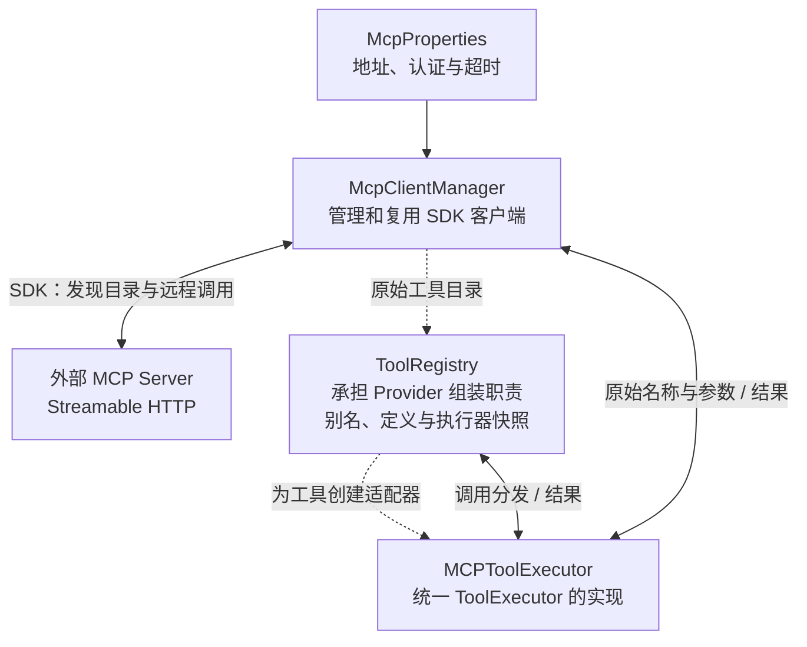

# ShadowRAG MCP 客户端集成：主流实现调研

> 调研日期：2026-10-03。范围：官方协议、官方 Java SDK、Spring AI、LangChain4j、OpenAI Agents SDK 的客户端工具接入。本文是设计调研，未添加业务实现，也未验证 Maven 依赖或连接真实天气服务。

## 1. 结论

原方案的核心链路成立：连接配置中的 MCP Server，发现工具，把工具定义和执行入口适配到现有 LLM 工具调用机制，再把实际结果送回模型。多个框架采用了这个结构。

`ToolExecutor + MCPToolExecutor` 有直接的框架实现参照：LangChain4j 的 `McpToolExecutor` 实现其统一 `ToolExecutor` 接口，内部转交给 MCP 客户端执行。这既是统一执行策略的一种实现，也承担远程 MCP 工具的适配职责。[LangChain4j 执行器源码](https://github.com/langchain4j/langchain4j/blob/main/langchain4j-mcp/src/main/java/dev/langchain4j/mcp/McpToolExecutor.java)。

需要调整的是组装职责和重复建设：Provider 负责获取目录、选择工具、创建执行适配器；SDK 负责协议与传输；应用负责模型请求、调用分发和结果消息。类名、注册表形状、启动发现还是按请求发现，由应用决定。

## 2. 官方协议规定了什么

MCP 的 Host 是 LLM 应用，Host 创建客户端，各客户端对应一个 Server。因此本项目是 Host，天气服务是 Server，应用内部的连接是 Client。服务器可以包含多个工具，工具不是服务器本身。[MCP 架构](https://modelcontextprotocol.io/specification/2026-07-28/architecture)。

Tools 功能提供 `tools/list` 与 `tools/call`，定义包括 name、description、inputSchema；结果可包含文本、结构化数据或其他内容，业务错误通过 isError 表示。协议不要求 Java 应用建立名为 ToolRegistry 的类，也不规定具体 LLM 供应商的函数调用消息格式。[Tools 规范](https://modelcontextprotocol.io/specification/2026-07-28/server/tools)。

标准传输包括 stdio 和 Streamable HTTP；普通 TCP 属于自定义传输。网上的天气服务应优先匹配其公开的 HTTP MCP 端点。本地 stdio 服务需要配置启动命令和参数，不能仅填一个网址。[传输规范](https://modelcontextprotocol.io/specification/2026-07-28/basic/transports)。

## 3. 框架对照

| 实现 | 客户端与工具组装 | 模型调用与执行 | 对 ShadowRAG 的意义 |
| --- | --- | --- | --- |
| 官方 Java SDK | McpClient / McpAsyncClient 提供协议操作 | 提供 listTools / callTool，不负责当前 DeepSeekClient 的聊天循环 | 适合围绕已有聊天代码添加薄适配层 |
| Spring AI | Client Starter 管理连接；ToolCallbackProvider 生成 MCP ToolCallback | Spring AI 工具执行机制调用 callback；完整 ChatClient 可以管理循环 | 可复用客户端模块，也可整体采用框架；二者改动范围不同 |
| LangChain4j | DefaultMcpClient + McpToolProvider | ToolSpecification 与 McpToolExecutor 进入统一工具机制 | 与原策略执行器方案结构非常接近 |
| OpenAI Agents SDK 客户端模式 | MCP Server 包装器提供 list_tools；MCPUtil 转换 FunctionTool | Runner 驱动模型轮次，通过包装器调用工具 | 另一语言的实现也分开处理协议接入与模型工具适配 |

来源：[Java SDK 客户端](https://java.sdk.modelcontextprotocol.io/latest/client/)，[Spring AI MCP 客户端](https://docs.spring.io/spring-ai/reference/1.1/api/mcp/mcp-client-boot-starter-docs.html)，[LangChain4j MCP](https://docs.langchain4j.dev/tutorials/mcp/)，[Agents SDK 转换源码](https://github.com/openai/openai-agents-python/blob/main/src/agents/mcp/util.py)。LangChain4j 和 Agents SDK 的 main 源码用于比较职责，不代表本文已验证某一发布版本可以直接加入项目。

### 3.1 Spring AI 的源码证据

`SyncMcpToolCallbackProvider.getToolCallbacks()` 向客户端获取工具，经筛选后创建 callback，并维护缓存及失效状态。这说明发现后的工具对象通常由 Provider 组装。[Provider 源码，v2.0.1](https://github.com/spring-projects/spring-ai/blob/v2.0.1/mcp/common/src/main/java/org/springframework/ai/mcp/SyncMcpToolCallbackProvider.java)。

`SyncMcpToolCallback` 将工具转换成模型定义，执行时使用原始 MCP 名称构造 CallToolRequest，交给客户端。错误处理策略可以抛异常，不能把所有框架描述为默认向模型返回同一种错误 JSON。[Callback 源码，v2.0.1](https://github.com/spring-projects/spring-ai/blob/v2.0.1/mcp/common/src/main/java/org/springframework/ai/mcp/SyncMcpToolCallback.java)。

### 3.2 LangChain4j 的源码证据

`McpToolProvider.provideTools()` 读取各客户端目录，过滤、映射名称，并以原始工具名构造 McpToolExecutor。其默认策略允许某个服务发现失败时继续提供其他服务工具。[Provider 源码](https://github.com/langchain4j/langchain4j/blob/main/langchain4j-mcp/src/main/java/dev/langchain4j/mcp/McpToolProvider.java)。

工具别名与原始名称应分别保存。比如模型看到 `mcp_weather_get_weather`，客户端实际调用 `get_weather`。这对应 Provider 的名称映射能力，适合处理多个服务的同名工具。工具发现不要求每种服务新增 WeatherTool 等专属类。

### 3.3 模型循环与托管模式

常见模型调用流程是：发送工具定义，模型返回调用请求，应用执行工具，追加结果，再请求模型；必要时继续循环。模型输出的名称和参数本身不会自动产生远程调用。[Spring AI 工具调用流程](https://docs.spring.io/spring-ai/reference/api/tools.html)。

OpenAI 的 HostedMCPTool 是另一种部署方式，由支持该能力的 Responses API 承担远程工具流程。它不能直接套在项目目前使用的通用 Chat Completions 接口上。[Agents SDK 客户端与托管模式](https://openai.github.io/openai-agents-python/mcp/)。

## 4. 修正原设计

| 原设计项 | 调研结论 | 修订 |
| --- | --- | --- |
| 配置服务地址、认证头和超时 | 常见配置方式 | 保留，声明认证与协议支持范围 |
| 每个服务有独立客户端 | 与官方架构一致 | 客户端在应用中复用，关闭时释放 |
| MCPToolExecutor 实现统一工具接口 | 有框架源码参照 | 保留通用执行器，不添加天气专属分发 |
| Manager 创建执行器，执行器自行注册 | 组装职责容易混杂 | Manager 提供原始目录，Provider / Registry 创建并收录适配器 |
| ToolRegistry | 可行的应用内结构 | 合并本地知识库工具与外部工具，保存模型别名和原始路由 |
| 手写完整分页循环 | 所选 SDK 已提供聚合 | 首版复用 SDK listTools，加总体发现超时 |
| 变更通知到来再自行 listTools | 所选 SDK 已经重新读取 | 消费 SDK 返回的完整目录，避免重复读取 |
| 所有连接失败都只能重启恢复 | 与 SDK 会话机制不符 | 区分启动失败与已建立会话失效 |
| 固定两次模型请求 | 简单工具可用，组合调用不足 | 使用有界循环，次数是本项目策略 |
| MCP 是把工具写入 Prompt | 不足以接入现有 MCP Server | 协议用 SDK，模型工具选择使用现有 Function Calling |

SDK 2.0.1 的无参 `listTools()` 自动聚合分页；通知处理器会再次获取目录再调用 consumer。它不等于应用自己的模型工具快照缓存。重复 cursor 的严格检测等额外保护应按需求补充，不能把 SDK 没有提供的保证写成已验证能力。[McpAsyncClient 源码，v2.0.1](https://github.com/modelcontextprotocol/java-sdk/blob/v2.0.1/mcp-core/src/main/java/io/modelcontextprotocol/client/McpAsyncClient.java)。

SDK 的 LifecycleInitializer 识别会话失效并触发重新初始化。应用不用重新实现会话协议；也应区分会话恢复、HTTP 续传和业务工具重试。首版不添加应用层 tools/call 自动重试。[LifecycleInitializer 源码，v2.0.1](https://github.com/modelcontextprotocol/java-sdk/blob/v2.0.1/mcp-core/src/main/java/io/modelcontextprotocol/client/LifecycleInitializer.java)。

## 5. 版本兼容是本次重要发现

### 5.1 MCP 规范与 SDK 不同步

调研时最新规范是 `2026-07-28`，采用请求携带版本与能力信息的无状态核心。旧版 `2025-11-25` 及更早版本使用 initialize。双版本实现可以兼容两者；只支持旧流程的客户端不能直接连接只支持新流程的服务。[官方兼容矩阵](https://modelcontextprotocol.io/specification/2026-07-28/basic/versioning)。

Java SDK 当前稳定 2.x 实现 2025-11-25，路线图将新协议支持放在 3.x；“选了最新稳定 SDK”不能推导出“支持最新协议的任何服务”。首版选 2.0.1 时，验收服务必须支持它可以协商的流程。[Java SDK 路线图](https://github.com/modelcontextprotocol/java-sdk/blob/main/ROADMAP.md)，[2.0.1 发布记录](https://github.com/modelcontextprotocol/java-sdk/releases/tag/v2.0.1)。

### 5.2 Spring AI 不要求整体迁移，但有版本边界

Spring AI 1.1 的官方支持范围包含 Boot 3.4.x 和 3.5.x；2.x 对应 Boot 4.0.x 和 4.1.x。项目是 Boot 3.4.2，若选择客户端 Starter，应按兼容的发布线选型。[1.1 支持范围](https://docs.spring.io/spring-ai/reference/1.1/getting-started.html)，[2.x 支持范围](https://docs.spring.io/spring-ai/reference/getting-started.html)。

Starter 可以只创建 MCP 客户端和 ToolCallbackProvider，应用取出工具定义并调用 callback。因此“采用 Spring AI 必须整体迁移模型接口”不准确。基于其公开 API 推断，可以保留当前 LLM 客户端并添加桥接；这样仍需改造动态工具列表、流式调用解析及聊天循环，不会自动改好已有 ChatHandler。

### 5.3 本项目依赖尚未验证

项目显式固定 jackson-databind 2.15.2。SDK 2.0.1 的 mcp 聚合模块默认带 Jackson 3，另有 Jackson 2 绑定可选。私有 mapper 只能隔离对象使用，不能消除共享依赖的版本冲突。[SDK 聚合模块 POM](https://github.com/modelcontextprotocol/java-sdk/blob/v2.0.1/mcp/pom.xml)，[SDK 父 POM](https://github.com/modelcontextprotocol/java-sdk/blob/v2.0.1/pom.xml)。

本文未运行依赖解析、编译、真实服务通信，因此尚未确定最终可用的依赖组合。实施前应验证选定 SDK、JSON 绑定、Spring Boot 与 Reactor，并锁定支持的服务版本。

## 6. 推荐落到 ShadowRAG 的结构

虚线表示工具组装，实线表示配置依赖或调用。聊天编排与 LLM 在图外：它读取 Registry 快照，把定义交给模型，再把模型请求交给 Registry 执行。

这里的 Provider 是职责名称。最小版可以把 MCP 工具的组装放在 ToolRegistry 中，后续服务和过滤规则增加时再拆出 McpToolProvider，不要求增加一个文件才能符合常见做法。

McpClientManager 只包装 SDK 的创建、原始目录和关闭；MCPToolExecutor 转换参数、调用指定工具并返回结果；ToolRegistry 管理统一工具视图和路由。原有 KnowledgeBaseToolExecutor 继续从后端用户上下文获取权限。

## 7. 最小可用的范围与实际改造点

第一版验证：配置一个兼容的 Streamable HTTP 天气 Server，启动发现其工具，模型按需调用并基于结果回答；更换另一个兼容服务只改配置。定义按启动发现结果缓存，配置修改以重启生效。可选名称过滤与通知刷新属于扩展。

当前项目真正需要处理的主要改造位于聊天链路：

- DeepSeekClient 目前只读取 tool_calls[0]，没有工具名称回调，需要按 index 重建多个调用的名称与参数。
- ChatHandler 的工具定义和执行固定为知识库搜索，需要读取动态定义并按名称定位执行器。
- 当前工具执行后的第二次请求不带工具，组合调用需要有界模型循环。
- Prompt 当前统一限制工具只能读取知识库，需要把这条限制收窄到知识库工具。
- 工具定义与多个结果要计入上下文预算，调用与结果 ID 要正确配对。

客户端生命周期、缓存、名称映射、故障隔离都属于常见工程措施。默认 3 轮、6 次调用、10 秒超时、20000 字符等是本项目的初始取值，不是 MCP 标准或统一行业默认。

详细支持范围和验收标准见[修订设计](../superpowers/specs/2026-10-03-mcp-client-integration-design.md)。
