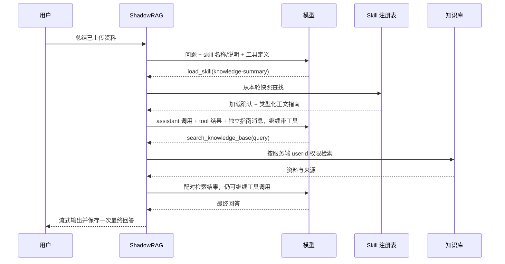

# ShadowRAG Skill 配置与加载：PaiCLI 源码对照与接入建议

日期：2026-10-03。状态：源码调研与方案建议，尚未实现。

用户目标：参考 `E:/Curzsu/paicli-main/paicli-main` 的实际实现，让 ShadowRAG 能配置和加载 skill。用户已选择首版入口为**后端配置文件 + SKILL.md 目录**。本文的配置、类名和接口均为建议，当前项目尚不识别这些配置。

## 1. 推荐结论

采用 PaiCLI 的核心机制：**目录发现 → 名称与说明索引 → 模型按需调用 load_skill → 同一用户轮内注入正文 → 继续模型与工具调用**。

Skill 提供任务方法、输出格式和操作指引；知识库提供事实证据；Java 或 MCP 工具执行实际操作。Skill 的加载不能自动新增浏览器、命令执行或外部服务能力。

ShadowRAG 先建立通用工具注册与有界 Agent Loop，再把知识库搜索、skill 加载、参考文件读取放进去。仓库已有的 [MCP 客户端设计](E:/Curzsu/ShadowRAG/docs/superpowers/specs/2026-10-03-mcp-client-integration-design.md:88) 也需要这套基础设施，但**目前仍是设计文档，相关运行时代码尚不存在**。实现 skill 不必等待 MCP 客户端上线，也不要各做一套循环。

| 选择 | 取舍 |
| --- | --- |
| 索引 + 按需加载，推荐 | 通常只发送名称和 description；需要时展开正文，便于以后与 MCP 共用运行时 |
| 所有正文直接拼入 system | 改动较少，但每次请求都消耗全部正文上下文，难以控制多个 skill 的使用范围 |
| 数据库 + 管理页面 | 适合后续在线编辑和权限管理；当前用户已选择文件配置，首版无需加入 |

## 2. PaiCLI 当前源码如何实现

以下结论以源码为准。`docs/phase-15-skill-system.md` 中的旧 `SkillContextBuffer`、等待下一条用户消息等描述，与当前实际实现不同。

| 环节 | 实际行为 | 源码 |
| --- | --- | --- |
| 初始化 | 解压内置资源、创建状态存储和注册表、执行 reload、注入工具与 Agent | [Main.java:322](E:/Curzsu/paicli-main/paicli-main/src/main/java/com/paicli/cli/Main.java:322) |
| Skill 模型 | 保存 name、description、version、author、tags、source、body 和参考目录 | [Skill.java:14](E:/Curzsu/paicli-main/paicli-main/src/main/java/com/paicli/skill/Skill.java:14) |
| 三层发现 | 内置缓存 < 操作系统用户目录 < 项目目录，后者整体覆盖同名 skill | [SkillRegistry.java:41](E:/Curzsu/paicli-main/paicli-main/src/main/java/com/paicli/skill/SkillRegistry.java:41) |
| Frontmatter | 自写 YAML 子集解析；支持单行、`|` 块字符串、行内数组；缺 name 回退目录名 | [SkillFrontmatterParser.java:31](E:/Curzsu/paicli-main/paicli-main/src/main/java/com/paicli/skill/SkillFrontmatterParser.java:31) |
| 启停 | 默认全部启用；`~/.paicli/skills.json` 只持久化 disabled 名称 | [SkillStateStore.java:33](E:/Curzsu/paicli-main/paicli-main/src/main/java/com/paicli/skill/SkillStateStore.java:33) |
| 模型索引 | name + description，最多 20 个；说明最多 500 code point；总段按 Java 字符长度裁剪 | [SkillIndexFormatter.java:17](E:/Curzsu/paicli-main/paicli-main/src/main/java/com/paicli/skill/SkillIndexFormatter.java:17) |
| 加载工具 | `load_skill(name)` 检查是否存在及是否禁用，只返回加载确认 | [ToolRegistry.java:816](E:/Curzsu/paicli-main/paicli-main/src/main/java/com/paicli/tool/ToolRegistry.java:816) |
| 正文注入 | 从本批成功加载结果生成独立 user 消息，追加在 tool 结果后；每份正文最多 5120 个 Java 字符 | [LoadedSkillMessages.java:33](E:/Curzsu/paicli-main/paicli-main/src/main/java/com/paicli/tool/LoadedSkillMessages.java:33) |
| 注入时机 | 本次用户任务内，下一次模型请求前完成注入；ReAct、Plan、Team 均接入 | [Agent.java:283](E:/Curzsu/paicli-main/paicli-main/src/main/java/com/paicli/agent/Agent.java:283) |
| 内置参考文件 | 通过明确文件清单从 jar 解压到版本缓存 | [SkillBuiltinExtractor.java:23](E:/Curzsu/paicli-main/paicli-main/src/main/java/com/paicli/skill/SkillBuiltinExtractor.java:23) |
| 同轮测试 | 验证首个请求无正文，加载后的第二个请求包含正文，且正文紧跟 tool 结果 | [LoadSkillSameTurnTest.java:91](E:/Curzsu/paicli-main/paicli-main/src/test/java/com/paicli/agent/LoadSkillSameTurnTest.java:91) |

两个值得保留的实现细节：

- “按需加载”主要指模型上下文的按需展开。PaiCLI 的注册表在扫描时已经读取并保存 body，并非 load_skill 时才首次读文件。
- 正文由 `LoadedSkillMessages` 根据本批执行结果生成，没有所有任务共用的正文缓冲区。不能按旧设计另建全局 buffer。

两个不宜直接照抄的细节：

- `MAX_INDEX_BYTES` 实际以 `String.length()` 限制字符，并不是 UTF-8 字节；正文也按字符裁剪。ShadowRAG 已有 TokenEstimator，应直接按模型上下文预算控制。
- 自写解析器未完整支持常见 YAML 写法，例如 folded block `>`。配置加载器应明确支持 `|`、`>`、引号和列表，并限制类型；不要声称任意现成 skill 都可无差异兼容。

## 3. ShadowRAG 必须先补齐的接入点

| 当前代码 | 对 skill 的影响 | 建议改动 |
| --- | --- | --- |
| [ChatHandler.java:52](E:/Curzsu/ShadowRAG/src/main/java/com/yizhaoqi/smartpai/service/ChatHandler.java:52) 只有固定 SEARCH_TOOL | 模型看不到 load_skill | 从 ToolRegistry 获取本轮工具定义 |
| [DeepSeekClient.java:240](E:/Curzsu/ShadowRAG/src/main/java/com/yizhaoqi/smartpai/client/DeepSeekClient.java:240) 只处理 tool_calls[0]，不传 name/index | 无法区分搜索、skill、参考文件；多个调用会串参数 | 返回包含 index、id、name、arguments 分片的流事件，按 index 累积 |
| [ChatHandler.java:221](E:/Curzsu/ShadowRAG/src/main/java/com/yizhaoqi/smartpai/service/ChatHandler.java:221) 将工具调用固定解释为搜索 | load_skill 参数会误入知识库检索 | 按精确工具名分发；非法参数和未知工具返回配对错误 |
| [ChatHandler.java:255](E:/Curzsu/ShadowRAG/src/main/java/com/yizhaoqi/smartpai/service/ChatHandler.java:255) 第二次请求不带工具 | load_skill 后无法继续读取参考文件或搜索知识库 | 改为有上限的多轮 Agent Loop |
| [ChatHandler.java:168](E:/Curzsu/ShadowRAG/src/main/java/com/yizhaoqi/smartpai/service/ChatHandler.java:168) 构建消息与固定工具预算 | 缺少 skill 索引和动态定义预算 | 基于同一运行时快照生成索引与 tools |
| [ContextBudgetService.java:44](E:/Curzsu/ShadowRAG/src/main/java/com/yizhaoqi/smartpai/service/ContextBudgetService.java:44) 按固定尾部消息数保护，仅裁剪最后一个 tool | 多轮时可能删掉当前问题、skill 正文或拆散调用配对 | 保护完整当前用户轮；优先删除旧历史单元，结构化裁剪工具数据 |
| [ChatHandler.java:379](E:/Curzsu/ShadowRAG/src/main/java/com/yizhaoqi/smartpai/service/ChatHandler.java:379) 只持久化用户与最终助手文本 | 不能承诺一次加载后永久存在于整个会话 | 首版每个用户轮独立加载，不把指南伪装成用户原话写入聊天历史 |
| [application.yml:142](E:/Curzsu/ShadowRAG/src/main/resources/application.yml:142) 通用问题被要求“不调用工具” | 写作、总结等 skill 可能被错误禁止 | 限制只针对 search_knowledge_base；skill 是否使用由说明与当前任务决定 |
| [ChatHandler.java:459](E:/Curzsu/ShadowRAG/src/main/java/com/yizhaoqi/smartpai/service/ChatHandler.java:459) 停止只控制输出标志 | 用户停止后仍可能继续加载、搜索及请求模型 | 返回可取消的响应流；停止和断开时取消当前订阅 |

## 4. 首版建议配置与 Skill 格式

下面是**待实现的配置形状**。默认 `skills.enabled=false`；启用、禁用及目录变更均重启生效。

```yaml
skills:
  enabled: true
  builtin-enabled: true
  directories:
    - ./skills
    # 可追加管理员维护的其他目录，越靠后优先级越高
  disabled:
    - experimental-report
  max-index-tokens: 1500
  max-body-tokens: 3000

ai:
  agent:
    max-tool-rounds: 4
    max-tool-calls: 8
```

- 顺序为 classpath 内置 < directories[0] < directories[1]……；同名覆盖整份 skill 及其参考资源，不混用不同来源文件。
- 相对目录基于应用启动工作目录解析，并在启动日志中输出实际目录；Docker 部署用挂载目录的绝对路径。
- 目录来自管理员配置，首版作用于该应用实例的聊天用户。PaiCLI 的 USER 是操作系统用户目录，不应直接当作 ShadowRAG 的登录用户作用域。
- disabled 是配置的唯一启停来源，无管理页面时无需另建 skills.json 或数据库状态，避免多个来源冲突。
- 配置字段无效时明确报错；个别 SKILL.md 解析失败时跳过并记录诊断。启用但指定目录不存在时记录警告，其他有效 skill 和知识库仍可用。

目录结构：

```text
skills/
  knowledge-summary/
    SKILL.md
    references/
      output-template.md
```

一个可用来验证加载链路的 skill：

```markdown
---
name: knowledge-summary
description: 当用户要求总结或比较已上传文档、知识库资料，并需要来源引用时使用。
version: "1.0.0"
---

# 知识库资料总结

1. 明确用户指定的资料和总结范围；缺少必要信息时先澄清。
2. 使用 search_knowledge_base 获取资料，依据结果整理结论，不补造事实。
3. 需要输出模板时，使用 read_skill_reference 读取 references/output-template.md。
4. 按“主要结论、支持证据、未覆盖的信息”组织回答，并保留文件来源。
```

`name` 和 `description` 必填，name 使用小写字母、数字及连字符且与目录名一致；version、author、tags 可选。未知元数据不赋予任何权限。首版支持正文及 references 下的 UTF-8 文本，不执行 scripts，不自动安装依赖，也不自动连接 SKILL.md 提到的外部服务。

## 5. 运行时职责与调用流程

新增代码建议统一放在 `src/main/java/com/yizhaoqi/smartpai/`：

| 位置 | 职责 |
| --- | --- |
| `config/SkillProperties.java` | 绑定目录、启停、索引与正文预算，校验配置 |
| `config/AgentProperties.java` | 绑定通用工具轮数与调用额度；skill 和后续 MCP 共用 |
| `skill/Skill.java` | 不可变元数据、来源、正文及参考资源 |
| `skill/SkillFrontmatterParser.java` | 分离 frontmatter 和正文，校验有限元数据类型 |
| `skill/SkillRegistry.java` | 启动扫描、分层覆盖、禁用过滤，发布含正文和参考文本的不可变快照 |
| `skill/SkillIndexFormatter.java` | 渲染预算内的完整索引条目，不切半个名称或说明 |
| `skill/SkillGuidance.java` | 服务端类型化的正文/参考指南附加项，不从任意工具返回文本推断 |
| `tool/LoadSkillToolExecutor.java` | 精确名称查找、参数校验、返回加载确认及指南附加项 |
| `tool/ReadSkillReferenceToolExecutor.java` | 读取当前已加载 skill 的参考文件 |
| `tool/ToolExecutor.java`、`ToolRegistry.java`、`ToolCallAccumulator.java` | 通用定义、执行映射及流式调用重建；与 MCP 设计共用 |
| `tool/KnowledgeBaseToolExecutor.java` | 封装现有带权限的知识库检索 |
| `service/AgentLoopService.java` | 编排模型请求、工具执行、指南注入、上限及取消 |

内置 skill 使用 classpath 的明确文件清单读取，开发目录与打包 jar 都走同一资源抽象；首版无需为 CLI 的通用 read_file 而解压到操作系统用户缓存。外部 skill 使用受配置目录约束的文件资源。只有存在内置示例资源时才发布对应 skill，不生成空的占位项。

工具参数：

```text
load_skill({ "name": "knowledge-summary" })
read_skill_reference({ "name": "knowledge-summary", "path": "references/output-template.md" })
search_knowledge_base({ "query": "用户指定的文档主题" })
```

参考文件工具只允许当前轮已加载的 skill，路径必须位于它的 references 目录；拒绝绝对路径、`..`、非文本资源及解析后跳出该目录的链接。内置资源按明确清单查找。参数不能指定 userId 或任意服务端文件。



每个用户轮获取一个不可变运行时快照，索引、加载和参考资源都使用该快照。参考文本在启动时按文件大小及数量上限校验后读入快照，运行时只按名称查找，文件更新也需要重启；读取失败的参考项保留不可用诊断。共享服务只保存配置和只读注册表；messages、已加载名称、指南和额度保存在请求内。

通用工具执行返回结构需要增加可选的 `List<SkillGuidance>`，普通知识库和 MCP 执行器始终留空。仅受控的 skill 执行器创建该附加项，不根据 payload 内的字段名判断是否是指南。

每批工具按 index 顺序执行，成功加载后立即更新当前轮的已加载集合。消息先追加一个包含全部 tool_calls 的 assistant 消息，再为所有调用追加匹配的 tool 结果，最后追加本批成功加载的指南 user 消息。system 固定规则要求指南服从 system 和用户原始要求；正文来自管理员配置的 skill，不能从知识库、网页或普通 MCP 返回文本中冒充。

同一个 skill 在当前用户轮只追加一次正文。下一个用户轮重新按需加载，因为当前历史存储不保留工具和指南。去重记录必须与正文是否仍在有效上下文一致，不能正文已丢失却仍返回“已加载”。参考文件只读其预算内的完整文本，并沿同样的类型化指南通路注入；普通工具数据保持数据角色，不通过结果里的字符串提升为指南。

采用 4 轮、8 次工具调用作为首版建议上限，可以覆盖“加载 → 参考文件 → 检索 → 补充检索”。skill 及参考文件读取也计入额度。达到上限后为超额调用返回配对错误，并用已有信息发起一次不带工具的最终回答；工具失败不回退成搜索或虚构成功。

## 6. 上下文、权限与错误处理

- 使用现有 [TokenEstimator](E:/Curzsu/ShadowRAG/src/main/java/com/yizhaoqi/smartpai/service/TokenEstimator.java:24) 估算索引、正文、参考文本、动态工具定义及输出预留，并沿用安全余量。这仍是近似预算。
- 索引放入现有 system 的受控索引区；仅包含元数据，不预先塞入所有正文。必须保留索引中的加载规则，超出索引预算的整条 skill 记录省略并提供诊断。
- 正文超过 max-body-tokens 时明确返回 skill_body_too_large，要求管理员拆分到参考文件；首版不静默裁掉关键指令。参考文本也用该上限和文件读取大小上限检查。
- 保护完整当前用户轮及调用配对；优先裁剪旧历史和工具数据。仍不满足上下文预算时明确终止，不能丢掉指南后继续宣称已按指南执行。
- search_knowledge_base 继续使用后端 userId 调用 searchWithPermission。Skill 中写“读取所有用户资料”也不能改变执行器的权限范围。
- 停止和断开时取消订阅，不继续启动后续模型或工具请求；文件读取与本地检索放在允许阻塞的工作线程。
- 错误包含 invalid_arguments、unknown_tool、skill_not_found、skill_disabled、skill_body_too_large、invalid_reference_path、reference_not_found、context_budget_exceeded、call_limit_exceeded。日志保留 skill 名称、来源、状态及耗时，不复制整份资料正文。

原有两阶段流程限制了检索结果驱动后续工具调用；引入多轮后，这一约束会改变。因此首版注册的新增工具保持只读、资源范围固定，后续 MCP 权限独立控制，不能认为 skill 的指引替代服务端授权。

## 7. 实施顺序与验收

1. **通用调用层**：提取知识库执行器和 ToolRegistry，修正 name/index 分片解析，加入有界循环及取消。仅搜索时回归原有行为。
2. **配置与目录加载**：完成 SkillProperties、解析、优先级及禁用过滤；验证内置资源在打包 jar 中可读。
3. **按需上下文**：接入索引、load_skill、类型化指南和预算，证明同轮生效。
4. **参考文件**：接入受限的 read_skill_reference，提供 knowledge-summary 示例和配置说明。

| 验收场景 | 必须证明的行为 |
| --- | --- |
| 总开关关闭 | 不扫描外部目录、不发送 skill 索引及加载工具；原有聊天与知识库行为正常 |
| 配置目录并重启 | 无需改 Java 即发现新的 SKILL.md，日志展示来源及启用状态 |
| 同名覆盖和禁用 | 后配置目录完整覆盖；被禁用项既不出现在索引，也无法通过工具加载 |
| 按需展开 | 首次模型请求只含索引；load_skill 后同一用户轮的下一次请求包含正文 |
| 连续调用 | 模拟模型依次加载、读参考、搜索、回答，验证每次请求和调用配对，而非只断言格式化字符串 |
| 多个交错分片 | 不同 index 的名称和参数独立重建；失败调用也有对应结果 |
| 用户并发 | A 用户加载的正文不出现在 B 的请求；服务端权限身份不由模型参数覆盖 |
| 下一轮与会话重建 | 当前轮去重有效；下一轮和 Redis 历史重建后可再次加载，正文不缺失 |
| 预算与取消 | 超长正文明确失败，多轮调用配对保留；停止后不发起后续请求；完成和历史保存只发生一次 |
| 文件边界 | 非法路径、目录外链接、未加载 skill、缺失或非文本参考文件被拒绝 |
| 真实模型行为 | 对固定问题核对模型是否选择 load_skill 并遵循指引；模拟调用链测试不能代替这项验收 |

本次仅进行源码与已有文档核对，没有修改生产代码，没有执行测试或调用真实模型。推荐先完成这条文件配置的加载链路，再接入 MCP 或管理页面。
