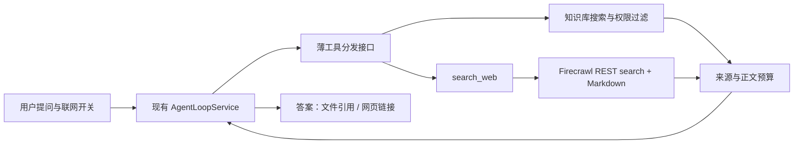

# Firecrawl 联网搜索调研与 ShadowRAG 接入 ROI

> 引用说明：源码行号保留调研时的位置；本仓库链接已改为相对路径，外部参考仓库的本机路径仅作为文字定位记录，不代表可共享入口。

日期：2026-10-06。范围：官方文档、官方 MCP 仓库、ShadowRAG 当前源码，以及公开端点的免密钥探测。本文给出工程建议，没有实现联网功能，也没有测得成功搜索的质量、P50/P95 延迟或付费账户吞吐。

## 推荐结论

**以当前代码为基准，先通过 REST API 封装一个本地 `search_web` 工具，加入现有 AgentLoopService，短期 ROI 最高。** 抽出很薄的工具定义与执行接口，使知识库搜索和联网搜索共用分发、预算和进度逻辑。等通用 MCP 客户端真正落地，或多个外部服务成为明确需求，再增加 MCP 执行器。

如果近期确定要同时接天气、数据库、业务系统等多个 MCP 服务，则可以改变顺序：先完成已有 MCP 客户端设计，再把 Firecrawl 作为首个或第二个接入对象。此时共享基础设施的长期收益可能超过 REST 的短期优势。这个判断来自项目当前状态与改造范围，未使用真实开发工时量化。

CLI 适合开发者试用、调试和批量导入脚本；不建议作为 Java 在线聊天的执行后端。自托管 Firecrawl 首版也不优先。

## 1. Firecrawl 提供什么

| 能力 | 对 ShadowRAG 的用途 |
| --- | --- |
| `POST /v2/search` 返回标题、URL、描述；可通过 `scrapeOptions` 同时获取 Markdown 正文 | 补充最新信息与知识库没有覆盖的公开资料 |
| `POST /v2/scrape` 读取给定 URL | 用户贴链接、或搜索后选择少量页面深入阅读 |
| `web`、`news`、`images` 来源，域名过滤、时间过滤、地区参数 | 优先官方来源，约束时效和主题；首版只需 web |

搜索加正文是它对 RAG 的主要价值。取得正文也不代表事实可靠，仍需选择来源和校验引用。以上能力见 [Search 功能说明](https://docs.firecrawl.dev/features/search) 与 [Search API 契约](https://docs.firecrawl.dev/api-reference/endpoint/search)。

官方也提供 Java SDK：文档当前列出 `com.firecrawl:firecrawl-java:1.1.1`，要求 Java 11+，支持 search 和 scrape。它是可行候选；仅做一两个端点时，直接 HTTP 更便于对接本项目已有取消和总期限机制。没有验证 SDK 的依赖解析或请求取消能力，不能据此断言 SDK 不兼容。[Java SDK 文档](https://docs.firecrawl.dev/sdks/java)

## 2. 当前项目的真实接入成本

仓库里的旧设计文档不能当作已完成实现。2026-10-03 的 MCP 设计明确标注“尚未实现”，其中部分聊天流程描述也已落后于现在的 ReAct 代码。

| 当前事实 | 已核对位置 | 对接入的影响 |
| --- | --- | --- |
| 多轮模型/工具循环已有，模型客户端能接收工具定义列表 | [AgentLoopService](../../src/main/java/com/yizhaoqi/smartpai/service/AgentLoopService.java#L54) | 无需为了 Firecrawl 更换 LLM 框架 |
| 工具定义与执行仍固定为知识库工具 | [AgentLoopService](../../src/main/java/com/yizhaoqi/smartpai/service/AgentLoopService.java#L81) | REST、MCP 都需要改成按工具名分发；MCP 不能省掉这部分 |
| 重复调用归一化使用知识库 query 解析器，进度事件也固定知识库工具名 | [AgentLoopService](../../src/main/java/com/yizhaoqi/smartpai/service/AgentLoopService.java#L91) | 必须同步泛化，不能只添加一个 HTTP 客户端 |
| 默认 3 轮工具、6 次调用，结果上限 16384 字符，收尾预留 10 秒 | [配置](../../src/main/resources/application.yml#L177) | 可以复用，但联网需要额外的搜索次数、费用和时间边界 |
| 请求资源支持挂接 HTTP future 和响应流，停止时取消并关闭 | [ChatGenerationResources](../../src/main/java/com/yizhaoqi/smartpai/service/chat/ChatGenerationResources.java#L38) | 新 HTTP 工具应接入相同生命周期；本地取消不承诺撤销供应商执行或费用 |
| 预算器只对 `[来源索引]` 首行做特殊保留 | [ContextBudgetService](../../src/main/java/com/yizhaoqi/smartpai/service/ContextBudgetService.java#L100) | 网页来源 URL 要放入受保护的来源清单，正文裁剪与来源状态一起处理 |
| 提示词要求事实问题先查知识库，并使用文件引用 | [application.yml](../../src/main/resources/application.yml#L149) | 需新增公开资料与最新信息的联网规则 |
| 前端将 `(来源#编号: 名称)` 解释为内部文件 | [chat-message.vue](../../frontend/src/views/chat/modules/chat-message.vue#L23) | 网页应使用独立的 Markdown 链接，不能把网页标题伪装成文件引用 |
| MCP 仅有待实施设计，未发现客户端源码或 Maven 依赖 | [MCP 设计](../superpowers/specs/2026-10-03-mcp-client-integration-design.md#L5) | 选择 MCP 需要计入协议客户端、发现、生命周期和适配成本 |

已有前端未提交改动，本次仅阅读，没有修改这些文件。

## 3. 接入方式比较

以下为相对成本判断，不是实测得分或工期承诺。

| 方式 | 额外建设 | 运行与维护成本 | 适用场景 | 当前建议 |
| --- | --- | --- | --- | --- |
| REST API + 本地 Function Calling 工具 | 薄 HTTP 客户端、工具分发、网页来源封装 | 易控制超时、返回体、费用与取消；需维护少量 API 映射 | 当前只增加联网搜索 | **首选** |
| 官方 Java SDK + 本地工具 | SDK 依赖验证和生命周期适配，其余同 REST | 少写请求映射；需确认取消、超时、依赖与字段覆盖 | 后续使用较多 Firecrawl 端点 | 可行备选 |
| 官方远程 MCP | 通用 MCP 客户端、工具发现和筛选、名称映射、生命周期；另需聊天适配 | 多一层服务链路与协议维护；完成后便于接多个服务 | 近期有明确的多服务计划 | 条件性首选 |
| 本地 stdio MCP / HTTP sidecar | 上述 MCP 基础设施，再增加 Node 进程或容器管理 | 增加部署与进程故障面 | 不方便连接官方远程 MCP、需要本地代理 | 首版不优先 |
| CLI 子进程 | Node/CLI 部署、进程管理、输出解析、认证环境、取消传播 | 在线请求要管理子进程和 CLI 版本；聊天仍需定义工具 | 调试、离线抓取、批量导入 | 不用于在线聊天 |
| 自托管 Firecrawl API | 爬取服务栈、存储与队列、配置、监控、升级 | 不等于免费搜索；需计入基础设施和可选供应商成本 | 明确的基础设施控制需求或高规模长期任务 | 后续按需求评估 |

CLI 支持 `search`、`--scrape` 和 JSON 输出，但它仍调用 Firecrawl 服务，不会因为采用 CLI 就免掉服务费用。[CLI 文档](https://docs.firecrawl.dev/sdks/cli)

官方自托管包含核心 API，但 Cloud 的部分能力不在默认栈里，持久化、认证、可用性、升级也由使用者负责。若评估自托管搜索，应进一步核对选定版本的搜索后端，而不能只看路由存在。[自托管说明](https://docs.firecrawl.dev/contributing/self-host)、[开源与 Cloud 对比](https://docs.firecrawl.dev/contributing/open-source-or-cloud)

## 4. MCP 的实际能力与容易误判的地方

官方全功能远程地址是 `https://mcp.firecrawl.dev/v2/mcp`，API Key 放在 `Authorization: Bearer ...` 请求头。免密钥模式公开 search、scrape、parse 三个工具。已认证的完整工具目录更大，接入时应筛选工具，避免把抓取、浏览器操作、文件解析等全部交给聊天模型。[官方 MCP 仓库](https://github.com/firecrawl/firecrawl-mcp-server)

另一个 `https://mcp.firecrawl.dev/v2/mcp-search` 端点要求认证，且它的 `firecrawl_search` 不接受 `scrapeOptions`。若要正文，需要另行调用该端点提供的 `firecrawl_scrape`。检索摘要与网页正文应明确区分。[search-profile 契约](https://github.com/firecrawl/firecrawl-mcp-server/blob/main/docs/search-profile.md)

如果最终选 MCP，优先官方远程服务与静态 API Key，复用项目已有设计；首版不必加 Node sidecar 或 OAuth 登录页面。需新增工具筛选和参数/费用边界，不能仅透传全部工具。协议 SDK 版本仍需实际构建和联调，下面的握手探测不是 SDK 兼容性测试。

### 本机公开端点探测

查询仅包含 Spring Boot 公共文档，没有使用私有资料、API Key 或付费账户。

| 探测 | 观测结果 | 能得出的结论 |
| --- | --- | --- |
| 免密钥 REST `/v2/search` | HTTP 403，错误说明当前 IP 不允许匿名访问 | 匿名 REST 在本次出口不可用；不是 API Key 调用结果 |
| MCP initialize，声明 `2025-11-25` | HTTP 200，返回同一协议版本 | 远程服务本次支持此初始化流程 |
| `notifications/initialized` 与 `tools/list` | 202 / 200；发现 search、scrape、parse | 握手与目录读取成功 |
| MCP search + Markdown | HTTP 200，但 `result.isError=true`，说明匿名访问不可用 | MCP 也没有绕过匿名访问限制；HTTP 成功不等于工具成功 |

免密钥限额按 IP 管理，官方文档也建议获取 Key 以提高限额。[限流文档](https://docs.firecrawl.dev/rate-limits)

因此建议开发验证使用免费账户 API Key，生产使用服务端管理的 Key。本次没有注册账号或申请密钥。尚不能对中文召回、国内部署延迟和网页正文成功率作结论。

## 5. 推荐的最小接入范围

首版只向模型新增一个 `search_web(query)`，通过 `/v2/search` 同时获取少量页面正文；先得到完整的联网问答体验，再用真实指标决定是否拆出 `read_web_page(url)`。

建议改造点：

1. 保留 DeepSeekClient 和现有多轮循环，抽出工具定义、执行结果和按名分发接口。当前仅两个工具，一个不可变映射即可，无需先建设动态插件平台。
2. 新增 Firecrawl HTTP 客户端与 WebSearchTool。模型只生成查询，服务端固定或约束返回条数、抓取格式、解析器、超时和总预算；未知工具与无效参数返回配对错误。
3. 新增服务端默认关闭的联网配置与会话/请求开关。只有允许联网时才暴露工具；未开启时保持现有知识库流程。公开且有时效要求的问题可直接联网，内部人物与业务资料继续优先知识库，不把知识库未命中自动作为对外发送查询的授权。
4. 返回 `sourceType=web`、稳定来源 ID、title、url、检索时间、正文是否完整等信息。工具结果先保留来源清单再裁剪正文。最终答案使用 `[标题](URL)`，文件引用沿用现有格式；避免截断后仅剩 URL 却声称已读取全文。
5. 泛化重复调用计算和 tool_progress，前端按工具名显示“搜索知识库 / 联网搜索”；复用现有 SSE 与聊天历史。网页文本按非可信证据处理，不可驱动提权或把内部材料当查询发出。
6. 请求、响应流接入 ChatGenerationResources；工具期限取配置上限和剩余总期限扣除收尾预留中的较小值。429、鉴权失败、空结果或正文抓取失败要明确返回，不能把错误消息包装为证据。

首版起点：`sources=[web]`、`limit=3`、`domainTools=false`、Markdown 主体正文、关闭不需要的 PDF 解析、每个回答最多 1–2 次联网搜索。调用期限与正文限额由部署验证调整。这些是候选默认值，不是已确认的最优参数。

不建议首版自动把网页入库并向量化。即时搜索首先用于当前问题的外部证据；长期保留某些网址时，再做明确的导入、更新与过期机制。否则会增加存储、向量化和版本管理成本，削弱知识库来源边界。

## 6. 费用与成本优化

普通搜索每 1–10 条结果按 2 credits 计费，基本网页抓取每页额外 1 credit；PDF 解析按页，JSON 提取还有额外费用。[Search 计费说明](https://docs.firecrawl.dev/features/search)

假设每个页面基本抓取成功、没有 PDF/额外格式，也没有反馈返还或缓存优惠：

| 一个回答的联网操作 | 理论 credits |
| --- | ---: |
| 搜索 3 或 5 条，只读摘要 | 2 |
| 搜索并抓取 3 个普通网页 | 5 |
| 搜索 5 条，选择 1 个网页抓取 | 3 |
| 搜索 5 条，选择 2 个网页抓取 | 4 |
| 两次搜索，每次抓取 3 个普通网页 | 10 |

首版一体化搜索加抓取减少工具轮次与实现范围；后续“先搜索、后选择 1–2 页”可能降低抓取和上下文费用，但也可能增加模型轮次与等待时间。两种策略应按每个有效回答的总成本比较，而不只比较 credits。

截至调研日，官方价格页显示免费账户每月 1000 credits，Hobby 每月 5000 credits，月付 $19、年付折合 $16/月。若每答消耗 5 credits，理论约为 200 / 1000 个联网回答；这只是用量估算，不含模型费用、重试、其它端点和套餐闲置。[价格页](https://www.firecrawl.dev/pricing)

真正影响 ROI 的通常是联网触发频率、页面数、正文长度、额外 LLM 轮次和失败率。REST、SDK、MCP、CLI 并不会因协议不同自动改变同一底层操作的基础费率。不要为了减少工具定义代码，失去对参数和用量的控制。

## 7. 上线前用小规模评测决定是否继续投入

建议固定 30 个真实问题，分别覆盖内部知识库、中文公开资料、最新信息、知识库与外部资料对照、无有效来源等场景。比较“只用知识库”和“允许联网”，再比较一体化与选择性抓取。

记录：可由来源支持的答案比例、来源相关性与链接正确率、中文命中情况、端到端 P50/P95、每答 credits、输入 token、模型轮次、错误与429比例。另验收关闭联网零外部请求、停止及时释放资源、内部查询边界、工具错误不被当事实、知识库权限不退化。

先回答“新增联网是否解决了真实问题”，再考虑 MCP 的扩展收益。若下一阶段多个外部服务已确定，把薄工具接口接上 MCP；若仍只有 Firecrawl，一个受控 HTTP 适配器足以长期使用。
