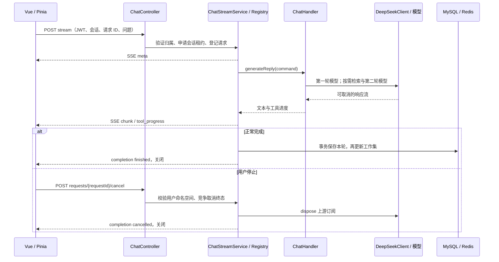

# WebSocket 改为 SSE：聊天链路重构方案

日期：2026-10-03。状态更新（2026-10-05）：任务 1–7 的实现、专项自动化与真实 Nginx 已有证据；本轮生产/开发/两份HTML浏览器、真实Gemini/Markdown/历史均已验证，A01–A36证据已记录；最后live后安全复扫/临时进程清理已通过，九个原全量错误及真实DB/Redis/ES未验边界保留。实际状态及环境边界见 [验收矩阵](../../eval/chat_stream/README.md)，历史阶段结果保留。

代码基线：`6cb1e866a503af568bb58d8913c73dfb8154243a`。实施清单见 [配套实施计划](../plans/2026-10-03-websocket-to-sse-refactor.md)。后续执行者应同时阅读两份文档。

## 1. 目标、范围与固定决策

将浏览器与后端之间的聊天 WebSocket 改为 **HTTP POST 返回 SSE**。保留当前 Spring MVC、JWT 登录、知识库权限过滤、两阶段 Agentic RAG、MySQL 原始消息、Redis 工作集和上下文压缩。迁移同时解决上游无法取消、会话串流和连接生命周期不清晰的问题。

本次采用以下固定决策；它们也是实施与验收的约束。

| 编号 | 决策 |
| --- | --- |
| D01 | 每次提问创建一条有限时长的 HTTP 流，完成后关闭；前端使用 `fetch` POST，后端使用 Spring MVC `SseEmitter`。 |
| D02 | 请求显式携带 `conversationId`、客户端生成的 UUID `requestId` 和 `message`；用户名只取已认证的 `Principal`。 |
| D03 | JWT 使用 `Authorization: Bearer ...`，请求 URL、SSE 数据和聊天日志均不得携带 token。 |
| D04 | 同一会话最多运行一个生成请求；同一用户的不同会话可并行。已结束请求 ID 保留 300000 ms，用于拒绝重复提交。 |
| D05 | 停止、生成超时、运行中的下游断线必须取消当前上游订阅，并阻止后续检索/第二轮模型调用。 |
| D06 | 完成、取消、失败和超时使用统一状态机；可写的连接只发送一次终止 `completion`，终止后不再发送内容事件。 |
| D07 | 成功完成后，先事务保存本轮 user/assistant，再发送 `completion(status=finished)`。运行中取消、失败、超时不保存本轮。 |
| D08 | SSE 事件带请求和会话标识；前端按这些标识定位消息，切换会话、注销或旧异步回调不能修改新会话。 |
| D09 | 中途断流不自动重放 POST、不自动重新生成；手动重试使用新 `requestId`。本次不提供事件回放和断点续传。 |
| D10 | 首版部署验收基线为当前单个后端实例、同源代理。本地注册表不支持多实例随机分发取消请求。 |
| D11 | 不新增数据库表、不升级 Java/Spring/Vue/Node、不改模型供应商协议、不扩展 MCP/多工具 Agent 功能。 |
| D12 | 使用有界工作池、事件缓冲和请求记录；保留可观测的结束原因，所有生命周期资源均可清理。 |

取消或失败的局部文本保留在当前页面，并显示相应状态；刷新或重新加载历史后不保证保留这轮局部文本。这是本次明确的产品行为，避免新增消息状态表和部分回答持久化机制。若连接在数据库提交阶段断开，已提交的完整回答仍可通过历史查询恢复，详见第 6 节。

## 2. 当前实现与迁移原因

| 代码位置 | 当前行为 | 本次处理 |
| --- | --- | --- |
| `frontend/src/store/modules/chat/index.ts:19` | store 创建时把 token 拼进 WebSocket URL，长期连接并自动重连。 | 改为每次发送时读取 token，建立一次 POST SSE。 |
| `frontend/src/views/chat/modules/input-box.vue:19` | chunk 直接追加到列表最后一条；停止先获取内部指令 token。 | 接收逻辑迁入 store/请求会话控制器；使用消息 ID 和请求 ID；删除内部 token 流程。 |
| `handler/ChatWebSocketHandler.java:35` | 保存用户到 socket 的本地映射，并记录包含 JWT 的路径。 | 移除处理器，用按用户/requestId 管理的请求注册表替代。 |
| `config/WebSocketConfig.java:20`、`config/SecurityConfig.java:49` | `/chat/{token}`，允许所有 Origin，WebSocket 路径放行。 | 删除握手入口及放行规则；SSE 与取消接口进入正常认证链。 |
| `service/ChatHandler.java:97` | 会话从用户全局 `current_conversation` 获取，业务直接操作 `WebSocketSession`。 | 使用显式会话，业务输出事件，不依赖网络连接类型。 |
| `service/ChatHandler.java:459` | 停止只屏蔽发送，两秒后删除标志，模型和保存流程继续运行。 | 取消真正的上游订阅，统一终态和清理。 |
| `client/DeepSeekClient.java:171` | 客户端内部 `subscribe()`，没有把可取消的句柄交给业务。 | 返回冷 `Flux`，由流服务统一订阅。 |
| `utils/JwtUtils.java:215`、`:234` | 过期宽限刷新和直接 refreshToken 没有验证撤销状态；token 缓存缓冲只有 5 分钟，宽限期是 10 分钟。 | 刷新也检查签名、签发记录与撤销状态，缓存期限覆盖原有宽限期。 |
| `service/ChatHandler.java:377` | 保存异常被吞掉；当前完成通知先于持久化。 | 区分 MySQL 提交失败与 Redis 更新失败，完成通知以 MySQL 成功为准。 |
| `docs/nginx.conf` | 配置 WebSocket Upgrade，普通 API 路径未针对流式输出关闭缓冲。 | 配置 SSE 专用 location、心跳和超时，移除聊天 Upgrade。 |

上表中的 Java 相对路径以 `src/main/java/com/yizhaoqi/smartpai/` 为前缀。遗留设计文档可保留历史描述；README、部署示例和可执行测试页必须更新。

### 备选方案

| 方案 | 优点 | 代价与结论 |
| --- | --- | --- |
| POST + fetch 读取 SSE（选定） | 请求体传问题，请求头传 JWT，一次请求对应一次生成。 | 需要 SSE 解析与生命周期管理；最贴合现有问答交互。 |
| POST 创建任务 + 原生 EventSource GET 订阅 | 浏览器提供 EventSource 连接管理。 | 增加任务/订阅两个阶段，原生 API 不能设置 Authorization；当前项目无需引入这一复杂度。 |
| 继续 WebSocket 并修复生命周期 | 可保留现有前端协议，适用于持续双向消息。 | 当前主要是单次问答；不会减少已有请求隔离、鉴权和取消问题的处理工作。 |

## 3. 目标结构与职责



职责划分：

- `ChatController`：HTTP 参数、认证身份、响应头、请求开始前的 HTTP 错误和取消接口。
- `ChatRequestRegistry` / `ChatRequestContext`：会话租约、重复请求、先到的取消标记、状态竞争、上游句柄、终态保留与清理。
- `ChatStreamService`：唯一的业务流订阅点，SSE 串行写入、心跳、计时、累积成功写出的文本、持久化完成流程。
- `ChatHandler`：显式会话下的现有 RAG 编排和完成消息持久化；不引用 WebSocket 或 SseEmitter。
- `DeepSeekClient`：供应商响应解析，返回冷 `Flux`；不持有浏览器连接，不执行内部 fire-and-forget 订阅。
- 前端 `chat-stream.ts`：POST、Authorization/New-Token、SSE 解码；`chat-session.ts`：请求身份与异步竞态；Pinia store：消息列表和视图操作。

保留现有搜索工具、prompt、权限过滤、预算和压缩规则。第一轮 content 必须到达即转发，不能等第一轮结束后再整体输出。两个模型阶段组成同一条可取消的响应链，禁止第二轮使用脱离外层生命周期的独立订阅。

## 4. HTTP 接口契约

### 4.1 提交并接收 SSE

`POST /api/v1/chat/stream`

请求头：`Authorization: Bearer ...`、`Content-Type: application/json`、`Accept: text/event-stream`。

```json
{
  "conversationId": "22222222-2222-4222-8222-222222222222",
  "requestId": "11111111-1111-4111-8111-111111111111",
  "message": "请根据知识库说明项目的部署流程"
}
```

- `conversationId` 必填，必须是已存在且属于当前用户的会话，不隐式创建或切换会话。
- `requestId` 必填，UUID 格式，唯一性范围为当前用户；在前端提交前生成。
- `message` 必填，拒绝纯空白，最大 16000 个 UTF-16 code unit；保留传入正文，不把 JSON 指令解析为聊天控制命令。
- 会话检查和请求登记在订阅模型之前完成，拒绝的请求不能调用模型或写历史。
- 用户名来自认证 Principal，沿用项目以 username 调用会话服务的约定；请求体不接受 `userId`/`username` 身份覆盖。

成功响应头：

```http
HTTP/1.1 200 OK
Content-Type: text/event-stream;charset=UTF-8
Cache-Control: no-cache, no-transform
X-Accel-Buffering: no
```

若 JWT 过滤器合法刷新 token，保留 `New-Token` 响应头，前端在读取 body 前更新认证状态。同源代理为默认配置；如果启用跨域部署，必须明确配置允许的前端 Origin、Authorization/Content-Type 请求头并暴露 New-Token，不使用通配符凭据策略。

合法刷新必须同时满足已验证签名、仍存在的有效 token 缓存记录、未撤销以及原有时间规则。`canRefreshExpiredToken()` 和 `refreshToken()` 都要检查缓存/黑名单，缓存检查失败拒绝认证；不能因解析到过期 claims 就重新签发。保持 access token 3600000 ms、预刷新阈值 300000 ms、过期宽限 600000 ms、refresh token 604800000 ms 的现有数值；access token 记录与用户 token 集合保留至 `exp + 600000 ms`，黑名单至少保留至同一时间，覆盖注销后进入宽限期的情况。此项是 SSE 鉴权验收的必要修正，不扩展登录协议或增加认证存储。

开始流之前的错误使用 HTTP 状态和 JSON，格式为：

```json
{
  "code": 409,
  "message": "当前会话正在生成回答",
  "data": { "errorCode": "CONVERSATION_BUSY" }
}
```

| HTTP 状态 | errorCode / 含义 |
| --- | --- |
| 400 | `INVALID_REQUEST`：缺字段、空白正文、正文超长、非法 UUID。 |
| 401 | `UNAUTHENTICATED`：无认证、伪造/已注销 token、过期且不满足现有合法刷新规则。 |
| 403 | `CONVERSATION_FORBIDDEN`：访问其他用户会话。 |
| 404 | `CONVERSATION_NOT_FOUND`：会话不存在或已删除。 |
| 409 | `CONVERSATION_BUSY`、`REQUEST_DUPLICATE`、`REQUEST_CANCELLED`。重复 ID 优先于同会话忙检查。 |
| 429 | `CHAT_CAPACITY_EXCEEDED`：活跃请求或保留记录到达上限。 |
| 500 | `CHAT_START_FAILED`：开始前的内部错误；响应不包含堆栈或内部凭据。 |

HTTP 200 已提交后，业务失败通过 SSE `error` 和终止 `completion` 表达，不能再把整个响应改成 JSON 或假装改变 HTTP 状态。

### 4.2 取消请求

`POST /api/v1/chat/requests/{requestId}/cancel`，使用同样的 Authorization；不需要内部指令 token，不接收问题正文。

```json
{
  "code": 200,
  "message": "请求状态已确认",
  "data": {
    "requestId": "11111111-1111-4111-8111-111111111111",
    "status": "cancelled"
  }
}
```

- `running`/已登记未订阅：竞争取消成功后，状态为 `cancelled`，销毁上游句柄，尽力通知 SSE，然后关闭。
- 已经 `completing`：返回 `completing`，不撤销正在提交的事务；前端继续等待这条流的最终结果。
- 已终止：返回实际状态 `finished`/`cancelled`/`failed`/`timed_out`，不重复通知、不重复取消或保存。
- **取消先于开始到达**：在当前用户命名空间写入取消标记，返回 `cancelled`；300000 ms 内相同 ID 的开始请求返回 409 `REQUEST_CANCELLED`，且不会启动模型。
- 未找到 ID 与上述先到取消使用同一行为；其他用户的同名 ID 也只会产生当前用户自己的标记，不能查到或修改对方任务。这样取消幂等，且不泄漏请求归属。
- 非 UUID 返回 400；无法通过认证返回 401；记录容量耗尽返回 429。注册表清理后不承诺旧 ID 的结果查询或去重。

## 5. SSE 事件契约

事件以空行结束。`event` 为类型，`id` 为本次请求内的 seq；data 是统一 JSON envelope。seq 从 1 开始，在真正串行写入时分配，严格递增；心跳不占 seq。业务 `requestId` 与现有 LoggingInterceptor 生成的 HTTP trace ID 是不同字段，日志中应分别命名。

```text
event: meta
id: 1
data: {"type":"meta","requestId":"11111111-1111-4111-8111-111111111111","conversationId":"22222222-2222-4222-8222-222222222222","seq":1,"data":{}}

event: chunk
id: 2
data: {"type":"chunk","requestId":"11111111-1111-4111-8111-111111111111","conversationId":"22222222-2222-4222-8222-222222222222","seq":2,"data":{"chunk":"部署流程包括"}}

event: completion
id: 3
data: {"type":"completion","requestId":"11111111-1111-4111-8111-111111111111","conversationId":"22222222-2222-4222-8222-222222222222","seq":3,"data":{"status":"finished"}}

```

| event / type | data 字段 | 行为 |
| --- | --- | --- |
| `meta` | `{}` | 请求已登记，先于业务事件发送；可在模型首 token 前出现。 |
| `chunk` | `chunk: string` | 追加文本，包含可能的第一轮说明和第二轮答案，严格保持原顺序。 |
| `tool_progress` | `tool: "search_knowledge_base"`、`status: "started" / "finished"` | 展示检索阶段；不暴露工具参数、原始检索结果或内部错误。 |
| `error` | `code: string`、`message: string` | 一条可展示的错误。该事件后必须终止，不继续生成。 |
| `completion` | `status: "finished" / "cancelled" / "failed" / "timed_out"` | 唯一终止事件，之后关闭 HTTP 流。 |

流内 error code 固定为 `MODEL_ERROR`、`TOOL_ERROR`、`HISTORY_ERROR`、`PERSISTENCE_ERROR`、`STREAM_TIMEOUT`、`STREAM_OVERFLOW`、`INTERNAL_ERROR`。失败发送一次 error，再发送 `completion(failed)`；生成超时发送 `STREAM_TIMEOUT`，再发送 `completion(timed_out)`；用户取消只需 `completion(cancelled)`。

每 15000 ms 发送注释心跳 `: ping\n\n`。连接已经不可写时无需强行发送终止事件，但请求状态、取消和资源清理仍须发生。seq 不代表持久化游标，本次不实现 Last-Event-ID 恢复。未知业务 type 仍校验共同 envelope、推进 seq，但不更新正文或消息状态；已知 event 的字段类型错误、event 与 type 不一致、seq 缺口或非法 JSON 应终止前端接收并尽力取消服务端请求。相同请求的重复 seq 忽略，后续 seq 必须为上一次接受的 seq + 1。

## 6. 状态机、取消与持久化

### 6.1 状态与竞争规则

```text
REGISTERED -> RUNNING -> COMPLETING -> FINISHED
REGISTERED / RUNNING -> CANCELLED / FAILED / TIMED_OUT
COMPLETING -> FINISHED / FAILED
```

- 接受请求时预先创建 context、取消信号和订阅槽，再启动业务；不能先启动再登记。
- 所有状态竞争使用原子操作；正常结束、停止、网络错误与超时只能有一个路径获得终止处理权。
- 只有模型正常结束、待发送内容已成功写出、状态仍为 RUNNING，才允许竞争进入 COMPLETING。
- COMPLETING 是提交边界。取消先赢：不保存；完成先进入 COMPLETING：取消返回 completing，提交结果决定 FINISHED/FAILED。不能同时出现 finished 和 cancelled。
- 租约在请求登记时获取，终态处理完成后按 context 身份释放；旧请求的迟到清理不能释放新请求租约。
- 注册表的活跃对象与仅保留状态的记录分开。终态记录不引用 emitter、Flux、完整回答、定时任务或可变消息列表。

### 6.2 真正取消及断线

- DeepSeekClient 返回冷 Flux。ChatStreamService 是唯一业务订阅者，保存可取消句柄；使用预先建立的订阅槽解决“cancel 已到达，subscribe 刚返回”的竞态，迟到句柄应立即 dispose。
- 取消整条两阶段链，而非只取消最初一次 HTTP 调用。正在阻塞的检索可能无法立即中断，但其结果在取消后不得发出、启动第二轮模型或写历史。
- 将 emitter 的 `onCompletion`、`onTimeout`、`onError` 和写入 IOException 接到同一生命周期处理。正常 complete 引起的回调不能反过来把 FINISHED 改为 CANCELLED。正常模型结束并进入 COMPLETING 时取消生成期限 timer；emitter 的 320000 ms 期限仍是下游连接兜底。
- Servlet 不保证客户端断线立即通知；通过下一次业务写入或心跳发现，运行中的请求随即取消。若仍不可判定，以生成总超时兜底。
- 写入 IOException 后只做上游取消和自身清理，不继续尝试写 error/completion，不重复调用 Spring 的错误完成流程。
- 取消订阅只保证本系统停止读取/继续编排，并对模拟上游验证连接关闭；不承诺第三方供应商立即停止计算或计费。

### 6.3 保存与缓存

- 流服务累积 **成功按顺序写出的 chunk**；只有获得 COMPLETING 处理权的路径调用 `persistCompletedTurn(command, fullText)`。
- `ConversationMessageService.appendTurn()` 保持一次事务保存 user/assistant，事务超时设为 10 秒；不在模型回调中分别保存两条消息。
- MySQL 提交失败传播为 PERSISTENCE_ERROR；不能吞异常后发送 finished。COMPLETING 期间断线不撤销已开始的数据库提交；提交成功后的回答可从历史恢复。
- MySQL 成功后 Redis 追加/压缩失败：记录降级错误，完成状态仍为 finished；不得重试 appendTurn，避免重复保存。后续历史读取必须能从 MySQL 与遗留消息恢复。
- 抽取 `requireOwnedConversation(username, conversationId)` 与 `loadHistoryForChat(username, conversationId)`；后者只读取/重建该会话工作集，不调用会改变用户全局指针的 switchConversation。
- 缓存未命中、损坏或访问失败时，流式读取可回退到已有 MySQL 原始消息与遗留历史的合并逻辑；保留原有预算和压缩边界。
- 会话在生成期间被其他标签页删除时，不重建同名会话；完成保存若失败，返回持久化错误。当前页面主动删除、新建、切换会话时，应先关闭自己持有的生成请求。

## 7. 前端改造

### 7.1 传输层与解析

- 新建 `frontend/src/service/api/chat-stream.ts`，复用 `getServiceBaseURL(...).baseURL`，路径拼接 `chat/stream`；不要硬编码 `/proxy-ws`、8081 或其他 API 的 baseURL。
- 每次请求读取 `getAuthorization()`；保留 New-Token 更新。只在同一个仍有效的登录会话内应用该响应头，注销后的旧响应不能恢复 token。取消请求使用独立的 fetch/signal，不能复用已经 abort 的生成 signal。
- 收到响应先检查 HTTP 状态、Content-Type、body；非 2xx 读取约定 JSON 错误，不进入 SSE 解析。合法 token 刷新按现有认证方式处理，生成 POST 不做自动刷新重放；认证失败结束当前请求，由登录/刷新后用户重新提交。
- 新建 `frontend/src/utils/sse.ts`，使用带流状态的 UTF-8 decoder。支持网络字节任意拆分、中文/emoji 跨字节、一个 read 含多个事件、LF/CRLF/CR、多个 data 行、注释、id 和 event 字段。
- 只有空行结束的事件才派发；EOF 丢弃未完成事件。没有收到终止 completion 就 EOF，按 interrupted 处理，不能置 finished。
- 单个未完成 SSE 事件缓冲上限为 262144 个 UTF-16 code unit，超过即报协议错误并取消；decoder/parser 在 finally 中释放 reader 和缓冲。
- 不把整个 response.text()/JSON 一次性读取，也不按每个网络 read 直接 JSON.parse。

### 7.2 消息和界面状态

- 新建可独立测试的 `chat-session.ts`，通过依赖注入接收传输函数和状态回调，不依赖 Vue 自动导入或浏览器全局。
- Pinia 保存 active request 的 requestId、conversationId、assistant 本地 messageId、controller 和最后 seq。收到事件时必须同时匹配这三个消息归属条件。
- 消息状态扩展为 `pending / loading / cancelling / finished / cancelled / error`；error 可区分 interrupted、timed_out、HTTP 或业务错误，局部文本仍能显示。
- 点击发送先登记本地 active，再发 POST，避免极快响应找不到消息。客户端也限制每个会话只发送一个请求。
- 停止：立即进入 cancelling，发送独立 cancel 请求。确认 cancelled 后关闭本地 stream；若服务端返回 completing/finished，则读取既有流至终止。取消 HTTP 失败时仍关闭本地 stream、退出 loading，并展示“连接已关闭，停止结果未确认”。
- 切换、新建或删除当前会话：先使旧请求失去 UI 写入资格，再尽力发送取消并 abort，然后加载目标会话。旧回调的 finally 不能清除新 active。
- 注销和登录失效：在清理认证 token 前发起尽力取消，然后立即撤销旧 UI 写入资格并 abort；不等待取消网络请求才能退出登录。
- 移除 input-box 中 wsData watch、内部 token 获取及 socket 状态展示；状态文案改为请求状态，不要求用户先连接才能发送。
- completion finished 后刷新会话列表；chunk/tool_progress/心跳不触发完整历史刷新。tool_progress 独立于回答正文，不进入历史。

前端测试使用已有 `tsx 4.19.4` 与 Node 原生 `node:test`，不额外引入浏览器测试框架。store 的 Pinia 适配与页面交互需浏览器验收；纯解析、传输和请求会话竞态使用自动化测试。

## 8. 配置、部署与资源限制

新增 `chat.streaming` 配置，默认值如下。参数校验拒绝零、负数或互相矛盾的超时配置。

| 参数 | 默认值 | 含义 |
| --- | --- | --- |
| `generation-timeout-ms` | 300000 | 从登记到模型正常结束的总生成期限；心跳不能重置期限。 |
| `emitter-timeout-ms` | 320000 | 为终态发送与最多 10 秒数据库事务留下余量。 |
| `heartbeat-interval-ms` | 15000 | 注释心跳周期。 |
| `terminal-retention-ms` | 300000 | 终态/先到取消标记的保留时间。 |
| `max-active-requests` | 100 | 全实例活跃请求上限。 |
| `max-retained-requests` | 10000 | 活跃与保留记录的总上限。 |
| `max-retained-per-user` | 200 | 单用户活跃与保留记录上限。 |
| `worker-threads` | 16 | 有界流处理/写入工作池大小。 |
| `worker-queue-capacity` | 1024 | 工作池队列上限。 |
| `max-pending-events` | 64 | 每个请求待发送业务事件上限；溢出取消上游并终止。 |

活跃记录不按 TTL 自动淘汰；到终态后开始保留计时。容量不足拒绝新记录，不通过提前淘汰未过期记录破坏去重/先到取消保证。失去连接的清理须取消 timer、heartbeat、subscription 并清空缓冲，最终释放会话租约。

SSE 写入和阻塞检索/数据库工作不得在 Reactor Netty 事件循环线程执行；心跳调度线程只投递任务，不直接执行阻塞 send。每个请求的业务事件、心跳和终止消息串行写入；超时和取消状态不依赖获得可能被阻塞的写入锁才生效。测试中能观察缓冲容量和资源计数，无需新增生产调试接口。

更新 `docs/nginx.conf`：

```nginx
location = /api/v1/chat/stream {
    proxy_pass http://127.0.0.1:8081;
    proxy_http_version 1.1;
    proxy_set_header Connection "";
    proxy_set_header Host $host;
    proxy_buffering off;
    proxy_cache off;
    gzip off;
    proxy_read_timeout 90s;
    proxy_send_timeout 90s;
    send_timeout 90s;
}

location /api/ {
    proxy_pass http://127.0.0.1:8081;
}
```

read_timeout 是两次上游读取之间的空闲期限，心跳应维持长工具阶段的连接；它不代替 generation-timeout。开发代理保留现有 HTTP 路径，删除聊天 ws 配置；生产 SSE 走现有 `/api/v1`，取消接口走普通 API location。

本次单实例不需要额外 Redis Pub/Sub 或分布式锁。以后启用多个后端实例时，必须先实现跨实例请求归属/取消路由与会话并发控制，或明确的请求亲和；仅切换到 SSE 不能使本地状态自动共享。首版禁止把该本地实现直接部署为随机分发的多实例服务。

日志记录 username、chatRequestId、conversationId、结束原因、首正文耗时、总耗时、成功写出字符数和取消是否生效；不记录 JWT、完整 prompt 或工具原始结果。记录 DB 完成与网络完成的差异。应用关闭时停止接收新生成、取消 RUNNING 请求并关闭资源；已有 COMPLETING 最多等待事务期限，超出关闭预算不声称客户端已收到成功通知。

## 9. 迁移、兼容与回滚

按配套计划顺序实施：模型与生命周期 → SSE HTTP → 前端 → 代理/测试页 → 删除旧入口 → 全链路验收。

- 开发过程中可暂时保留旧 WebSocket 适配器以便对比；最终交付仅保留 SSE 聊天入口。
- 前后端、代理在一次版本发布中配套更新。先构建前端，再发布后端和代理，刷新客户端静态资源；进行中的旧 WebSocket 对话会断开，发布前停止接收旧请求并提示刷新。
- 删除 `ChatWebSocketHandler`、`WebSocketConfig`、ChatController 的 TextWebSocketHandler 继承、旧 token 接口/放行规则和 ChatHandler 的 stopFlags。
- 更新两份测试 HTML；共享普通静态 SSE helper。删除未引用的 `frontend/src/sockert.js` 与仅用于它的 ws/@types/ws 依赖；通用库自带 WebSocket 能力不属于删除对象。
- README 的现有接口、架构图、实时通信说明以及 `.env.test`、`.env.prod`、`OtherBaseURLKey` 和相关代理配置同步更新。历史研究/设计资料不要求全文替换。
- 与尚未实施的 MCP 设计协调：浏览器聊天输出以本方案为准；MCP 自身的 Streamable HTTP 传输与浏览器 SSE 是不同链路，本次不实现 MCP 功能。
- 回滚采用同一发布版本的前后端与代理一起回滚；数据库结构不变。不得只回滚其中一端。旧 WebSocket 鉴权/停止问题会随回滚恢复，应作为回滚限制记录。

## 10. 验收标准

所有 A01–A36 均为本次交付必验项。自动化用可控制的本地模型 SSE stub，避免调用真实计费模型；浏览器和 Nginx 项可使用测试账号及测试会话。预期行为必须有断言或可复核记录，不能只写“页面正常”。

| ID | 场景 / 操作 | 通过标准 | 证据 |
| --- | --- | --- | --- |
| A01 | 不调用搜索工具的普通问答 | meta → 若干 chunk → 单次 finished；首轮未结束时已经收到正文。 | 模型/RAG 流测试、HTTP 分帧记录。 |
| A02 | 第一轮决定搜索，随后第二轮回答 | 工具进度 started/finished，权限过滤保留；所有正文顺序一致，只保存一轮。 | RAG 测试、历史查询。 |
| A03 | 中文、emoji、换行及任意字节拆分 | 文本逐字一致，无乱码、漏字或重复；同一 read 中多个事件均派发。 | SSE parser 自动化。 |
| A04 | CRLF、CR、多个 data 行、注释、EOF 半帧 | 正确解析已结束事件；心跳不改正文；半帧不派发。 | SSE parser 自动化。 |
| A05 | 未认证/伪造/已注销（包括注销后过期进入宽限期）/不可刷新过期 token | HTTP 401 JSON，模型调用和历史写入次数均为 0；缓存验证异常不能重新签发 token。 | 认证/controller 测试。 |
| A06 | 合法的预刷新或过期宽限刷新 | 按现有规则认证，New-Token 生效；后续请求使用新 token。 | JWT 回归、fetch 测试。 |
| A07 | 其他用户会话或不存在会话 | 分别 403/404；无模型调用、无隐式建会话。 | controller 测试。 |
| A08 | 空白/缺字段/非 UUID/16001 长度正文 | 400；16000 边界可受理；不启动模型。 | 参数化 controller 测试。 |
| A09 | 相同用户重复 requestId，同 ID 改正文 | 保留窗口内 409；原任务不变；不会再次保存。 | registry/HTTP 测试。 |
| A10 | 同一会话并发两个不同请求 | 一个受理，另一个 409 busy；结束后新 ID 可进入。 | 并发 registry/HTTP 测试。 |
| A11 | 同一用户不同会话、不同用户 | 请求互不串流；更改全局 current_conversation 不影响已提交命令。 | registry/RAG/前端测试。 |
| A12 | 第一轮响应期间点击停止 | 本地模拟上游订阅 1 秒内收到 cancel；可写流只终止一次，之后无 chunk、不保存。 | 生命周期、真实 HTTP 测试。 |
| A13 | 检索期间或第二轮模型期间停止 | 不启动第二轮或取消正在运行的第二轮；迟到检索结果不发出、不保存。 | RAG/lifecycle 测试。 |
| A14 | cancel 先于 stream，及句柄返回前 cancel | 同 ID 300000 ms 内被拒绝；迟到句柄立即销毁，模型无孤儿请求。 | registry/订阅竞态测试。 |
| A15 | 重复停止、停止与正常结束竞争 200 次 | 只出现一条最终状态；appendTurn 至多一次；COMPLETING 返回符合契约。 | 确定性并发测试。 |
| A16 | B 使用 A 的 requestId 取消 | 仅改变 B 的命名空间；A 持续正常输出和保存，不泄漏 A 的状态。 | 多用户 registry/HTTP 测试。 |
| A17 | 真实 HTTP 客户端主动关闭 | 运行中请求在下一次业务写/心跳后取消；本地模型下一次写入可观察连接关闭。 | 嵌入式服务器 HTTP 测试，不能只用 MockMvc。 |
| A18 | 长检索期间没有正文 | 15000 ms 心跳维持连接；前端无空白回答和状态跳动。 | 假时钟测试、Nginx 分帧。 |
| A19 | 生成超过总期限，持续有心跳 | 超时不被心跳重置；发送 timeout/error 和单次 timed_out，取消上游，不保存。 | 可注入时间测试。 |
| A20 | 模型、工具、历史加载失败 | error 后 failed；安全文案，不泄露堆栈；释放会话锁。 | 参数化 lifecycle 测试。 |
| A21 | 缺 completion 的 EOF、非法 JSON、seq 缺口、超大帧 | 前端退出 loading，显示中断/协议错误，尽力取消；不假报 finished。 | fetch/parser/session 测试。 |
| A22 | 首 token 前、输出中连续切换/新建会话 | 旧请求立即失去 UI 写入资格；迟到事件和 finally 不影响新消息及 active。 | session 自动化、浏览器记录。 |
| A23 | 删除当前会话、注销、会话失效 | 本地连接关闭，取消独立发出，无卸载后写入；删后的会话不被重新创建。 | session/browser、持久化测试。 |
| A24 | 切换后的迟到 chunk/completion 与相同 seq | 错误身份事件被忽略；同请求重复 seq 不重复追加；不能更新列表最后一条作为定位。 | session 自动化。 |
| A25 | 正常完成与持久化顺序 | MySQL user/assistant 同事务，仅保存一次；保存正文等于本轮已发送 chunk 拼接；提交成功先于 finished。 | 持久化与 SSE 顺序断言。 |
| A26 | MySQL 保存失败 / 提交中断线 | 保存失败不得 finished；已进入提交的请求成功后允许从历史恢复，不重复保存。 | lifecycle/事务测试。 |
| A27 | Redis 读取或提交后的更新失败 | 读取可从 MySQL 恢复；MySQL 已成功的请求仍 finished，原始消息不重复。 | 历史/缓存回归测试。 |
| A28 | 请求完成后心跳、线程任务、buffer、租约 | 全部停止/释放；仅轻量终态记录保留，TTL 后清理。旧 cleanup 不伤害新请求。 | registry/lifecycle 资源断言。 |
| A29 | 活跃/保留容量满、慢消费者缓冲溢出 | 新请求 429；待发送事件最多 64，超限终止并取消模型；无无界队列。 | registry/背压测试。 |
| A30 | 经真实 Nginx 接收 20 ms 间隔的 stub 流 | 最后帧前能收到多帧，首正文 p95 ≤ 1000 ms；大于 90 秒的工具等待可由心跳维持。 | Nginx 配置检查、客户端时间记录。 |
| A31 | 50 并发、每条 200 个 chunk、20 ms 间隔 | 无串流/重复保存/非预期失败；直连首正文 p95 ≤ 1000 ms；全部结束后活跃计数归零。 | 本地 HTTP stub 压测结果。 |
| A32 | 10 个用户合计 1000 次串行短请求 | 无 subscription/timer/租约/缓冲残留；TTL 后保留记录归零；线程数量受工作池上限约束。 | 专项资源测试。 |
| A33 | 开发代理与生产构建 | SSE 与取消均命中正确 API；New-Token 保留；typecheck、只检查的 lint、build 通过。 | 构建输出与浏览器网络记录。 |
| A34 | 旧聊天入口与测试页 | 两份 HTML 可用 SSE 问答/停止；旧 /chat/{token} 不可握手，旧 token API 不再返回指令 token。 | 浏览器/API 负向检查、运行时代码搜索。 |
| A35 | 日志与异常输出 | 新聊天 URL、日志、错误事件中无测试 token、完整 prompt、原始工具结果。 | 使用专用测试 token 扫描日志。 |
| A36 | 现有历史、预算、检索、压缩回归与关闭 | 相关旧测试通过；服务关闭取消运行请求且无二次调用/新保存。 | 回归测试、生命周期关闭测试。 |

性能阈值仅用于同机、受控 stub 和固定数据的验收，不是实际供应商的首 token SLA。A30 的 90 秒等待与心跳测试允许缩短心跳/代理参数做自动化等价测试，但发布前须至少一次按默认参数经过真实 Nginx 验证。

交付证据应记录提交版本、配置、运行环境、测试命令、测试总数/失败数、首正文分位数、取消观测与 A01–A36 的证据位置。不满足的项目写明失败或未验证，不以“改成 SSE”代替验收。

## 11. 官方依据

- [WHATWG EventSource / SSE 标准](https://html.spec.whatwg.org/multipage/server-sent-events.html)：事件分帧、UTF-8、EventSource 接口与恢复字段。
- [Spring MVC 异步与 SSE](https://docs.spring.io/spring-framework/reference/web/webmvc/mvc-ann-async.html)：SseEmitter、阻塞响应写入与断线时的心跳检测。
- [Spring Framework 6.2 SseEmitter API](https://docs.spring.io/spring-framework/docs/6.2.x/javadoc-api/org/springframework/web/servlet/mvc/method/annotation/SseEmitter.html)：事件构建、timeout 与生命周期回调。项目保持 Boot 3.4.2 管理的依赖版本，不依照网页版本升级。
- [Reactor 订阅取消](https://projectreactor.io/docs/core/release/reference/coreFeatures/simple-ways-to-create-a-flux-or-mono-and-subscribe-to-it.html)：订阅句柄与取消资源清理。
- [Nginx proxy buffering](https://nginx.org/en/docs/http/ngx_http_proxy_module.html#proxy_buffering)：关闭缓冲、X-Accel-Buffering 以及代理行为。

以上文档用于确认能力；本方案中的状态、持久化策略、容量和验收阈值是项目设计决策。
