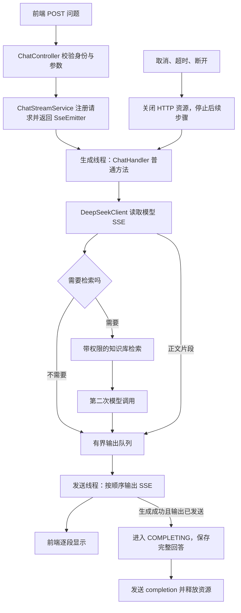

# ShadowRAG 去除 Flux 的改造设计

日期：2026-10-05  
状态：2026-10-06 已完成阶段A及聊天验收；阶段B及ReAct未实施
实现基线：`a96b80d`，包含已提交的 WebSocket → SSE 改造；本次聊天去Flux代码未提交。验证见 [阶段3验收](../../eval/chat_stream/remove-flux-phase-3-acceptance.md)。

## 1. 目标和范围

用户希望简化模型调用代码，便于理解、维护和在面试中解释。采用普通 Java 控制流程处理流式模型响应，通过 Spring MVC 的 `SseEmitter` 向前端发送 SSE。

目标架构：**Spring MVC + SSE + 有界线程池 + 普通 HTTP 流式读取**。

去除 Flux 不等于去除流式输出，也不等于恢复 WebSocket。后台仍然需要异步执行，避免 Controller 一直等待模型生成；异步执行使用 Java 线程池，不要求响应式编程。

范围分两阶段，避免把聊天改造和文档处理混成一次大改动：

| 阶段 | 目标 | 完成后的准确表述 |
| --- | --- | --- |
| A：主方案 | 移除聊天及 DeepSeek 客户端中的 `Flux`、`Mono`、`Scheduler`、`Disposable`；保留 SSE、权限、取消和保存行为 | 聊天编排使用普通 Java；检索依赖的部分 HTTP 客户端仍使用 WebClient |
| B：全项目清理 | 迁移 Embedding、Reranker、MinerU 的 WebClient 调用及测试，再移除 WebFlux 和 Reactor 相关直接依赖 | 项目业务源码和测试不再直接使用 Reactor/WebClient；传递依赖以 Maven 检查结果为准 |

阶段 A 是本次聊天简化的主要交付范围。若验收要求是“整个项目不再依赖 WebFlux/Reactor”，阶段 B 也必须完成，不能只完成 A 就宣称全项目已移除。

本次文档不要求同时实现完整 ReAct 或 MCP。先保留当前“模型判断是否搜索 → 搜索一次 → 模型生成答案”的行为，验证移除 Flux 没有回归，再扩展普通循环。文档第 11 节说明扩展位置。

2026-10-06 执行优先级更新：用户希望聊天去除Flux后尽快实现ReAct，MCP暂不处理。阶段A验收后优先执行 [知识库ReAct接续设计](2026-10-06-knowledge-base-react-design.md)，阶段B全项目客户端与依赖清理暂缓。阶段A和ReAct使用普通Java编排，但未迁移的Embedding/Reranker内部仍可保留WebClient。

## 2. 改造前的代码基线

本节描述去Flux之前的代码；阶段A文件现已切换为普通Java调用，阶段B文件仍待迁移。

当前聊天接口已使用 SSE：

- `POST /api/v1/chat/stream`：返回 `ResponseEntity<SseEmitter>`。
- `POST /api/v1/chat/requests/{requestId}/cancel`：停止指定请求。
- 前端通过 `fetch` 读取 POST 响应流，已经处理事件顺序、登录状态和取消。
- 原 WebSocket 配置、处理器和前端连接文件已经删除，包含在实现基线提交中。

当前响应式代码分布：

| 文件（相对仓库根目录） | 当前作用 | 阶段 |
| --- | --- | --- |
| `src/main/java/com/yizhaoqi/smartpai/client/DeepSeekClient.java` | WebClient 调用模型，返回 Flux；摘要请求用 Mono.block | A |
| `src/main/java/com/yizhaoqi/smartpai/service/ChatHandler.java` | Flux/Mono 编排历史加载、第一次模型、搜索和第二次模型 | A |
| `src/main/java/com/yizhaoqi/smartpai/service/chat/ChatStreamService.java` | subscribe 接收数据，以 Disposable 管理订阅 | A |
| `src/main/java/com/yizhaoqi/smartpai/service/chat/ChatRequestContext.java` | 实现 Disposable，保存上游句柄 | A |
| `src/main/java/com/yizhaoqi/smartpai/config/ChatStreamingConfig.java` | 在线程池上创建 Reactor Scheduler | A |
| `src/main/java/com/yizhaoqi/smartpai/client/EmbeddingClient.java` | WebClient + Mono.block + Retry | B |
| `src/main/java/com/yizhaoqi/smartpai/client/RerankerClient.java` | WebClient + Mono.block | B |
| `src/main/java/com/yizhaoqi/smartpai/client/MinerUClient.java` | WebClient multipart 上传、健康检查和 Retry | B |
| `src/main/java/com/yizhaoqi/smartpai/config/WebClientConfig.java` | 配置上述三个客户端 | B |

`HybridSearchService.searchWithPermission()` 会调用向量生成和可选重排。因此阶段 A 的搜索编排虽然不再使用响应式操作符，其内部 HTTP 客户端仍有 Reactor 依赖。这是阶段划分，不是彻底去除 Reactor 的证明。

当前 `ChatStreamService` 已有请求状态、MVC 就绪检查、有界事件队列、串行发送、心跳、超时和完成后保存逻辑。这些解决实际问题，不应为了移除 Flux 一起删除。

## 3. 方案选择

| 方案 | 特点 | 结论 |
| --- | --- | --- |
| 保留 WebClient，将 Flux 包装在内部 | 改动少，但仍要解释订阅和响应式资源生命周期 | 不符合此次简化目标 |
| Java 17 HttpClient + InputStream + 普通方法调用 | 无需增加模型 HTTP 客户端依赖，业务流程直观，能够逐段读取 | 采用 |
| 新增 OkHttp 等客户端 | 也可完成流式读取，但增加依赖和新的客户端约定 | 本次无需引入 |

Java 17 `HttpClient` 支持请求级 HTTP 操作，`BodyHandlers.ofInputStream()` 能在正文尚未收完时提供输入流，适合逐步解析模型响应。[HttpClient 官方说明](https://docs.oracle.com/en/java/javase/17/docs/api/java.net.http/java/net/http/HttpClient.html)，[InputStream 响应处理器](https://docs.oracle.com/en/java/javase/17/docs/api/java.net.http/java/net/http/HttpResponse.BodyHandlers.html#ofInputStream())。

为覆盖“尚未收到响应头时取消”的窗口，客户端内部采用 `sendAsync()` 获取可取消的请求句柄，生成线程等待响应头后用普通循环读取正文。`CompletableFuture` 只用于持有 HTTP 请求和取消句柄，不作为业务编排链，不向 ChatHandler 暴露异步返回类型。

此方案删除业务中的 Reactor，不宣称底层 HTTP 库内部完全没有异步或订阅机制。

## 4. 改造后的结构



职责仍保持清楚：

- Controller 负责 HTTP 入参、身份和返回 SSE 通道。
- ChatHandler 负责聊天业务顺序，不创建线程、不发送终止事件、不提交数据库事务。
- DeepSeekClient 负责 HTTP、模型 SSE 解析和本轮调用结果，不操作数据库或前端 emitter。
- ChatStreamService 负责任务提交、事件发送、终止仲裁和最终保存。
- ChatRequestContext 保存本次请求状态和取消资源，不再实现 Reactor 接口。

## 5. 普通 Java 接口

下面是设计接口，名称在实施时可按项目习惯调整；当前尚未创建这些方法或新增类型。

```java
// 后台生成线程调用，返回代表整段生成正常完成；失败抛异常。
void generateReply(
        ChatCommand command,
        ChatRequestContext context,
        Consumer<ChatOutput> output);

// 逐段回调已有 ModelDelta，同时返回完整的本轮结果。
ModelRoundResult streamWithTools(
        List<Map<String, Object>> messages,
        List<Map<String, Object>> tools,
        ChatRequestContext context,
        Consumer<ModelDelta> onDelta);

// 保留摘要业务使用的同步入口，内部也迁移到普通 HTTP。
String callSync(String prompt, Duration timeout);
```

`Consumer` 就是“每拿到一段数据，调用一次处理函数”的普通 Java 接口，没有订阅和操作符概念。`output.accept(...)` 只把业务输出送入 ChatStreamService 的有界队列。

阶段 A 保持现有单搜索工具协议，`ModelDelta` 可继续使用现有正文、调用 ID 和参数类型。`ModelRoundResult` 至少保存本轮文本、调用 ID、完整参数和完成原因。每轮仅在确认完整结束后返回结果。

ChatHandler 的流程示意：

```text
检查请求是否仍可执行
加载当前用户拥有的会话历史，构造消息
第一次调用模型，正文片段写入输出队列
确认本轮完整结束

如果没有搜索调用：返回

检查请求是否仍可执行
输出 search_knowledge_base started
校验搜索参数
调用 searchWithPermission(query, 服务端用户名, 10)
检查请求是否仍可执行
输出 search_knowledge_base finished
组装 assistant 工具调用与 tool 结果
第二次调用模型，不提供工具，正文片段写入输出队列
确认本轮完整结束并返回
```

历史加载、模型失败和搜索失败分别保留现有 `HISTORY_ERROR`、`MODEL_ERROR`、`TOOL_ERROR` 分类。取消及超时采用已经获胜的请求状态，不因随后发生的 IOException 又改成模型失败。

生成任务在正常返回后标记 generationDone；此标记只表示生产结束。不能在此直接发送 `completion` 或保存回答，仍由发送端排空队列后决定。

## 6. HTTP 与模型 SSE 解析

### 6.1 请求行为

- 复用配置完成的 HttpClient，避免每段或每次循环都新建客户端。
- 保留 `deepseek.api.url`、`key`、`model`、`proxy-url` 和生成参数的现有含义。
- Base URL 若包含 `/v1`，拼接后必须保持该路径；不能简单 `resolve("/chat/completions")` 将它丢掉。
- 保留当前无认证 HTTP 代理的校验规则，使用客户端级代理配置，不修改 JVM 全局代理。
- 不自动跟随重定向，以免改变请求地址和认证头的发送范围。
- 模型流式请求不自动重试；已经输出内容或请求过工具时重放可能重复执行。
- 非 2xx、非预期响应格式、供应商错误对象统一转换为安全的模型异常。
- 日志不得输出 API Key、认证头或含凭证的 URL；错误正文只做受限诊断。

### 6.2 输入流读取

通过 `InputStreamReader(..., UTF_8)` 增量解码，再解析 SSE 帧。不能把每个网络字节块直接转成独立字符串，以免切坏中文字符；不能假设一次读取就是一个 JSON。

解析器规则：

1. 接受 LF 和 CRLF，用空行结束一帧。
2. 同一帧的多条 `data:` 按 SSE 规则合并；忽略注释和与模型解析无关的字段。
3. 完整帧后再解析 JSON，正文继续逐段回调。
4. 设置单行、单帧和总输出大小限制，超限失败，不使用无界 readLine 缓存任意长输入。
5. 收到 `[DONE]` 后立即结束读取并关闭响应资源，不等待供应商主动关闭连接。
6. EOF 出现在 `[DONE]` 之前，视为不完整响应；不能执行已收集但未确认完整的工具调用，也不能保存部分回答。
7. 保留当前“只有 finish_reason、没有 [DONE] 仍然失败”的契约。
8. 完成原因是 `length` 等截断情形时，不执行残缺参数；阶段 A 映射为现有安全错误，避免改变前端错误码集合。

模型响应的 SSE 和发给浏览器的 SSE 是两条独立连接。客户端要解析模型响应，再生成项目自己的 `ChatEventEnvelope`，不能原样透传模型的 `data:`。

阶段 A 新增以下配置，均要求为正数。UTF-8 解码前按字节限制单行和单帧；正文和参数按 Java 字符数限制累计值，超限使用 `MODEL_ERROR`。以下为设计默认值：

| 配置 | 默认值 | 限制对象 |
| --- | --- | --- |
| `deepseek.api.max-sse-line-bytes` | 1048576 | 一条模型 SSE 行，防止未出现换行的无界缓存 |
| `deepseek.api.max-sse-frame-bytes` | 1048576 | 合并前一帧的累计字节数 |
| `deepseek.api.max-stream-content-chars` | 1048576 | 当前聊天请求所有模型轮次的累计正文 |
| `deepseek.api.max-tool-arguments-chars` | 262144 | 单次工具调用的完整参数 |
| `deepseek.api.max-json-response-bytes` | 1048576 | 摘要同步请求的响应体 |
| `deepseek.api.max-error-response-bytes` | 16384 | 非成功 HTTP 响应的诊断读取上限 |

达到诊断读取上限后直接关闭错误响应，不能为了打印完整错误继续无界读取。

## 7. 线程与 SSE 输出

### 7.1 分离生成和发送线程池

普通 HTTP 读取会占用线程。当前生成调度器与 SSE 发送共享线程池的布局不能直接照搬，否则所有线程等待模型时，事件发送、心跳和终止消息会排队。

采用两个有界线程池，保持现有定时线程池：

| 线程池 | 执行内容 | 建议起始配置 |
| --- | --- | --- |
| `chatGenerationExecutor` | 普通模型读取、历史加载和搜索 | 16 个线程，64 个等待任务 |
| `chatStreamingExecutor` | 原有串行 drain、SSE 发送及完成保存 | 沿用现有 16 个线程、1024 个排队任务 |
| `chatStreamingTimers` | 超时、心跳标记和过期记录清理 | 沿用 2 个线程 |

这些数值是待验证的起始值，不是性能承诺。HTTP 客户端内部执行器不可与阻塞生成线程池绑定；不能让等待响应的线程占满用于完成响应的同一个池。

生成池配置使用 `chat.streaming.generation-worker-threads=16` 与 `chat.streaming.generation-worker-queue-capacity=64`；原有 `worker-threads` 和 `worker-queue-capacity` 继续控制发送池。两项新配置均校验为正数。

生成线程池拒绝任务时，按开始失败清理已注册的请求、会话占用和定时器；不能留下永久 busy 的会话。外部容量错误沿用当前契约，开始后的失败沿用 `INTERNAL_ERROR`，不随意增加前端未支持的码。

当前 `maxActiveRequests=100` 不代表能同时阻塞执行 100 个模型读取任务。文档、监控应区分正在执行、等待执行和被拒绝的请求。

### 7.2 保留单发送者

继续复用 ChatStreamService 的有界队列和串行 drain：

- 生成线程只投递 `ChatOutput`。
- 定时任务只请求心跳或终止处理，不直接发送业务事件。
- 同一个请求的 meta、正文、工具进度、错误和 completion 均由同一个串行发送流程赋予 seq。
- 单次请求的 `meta` 最先发送，completion 最多一次，结束后无新事件。
- 继续等待 MVC 的 `transportReady`，避免 SseEmitter 初始化前积压到不可控的早期发送缓冲。
- 队列溢出仍是 `STREAM_OVERFLOW`，同时停止模型读取；不能仅丢弃片段后继续保存。
- 前端 SSE 事件名、格式、请求 ID 和会话 ID 保持当前约定。

普通线程池不自动提供背压。本阶段保留项目现有的“有界队列 + 超限失败”策略，不另造响应式框架。

## 8. 取消、超时和资源释放

### 8.1 替换 Disposable

ChatRequestContext 改为普通 Java 类。它至少管理生成任务的 `Future<?>`、当前 HTTP 请求的 `CompletableFuture<?>`、当前响应的 `InputStream`，以及请求状态和绝对截止时间。

资源有独立生命周期，不能用一个 future 代替全部句柄：HTTP future 在响应头和输入流可用后即可完成，此时正文可能仍在传输。[InputStream 响应处理器说明](https://docs.oracle.com/en/java/javase/17/docs/api/java.net.http/java/net/http/HttpResponse.BodyHandlers.html#ofInputStream())。

资源登记和移除使用短锁或原子操作。请求已经停止后才拿到的 future 或输入流，必须立即取消或关闭。关闭动作在锁外执行，避免关闭网络资源时持有请求注册表锁。

给 HTTP future 同时安装响应到达时的收尾处理：若取消和响应到达竞争，且生成线程已经无法取得该响应，仍必须关闭迟到的 InputStream，防止无人接管的响应体泄漏。

### 8.2 取消处理顺序

取消、超时、队列溢出或浏览器断开时：

1. 通过现有状态机争取终止状态，已有终止结果不覆盖。
2. 撤销未完成的当前 HTTP 请求，关闭已取得的响应输入流。
3. 取消等待中的生成任务，对运行中的任务发出中断请求。
4. 禁止投递新事件，在模型调用、搜索前后和下一轮开始前检查状态。
5. 按当前传输状态发送终止事件或执行断开清理；资源释放重复调用安全。

关闭流和中断是取消手段，不是服务端撤回保证。JDK 对未完成请求的 `cancel(true)` 是尝试取消 HTTP 交换，可能已经发到供应商，释放时间也不保证立即完成。[HttpClient 取消约定](https://docs.oracle.com/en/java/javase/17/docs/api/java.net.http/java/net/http/HttpClient.html#sendAsync(java.net.http.HttpRequest,java.net.http.HttpResponse.BodyHandler,java.net.http.HttpResponse.PushPromiseHandler))。

因此取消验收要检查真实连接关闭或流终止，以及没有后续模型调用、输出和保存；不能只检查 future.isCancelled。

阶段 A 的同步向量、重排和搜索客户端可能不立即响应线程中断。必须有其自身的 HTTP 超时，搜索结束后再次检查状态，绝不启动第二次模型请求。不能声称阶段 A 可以瞬间中止所有底层检索工作。

### 8.3 超时边界

- 保留现有总生成超时：默认 300000ms；从请求注册开始计时，包含等待线程、搜索和所有模型调用。
- 保留 emitter 超时默认 320000ms 和心跳默认 15000ms。
- 保留 emitter 超时须比生成超时至少多 10000ms 的校验。
- 模型客户端设置连接和等待响应的超时；读取正文期间仍由请求总截止时间负责兜底。
- 不把 HttpRequest.timeout 当成 InputStream 每次读取的闲置超时承诺。该 API 是请求超时，流式正文的关闭需由项目自己控制。[请求 timeout 说明](https://docs.oracle.com/en/java/javase/17/docs/api/java.net.http/java/net/http/HttpRequest.Builder.html#timeout(java.time.Duration))。
- 超时任务主动关闭当前输入流；仅在读取下一帧时检查截止时间，无法唤醒正在阻塞的读取。
- 对阶段 B 的非聊天调用也设置覆盖整个响应体的截止时间，不能只对等待响应头设超时。

### 8.4 正常结束不能误用取消

正常生成完成、资源关闭、取消任务和数据库完成提交要分开处理。

进入 COMPLETING 时可以关闭模型资源、停止生成定时器，但不要用“一律 future.cancel(true)”的清理方法中断正在正常收尾的工作线程。尤其不能让结束清理中断负责持久化的发送线程。

应用关闭时停止接受新请求，取消 REGISTERED/RUNNING 请求；按现有逻辑给 COMPLETING 的事务有界收尾时间。线程池与任务计数必须核对实际任务退出，不能把取消 future 等同于线程已经释放。

## 9. 完成与历史保存

保留状态机：

```text
REGISTERED → RUNNING → COMPLETING → FINISHED
     │          │          └────→ FAILED（保存失败）
     └──────────┴────→ CANCELLED / FAILED / TIMED_OUT
```

正确完成需要同时满足：生成业务正常返回、所有应发送正文已成功发送、请求仍处于 RUNNING。

由发送端原子进入 COMPLETING，保存当前用户消息和已发送回答一次。数据库提交成功后进入 FINISHED，再发送完成事件。

继续保留现有约定：

- 取消、超时、模型错误和发送失败，不把半截回答保存成正常完成的会话轮次。
- MySQL 写入失败使用 `PERSISTENCE_ERROR`。
- MySQL 已提交而 Redis 更新失败，只做缓存恢复，不能重复 appendTurn。
- 进入 COMPLETING 后，用户停止请求返回真实状态，不能改成已取消并撤销已开始的保存。
- 数据库提交成功但最终 SSE 发送失败，记录“已持久化、完成事件未送达”，不能重放生成或再次保存。
- 继续使用显式 conversationId 和服务端认证身份，不回退到浏览器或 Redis 的当前会话指针。

## 10. 文件改动清单

### 10.1 阶段 A：聊天去除 Flux

| 文件 | 改动 |
| --- | --- |
| `client/DeepSeekClient.java` | WebClient 改 HttpClient；Flux 返回改普通回调与轮次结果；摘要同步入口也移除 Mono；保留代理和请求参数 |
| `client/ModelDelta.java` | 保留当前业务字段，作为普通回调事件；按需要增加独立 ModelRoundResult |
| `service/ChatHandler.java` | 删除响应式操作符和 Scheduler 注入，普通顺序方法保留当前两次调用流程 |
| `service/chat/ChatStreamService.java` | subscribe 改提交普通生成任务；保留事件队列、发送和保存逻辑 |
| `service/chat/ChatRequestContext.java` | 删除 Disposable，实现普通任务与 HTTP 资源管理 |
| `service/chat/ChatRequestRegistry.java` | 将 dispose 调用改普通清理入口，保留取消前注册、去重和会话互斥行为 |
| `config/ChatStreamingConfig.java` | 删除 Reactor Scheduler bean；生成线程池与发送线程池分离 |
| `config/ChatStreamingProperties.java` | 增加生成线程数和队列配置，保留原有超时校验 |
| `src/main/resources/application.yml` | 增加生成线程池配置，其余行为配置保持含义 |
| 聊天相关测试 | Reactor 的 StepVerifier/Sinks/Disposable 替换为普通回调、可控阻塞和资源句柄测试 |

上表 Java 路径前缀为 `src/main/java/com/yizhaoqi/smartpai/`。不恢复已删除的 WebSocket 文件。前端、鉴权和数据库 schema 不因阶段 A 改变。

### 10.2 阶段 B：全项目依赖清理

如果要彻底去除项目直接使用的 Reactor，迁移以下客户端：

| 客户端 | 应保持的行为 |
| --- | --- |
| EmbeddingClient | 分批生成向量、响应解析、认证、当前 30 秒整体调用边界；当前 HTTP 响应异常最多重试 3 次、间隔 1 秒的行为按整体剩余时间约束 |
| RerankerClient | 10 秒调用边界、开关、返回结构兼容；失败继续返回 null，回退 RRF 排序 |
| MinerUClient | multipart 文件上传、JSON/Markdown 提取、当前配置超时、5 秒健康检查；当前 HTTP 响应异常最多重试 2 次、间隔 5 秒的行为按整体剩余时间约束 |

普通 JSON 调用仍可复用 HttpClient。multipart 采用项目现有 Spring Web 模块提供的 RestClient 与标准 multipart 转换器，避免手工拼接边界和文件名；其 HTTP 请求工厂必须统一配置所需超时并做实际验证。上传使用 `files` 字段和携带原始文件名的 Resource，保持现有请求语义。RestClient 是同步客户端，支持 multipart 请求。[Spring Framework 6.2 REST 客户端说明](https://docs.spring.io/spring-framework/reference/6.2/integration/rest-clients.html)。不为阶段 A 提前造通用 HTTP 框架。

原有响应体限制也要迁移：Embedding 为 16MB、MinerU 解析为 50MB，不能换成不受限制的全量读取。阶段 B 配置 `embedding.api.max-response-bytes=16777216`、`mineru.api.max-response-bytes=52428800`、`reranker.api.max-response-bytes=16777216`；MinerU 健康检查响应上限为 1MB。模型摘要使用阶段 A 的 1MB 上限。所有限制在转换成完整字符串前执行，不把检查 Content-Length 作为唯一防护，缺少该头也按实际读取量限制。

重试只迁移当前允许的条件，不扩大到所有 IOException，也不对聊天生成增加重试；等待和重试期间检测中断，保留“次数”和“整体截止时间”的区别。

迁移后删除或替换 `WebClientConfig`，改写 `HybridSearchServiceLoggingTest` 等仍模拟 Mono/WebClient 的测试。确认业务和测试均无引用后，才从 pom 中删除 `spring-boot-starter-webflux` 和 `reactor-test`。

依赖树仍可能因其他 SDK 含有传递依赖，不能为了“零 Reactor”盲目排除运行时必需模块。验收表述需依据实际依赖树。当前阶段 A 不删除 WebFlux starter，以免其余客户端编译失败。

## 11. 与后续 ReAct 的关系

去除 Flux 和增加 ReAct 是两项不同改动。阶段 A 先保持当前功能；后续将 ChatHandler 的固定流程改为普通循环，或在代码增长时抽出 AgentLoopService：

```text
while 请求可执行且预算允许：
    整理上下文
    本轮 = 调用模型（消息、工具）
    没有工具调用：完成回答并退出
    追加完整的 assistant 工具调用消息
    顺序执行工具并追加相应 tool 结果
预算触发且有剩余时间：关闭工具，进行一次部分结果收尾
```

可参考 PaiCLI 中 `agent/Agent.java` 的退出逻辑，采用普通 Java 的控制流程；无需为了仿照它引入命令执行、浏览器、规划或多 Agent 功能。

完整 ReAct 必须单独解决：

- 工具流按 index 累积多个调用的 ID、名称和参数，不只取 tool_calls[0]。
- 每个工具结果按 tool_call_id 回填，上下文裁剪保持整组配对。
- 检索结果保留稳定来源，所有工具执行继续使用服务端权限。
- 中间轮次说明和最终答案分开，避免当前所有 chunk 直接拼接保存。
- 多工具进度事件需调整前端现在只接受 search_knowledge_base 的校验。
- 明确轮次、调用次数、重复调用和总时间预算。

现有 `2026-10-03-mcp-client-integration-design.md` 中的 Mono 执行器、WebSocket 描述等属于旧方案。未来实施 MCP 前要更新为普通接口与当前 SSE 链路，不能直接照旧文档生成代码。

## 12. 实施顺序

1. 为现有行为建立可重复验证：完整与中断模型流、搜索、取消和保存。
2. 迁移 DeepSeekClient 与摘要请求，使用本地模拟 HTTP 服务测试输入流解析、代理和关闭。
3. 将 ChatHandler 改普通顺序方法，暂不增加多轮 ReAct。
4. 更换请求资源管理，迁移 ChatStreamService 的任务入口，删除 Scheduler。
5. 分离生成/发送线程池，验证模型静默和大量阻塞任务时仍能发送心跳、取消和终止事件。
6. 通过阶段 A 验收，修正文档和日志中关于上游订阅的措辞。
7. 基础聊天链路验收后，优先按知识库ReAct接续设计实现普通循环，MCP暂不处理。
8. 需要全项目移除Reactor时，再单独安排阶段B客户端与依赖清理，保留并回归已实现的ReAct。

保留当前工作区已做的 SSE 改动和其他用户修改。不要通过回退文件来移除 Flux，不自动提交、推送或修改部署。

## 13. 验收标准

### 13.1 阶段 A

| 场景 | 必须验证的结果 |
| --- | --- |
| 通用问题 | 第一次模型响应直接逐段输出，无搜索；保存一次 |
| 知识库问题 | 搜索前后输出进度；有权限过滤；第二次模型结果输出并保存一次 |
| 流式体验 | 模拟供应商先发一段、暂停再发完成标记；暂停期间前端已收到第一段 |
| UTF-8 和 SSE 分片 | 中文跨字节分片、CRLF、多行 data、注释均能解析；超大帧被拒绝 |
| 模型响应不完整 | 缺少 DONE、残缺 JSON、截断工具参数均失败；不继续搜索或保存 |
| 等待响应头时取消 | 上游请求取消资源被调用；迟到响应被关闭；无正文或保存 |
| 读取正文时取消 | 实际输入流关闭/HTTP 流终止，生成任务最终退出，无第二次模型调用 |
| 搜索中取消 | 搜索返回后不发新进度、不调用第二次模型、不保存 |
| 注册前取消和迟到句柄 | 保留原有取消墓碑；迟到任务或流立即清理 |
| 总超时 | 阻塞等待、静默正文、搜索均受总边界约束；仅发一次 timed_out 完成 |
| 并发竞争 | 完成与取消、超时与断开、资源登记与清理竞争不重复保存或泄漏 |
| 发送慢和队列溢出 | 失败并停止生成；有界内存；无正文丢失后却成功保存 |
| 生成池耗尽 | 发送池仍能处理心跳和终止；排队/拒绝请求正确释放会话 |
| 保存失败 | MySQL 失败报 PERSISTENCE_ERROR；Redis 提交后失败不重复写入 |
| 已提交但断开 | 保留已提交历史；不重试生成或数据库追加 |
| 多用户/多会话 | 状态、文本、取消和 HTTP 句柄互不串用，继续拒绝越权会话 |
| 应用关闭 | 不接收新生成；取消运行任务；提交中的事务按原约定收尾 |

迁移现有 DeepSeekClientStreamingTest、DeepSeekClientProxyTest、ChatHandlerStreamingTest、ChatRequestRegistryTest、ChatStreamServiceTest、MVC 流式和响应头时序测试。保留测试的行为断言，移除对响应式类型本身的断言。

不需要靠真实模型付费调用证明取消和协议解析。优先使用项目已有本地模拟供应商以及可控线程测试；需要真实联调时记录实际结果，不把模拟通过当成生产性能保证。

### 13.2 阶段 B

- Embedding 批次、重试、超时和限额行为通过针对性测试。
- Reranker 的失败回退和响应兼容通过测试。
- MinerU 的 multipart 文件名、二进制内容、超时、限额和健康检查通过测试。
- 对业务与测试源码搜索，无 `reactor.*` 或 Spring WebClient 的直接引用。
- Maven 编译和相关测试通过；移除 starter 后检查依赖树，说明剩余传递依赖。
- 前端原有 SSE 解析、取消、会话切换和登录隔离测试通过。

阶段A验收已执行，结果与环境限制见阶段3验收文档；阶段B验收尚未执行，不能宣称全项目已去除Reactor。

## 14. 面试解释

改造完成后，可以按实际实施范围说明：

> 聊天接口基于 Spring MVC，用 SseEmitter 输出 SSE。模型调用放在有界后台线程池里，通过普通 HTTP 输入流逐段读取，再交给串行发送流程。取消时同时撤销当前请求、关闭响应流，并禁止后续步骤；回答只有在生成和发送都成功后才保存一次。

若仅完成阶段 A，补充“向量生成、重排和文档解析客户端尚未迁移”，不要宣称全项目不存在 WebFlux。若后续实现 ReAct，再解释普通循环如何将工具结果回填给模型。

取舍是让业务控制流程更直观；代价是模型读取占用工作线程，需要有界线程池和容量限制。不能以移除 Flux 为依据宣称吞吐量更高，也不能说 SSE 本身负责模型读取、取消和业务编排。
