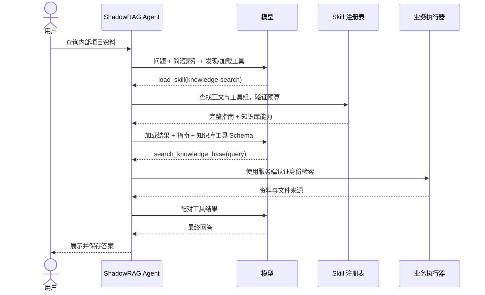

# ShadowRAG Skill 渐进式加载与动态工具开放设计

日期：2026-10-06。状态：可供实施的设计，功能尚未实现。

2026-10-07 更新：实施顺序见 [Skill 加载层分阶段计划](../plans/2026-10-07-skill-loading-phased-plan.md)。按最新范围，本轮只分四个阶段完成 Skill 加载层，用现有知识库检索验收，先不考虑 MCP。本文中的联网和 CLI 扩展作为历史备选保留，不属于本轮实施范围；Skill 格式、请求内状态、原子激活和上下文保护要求继续适用。

本文确定 skill 的文件格式、加载流程、工具开放规则、请求内状态、上下文预算和验收要求。核心功能以现有 Java 知识库搜索验证；Firecrawl CLI 作为第二阶段接入示例。无需先实施 MCP，也不更换现有 LLM 客户端和 SSE 链路。

## 1. 目标与设计结论

**初始上下文只包含有预算的 skill 索引及发现、加载工具；加载某个 skill 后，下一次模型请求才包含该 skill 正文与相关业务工具定义。** 后端注册的工具目录与模型可见工具集合分开管理。

期望解决两个问题：

- 模型知道有哪些任务方法，但不必每轮读取所有 skill 正文。
- 后端可以扩展许多工具，但不必每轮向模型发送全部工具 Schema。

采用三层展开：

| 层级 | 内容 | 展开时机 |
| --- | --- | --- |
| 发现层 | name、简短 description；目录太大时返回少量搜索候选 | 首次请求或 search_skills |
| 指南与能力层 | 当前 skill 正文、关联工具组的 Schema | load_skill 成功后的下一次模型请求 |
| 参考资料层 | 当前已加载 skill 的 references 文本 | read_skill_reference 成功后 |

业务能力不全部改为 CLI：知识库继续调用现有 Java 检索，Firecrawl 通过 CLI 执行器接入，以后 MCP 可以成为另一种执行器。Skill 负责方法和调用指引，执行器负责真正操作。



对比过的方案：

| 方案 | 取舍 |
| --- | --- |
| 全部正文和工具常驻 | 最简单，但上下文成本随总能力数量增长，不采用 |
| 正文按需加载、全部工具常驻 | 节省正文，但没有解决工具定义膨胀，不采用 |
| 正文和工具一起按需展开 | 推荐；多一个加载步骤，但可控制每轮上下文 |

## 2. 范围与首版约束

核心交付包含：管理员配置目录、SKILL.md 解析、目录索引、search_skills、load_skill、动态工具集合、知识库 skill、参考文件读取、预算与请求隔离、自动化验收。

扩展交付包含：run_cli、Firecrawl 程序策略、联网 skill、网页结果和来源规范化、真实联网验收。

首版不增加数据库或管理页面，不运行时安装 skill，不自动安装 CLI，不自动执行 skill 的 scripts，不提供任意 shell 命令，不热更新目录，不实现通用 MCP。管理员修改文件或配置后重启生效。

Skill 为应用管理员维护的实例级能力；它不是某个操作系统用户的私人目录，也不等同于 ShadowRAG 登录用户的私有知识库。后续用户上传或租户自定义 skill 应另行设计来源与权限。

## 3. 已核对的项目起点

| 当前实现 | 本次需要改的部分 |
| --- | --- |
| [AgentLoopService](E:/Curzsu/ShadowRAG/src/main/java/com/yizhaoqi/smartpai/service/AgentLoopService.java:54) 已能多轮调用模型和工具 | 替换固定 KnowledgeBaseSearchTool.DEFINITIONS 和 search.execute；复用循环与消息配对 |
| [DeepSeekClient](E:/Curzsu/ShadowRAG/src/main/java/com/yizhaoqi/smartpai/client/DeepSeekClient.java:37) 接受每次请求的工具定义列表 | 每轮传入动态集合，无需为 skill 改写供应商 HTTP 协议 |
| [ChatHandler](E:/Curzsu/ShadowRAG/src/main/java/com/yizhaoqi/smartpai/service/ChatHandler.java:146) 提前按知识库工具做一次预算 | 将工具相关预算集中到 AgentLoopService，避免初始请求仍预留隐藏业务工具 |
| [ContextBudgetService.fitAgent](E:/Curzsu/ShadowRAG/src/main/java/com/yizhaoqi/smartpai/service/ContextBudgetService.java:25) 用最后一条 user 消息确定保护范围 | 改为显式当前任务保护范围，避免 skill 指南被误认成新的用户任务 |
| [KnowledgeBaseSearchTool](E:/Curzsu/ShadowRAG/src/main/java/com/yizhaoqi/smartpai/service/KnowledgeBaseSearchTool.java:40) 使用 command.username() 做权限检索 | 保留底层实现，适配为通用执行器，身份不由 skill 或模型指定 |
| [ChatGenerationResources](E:/Curzsu/ShadowRAG/src/main/java/com/yizhaoqi/smartpai/service/chat/ChatGenerationResources.java:38) 管理 HTTP 请求与响应流 | CLI 需新增独立进程资源管理，不能只借用 HTTP future 当作取消保证 |
| [AgentLoopService](E:/Curzsu/ShadowRAG/src/main/java/com/yizhaoqi/smartpai/service/AgentLoopService.java:91) 的重复检测和进度名称固定知识库 | 泛化到不同工具的参数和名称 |

2026-10-03 的 skill 调研有参考价值，但其中“只支持一个 tool_calls”“第二次模型请求不带工具”等历史前提已变化。实施以本设计和当前源码为准。

## 4. 参考 PaiCLI，调整适合服务端的部分

已读取本地 PaiCLI 的以下实现：

- [SkillRegistry](E:/Curzsu/paicli-main/paicli-main/src/main/java/com/paicli/skill/SkillRegistry.java:41)：目录扫描、覆盖、缓存元数据与正文。
- [SkillIndexFormatter](E:/Curzsu/paicli-main/paicli-main/src/main/java/com/paicli/skill/SkillIndexFormatter.java:40)：先发 name/description，引导按需 load_skill。
- [ToolRegistry](E:/Curzsu/paicli-main/paicli-main/src/main/java/com/paicli/tool/ToolRegistry.java:816)：load_skill 名称查找与加载确认。
- [LoadedSkillMessages](E:/Curzsu/paicli-main/paicli-main/src/main/java/com/paicli/tool/LoadedSkillMessages.java:33)：成功加载后生成正文指南。
- [Agent](E:/Curzsu/paicli-main/paicli-main/src/main/java/com/paicli/agent/Agent.java:551)：本次用户任务内补入指南并继续模型请求。
- [LoadSkillSameTurnTest](E:/Curzsu/paicli-main/paicli-main/src/test/java/com/paicli/agent/LoadSkillSameTurnTest.java:91)：断言第一次请求无正文、第二次包含加载正文。

保留发现、索引、按需注入和同轮继续的机制。本设计额外加入业务工具按需开放、明确任务边界、实例级配置和请求内状态。不要复制 CLI 的全局用户目录、交互命令、字母序硬截断索引或固定字符截断正文。

## 5. 目录与文件格式

```text
skills/
  knowledge-search/
    SKILL.md
    references/
      comparison-template.md
  web-search/
    SKILL.md
```

采用 YAML frontmatter + Markdown 正文。name、description 必填，metadata 为字符串到字符串的映射。Agent Skills 规范支持元数据、指南和参考文件的渐进展开；本项目对工具开放的绑定属于自身运行时设计。[Agent Skills 规范](https://agentskills.io/specification)

自定义字段使用 `metadata.shadowrag-toolsets`，值为逗号分隔的工具组标识，例如 `knowledge-base,firecrawl-web`。这不是通用 skill 标准规定的权限语义。运行时将其解析为去重后的工具组列表，最多 4 个；空值表示纯方法 skill，不开放业务工具。

工具组的实际内容由管理员配置维护，skill 只能引用已配置的工具组。标准中实验性的 allowed-tools 字段可以保留，但首版不据此授予权限。compatibility 仅描述需求，不触发安装或联网。

### 知识库 skill 示例

以下是实施时应创建的文件内容：

````markdown
---
name: knowledge-search
description: 查询已上传文件、内部人物、项目和业务资料，或比较知识库内容并保留文件来源时使用。
metadata:
  version: "1.0"
  shadowrag-toolsets: knowledge-base
---

# 知识库检索

1. 提取当前问题的核心实体、主题和必要上下文。
2. 调用 search_knowledge_base；检索结果不足时可改写查询或拆分问题。
3. 只使用与问题相关且实际返回的资料，不把同名对象视为同一个人。
4. 比较资料时，可调用 read_skill_reference，读取 references/comparison-template.md。
5. 回答保留工具提供的文件来源编号和名称；未找到资料时明确说明。
6. 不把内部资料或内部检索查询自动转发给互联网工具。
````

参考文件内容：

```markdown
# 资料比较格式

先给主要结论，再按比较维度列出各资料的依据与来源。
最后说明缺失资料、口径差异以及无法确认的部分。
```

### 联网 skill 示例

````markdown
---
name: web-search
description: 用户要求联网查证、查最新公开信息、官网文档或行业资料，并需要网页来源时使用。
compatibility: Requires a configured Firecrawl CLI and permission to search public web information.
metadata:
  version: "1.0"
  shadowrag-toolsets: firecrawl-web
---

# Firecrawl 联网搜索

1. 只查询当前任务需要的公开信息；不得把内部文档全文或内部身份信息当作搜索查询。
2. 使用 run_cli，program 固定为 firecrawl。
3. 搜索示例参数：
   ["search", "公开主题", "--sources", "web", "--limit", "3", "--scrape", "--scrape-formats", "markdown", "--json"]
4. 已有明确网页地址时，可用：
   ["scrape", "https://example.com", "--only-main-content", "--json"]
5. 优先使用官方或一手来源；区分搜索摘要和实际抓取的正文。
6. 仅引用返回的有效标题和 URL，格式为 [标题](URL)。不要套用知识库文件引用格式。
7. 若认证、限流、搜索或正文抓取失败，说明限制，不把错误消息当作事实。
````

以上命令形式由官方 CLI 文档提供，部署时必须固定 CLI 版本并做输出契约测试；本设计没有安装 CLI 或验证成功联网。[Firecrawl CLI 文档](https://docs.firecrawl.dev/sdks/cli)

## 6. 配置与启动加载

下面为新增配置形状，当前应用尚不识别这些字段：

```yaml
skills:
  enabled: false
  directories:
    - ./skills
  disabled: []
  max-index-tokens: 1500
  max-body-tokens: 3000
  max-reference-tokens: 1500
  max-guidance-tokens-per-turn: 9000
  max-loaded-per-turn: 3
  max-active-tools: 8
  max-search-results: 5
  max-file-bytes: 65536
  max-reference-files-per-skill: 10
  max-snapshot-bytes: 33554432
  toolsets:
    knowledge-base:
      tools: [search_knowledge_base]
      cli-programs: []
    firecrawl-web:
      tools: [run_cli]
      cli-programs: [firecrawl]

cli:
  enabled: false
  max-concurrent-processes: 2
  max-stdout-bytes: 1048576
  max-stderr-bytes: 16384
  process-timeout: 25s
  programs:
    firecrawl:
      enabled: false
      command:
        - ${FIRECRAWL_NODE_PATH:}
        - ${FIRECRAWL_CLI_ENTRY:}
      environment:
        FIRECRAWL_API_KEY: ${FIRECRAWL_API_KEY:}
      allowed-subcommands: [search, scrape]
      max-calls-per-turn: 2
```

启用 skills 时再显式将 `ai.agent.max-tool-rounds` 调为 6、`max-tool-calls` 调为 12。其他现有建议值保留：重复上限 3、收尾预留 10000 ms、工具结果 16384 字符。上面的默认关闭配置不修改现有 Agent 预算。

规则：

1. skills 关闭时完全保留目前知识库工具和提示词，不扫描目录，不发送 skill 索引或加载工具。6 轮/12 次为启用后建议预算；关闭状态保留原 3 轮/6 次默认值。不要仅为了默认关闭的功能修改全体用户的默认预算。
2. 相对目录基于后端工作目录解析；服务器或容器建议使用管理员配置的绝对目录。按配置顺序扫描，后一个目录整体覆盖同名 skill 及参考文件，不混用来源。
3. 使用支持标准基础 YAML 类型的安全解析器，支持引号、`|`、`>` 和 metadata 字符串映射；拒绝重复键、自定义对象标签、过深嵌套和超限输入。不要照搬 PaiCLI 的极简 YAML 子集解析器。
4. name 为 1–64 个小写 ASCII 字母、数字或连字符，与目录名称一致，禁止首尾连字符和连续连字符；description 为 1–1024 个字符且非空。
5. SKILL.md 与 references 下的 UTF-8 文本在启动时读入不可变快照；仅支持 .md、.txt、.json、.yaml、.yml。限制单文件、参考文件数及总快照大小，超限项跳过并记录诊断。更新须重启，聊天中不再读取变化中的磁盘文件。
6. 拒绝目录外符号链接或 Windows junction；按解析后的真实路径判断边界。参考项通过相对路径清单查找，不接受模型指定的任意文件路径。
7. 配置结构或预算无效时启动报错；个别 skill 文件无效时跳过该项，不阻断知识库功能。缺失目录记录诊断，其他目录继续加载。
8. 未知工具组、未注册工具或依赖被禁用的 skill 标记为不可用，不进入可用索引和 search_skills 返回。显式加载时返回可诊断错误，不自动安装依赖。
9. Firecrawl 的 Node 和 CLI 入口变量仅在该程序启用时要求存在；都必须是实际安装文件的绝对路径，并要求非空 API Key。关闭时占位符解析为空，不因缺少 secret 阻断启动。固定安装版本，Windows 直接执行 node + CLI 入口 JS，避免把 npm 的 .cmd 启动器当作跨平台可执行文件。

## 7. 索引与发现：目录也要有预算

初始模型始终只看到两个基础工具：

```text
search_skills({"query":"任务关键词"})
load_skill({"name":"精确 skill 名称"})
```

search_skills 的 query 必须为 1–500 字符的非空字符串；load_skill 的 name 使用第 6 节的名称约束。两者拒绝未知字段，条数由服务端配置控制，模型不能要求返回整个目录。

索引段包含加载规则、name 和 description，不包含正文、工具 Schema、磁盘路径或 secrets。

- 所有可用条目能完整放入 max-index-tokens 时，发送完整索引。
- 放不下时，只发送说明“完整目录请用 search_skills 查询”，以及 knowledge-search、web-search 两个存在且可用的首版入口。先预留加载规则，再加入完整条目；绝不截断条目或丢掉发现规则。配置预算连基本规则和一个条目都放不下时启动拒绝。
- 无可用 skill 时，索引明确说明没有可用能力；仍可直接处理无需外部事实的任务，不暗中开放知识库工具。管理员可关闭 skills 恢复旧模式。

search_skills 只搜索当前策略允许且可用的 name、description 与 metadata.tags。tags 为逗号分隔字符串，缺省为空。

首版用本地词法排序：NFKC 规范化、小写、ASCII 词和中文字符二元组；按 name、tags、description 给予 3/2/1 的匹配权重，精确 name 优先，同分按 name 排序。返回最多 5 个有匹配的完整元数据条目，并受索引返回预算约束。无命中时返回空候选和“可改写关键词”，不靠字母顺序猜测相关性。

这是一个可替换的发现策略，不声称具有语义召回保证。先用真实中文问题评测；不引入额外 LLM 或向量服务。Skill 加载按合法精确名称查找，因此用户明确指定的可用 skill 即使未出现在初始短索引，也可直接加载。

## 8. 工具组与实际开放集合

业务工具 Schema 保存在后端 ToolRegistry，不由 Markdown 正文解析或生成。

```text
knowledge-search → knowledge-base → search_knowledge_base
web-search       → firecrawl-web  → run_cli，programs = {firecrawl}
```

纯方法 skill 不引用工具组，可以只规定写作、总结或输出流程。组合 skill 可以引用多个已配置工具组，一次加载一小组有关能力；也可以在指南中指示模型另行 load_skill。两种方式都不自动递归加载其他正文。

每轮集合：

```text
模型可见工具 = 基础发现工具
             ∪ 当前任务已加载 skill 的可用业务工具
             ∪ 有可读参考文件时的 read_skill_reference
```

重名工具按统一注册身份去重，不能用不同实现互相覆盖。max-active-tools 计算实际发送给模型的全部工具，包含两个基础工具及参考工具。run_cli 的 program 枚举仅包含当前已加载 skill 开放的程序。

业务 Schema 只写工具职责与参数，不再重复整份检索方法。例如 skill 模式下知识库工具说明可缩短为“检索当前用户有权限访问的已上传资料，返回正文片段和文件来源；不搜索互联网”。原来的检索优先、查询改写和引用方法移入 skill；关闭模式继续使用旧说明。

注册全部工具不等于允许调用全部工具。执行许可同时满足：本次模型请求确实看到了该工具定义、当前服务端策略允许、参数通过校验。模型直接猜出隐藏工具名也不能调用。

## 9. load_skill 的原子激活与同批规则

工具参数只接受 name，拒绝未知字段，不接受路径、工具名单或用户身份。

激活需要完成：

1. 在本次请求固定的 SkillCatalogSnapshot 中精确查找，验证存在、启用和依赖可用。
2. 取得完整正文及关联工具组；计算加载数量、指南 token、实际新增工具数量和 Schema token。
3. 构造候选消息与下一轮工具集合，试算完整上下文，包括当前批所有 assistant/tool 配对、即将追加的指南和输出预留。
4. 验证成功才提交已加载记录、指南和能力开放；失败返回具体错误，不残留半加载状态。

成功的 tool 消息只返回简短确认及工具名，例如：

```json
{"ok":true,"skill":"knowledge-search","status":"loaded","availableTools":["search_knowledge_base"],"effectiveFrom":"next_model_request"}
```

正文通过仅由加载执行器产生的类型化激活附加项补入当前任务。普通工具正文中的 `ok`、`skill` 或类似字段不能触发指南注入。

同一批工具调用开始时冻结该次模型请求的 ToolExposureSnapshot，包含工具定义、可执行映射和该请求开放的 CLI programs。加载会改变下一次请求的集合，不改变本批调用的许可：

| 模型同批返回 | 处理 |
| --- | --- |
| load_skill(A)、load_skill(B) | 可顺序验证并加载多个 skill；各项独立成功或失败 |
| load_skill(knowledge-search)、隐藏的 search_knowledge_base | 加载可以成功；后一个返回 TOOL_NOT_EXPOSED，下一次模型再按真实 Schema 调用 |
| search_knowledge_base、load_skill(web-search)，且前者已开放 | 正常检索，再准备联网 skill；下一次才出现 run_cli |

先追加 assistant 的完整调用列表，为每个调用追加对应 tool 结果，再追加本批成功的指南消息。指南不能插在一组尚未完成的 tool 结果中间。

同一个 skill 在当前任务只注入一次。重复加载返回 already_loaded，不重复增加正文或开放项；仍计入调用额度。新用户请求重新加载，不宣称一次加载永久覆盖会话。

## 10. 请求内状态与上下文保护

共享 Spring 单例只持有配置、不可变 skill 快照和执行器注册表。每次生成请求单独创建 TurnSkillState，至少包含：

```text
catalogSnapshot
loadedSkills：name → version/contentHash
activeToolNames
activeCliPrograms
loadedReferences：(skillName, relativePath, contentHash)
guidanceTokens
protectedTailCount
sources
各工具及程序的调用计数
```

不放在 static、共享全局 buffer 或 ThreadLocal 中。请求 A 的 skill、程序开放范围和资料不得进入请求 B。

### 消息角色与指南

受控指南采用独立 user 消息，显式标记为“管理员提供的操作指南，服从 system 与原始用户任务要求”。正文不写入 system，也不从网页、知识库或普通 MCP 返回中冒充指南。

这只是对模型说明指令用途，权限仍由后端执行器校验。指南只存在于当前请求的工作消息中；MySQL/Redis 聊天历史继续只保存真实用户输入和最终答案，不把指南伪装成用户原话。

### 必须修正 fitAgent 的任务边界

当前实现搜索最后一条 role=user 消息。加载指南后，该位置变成指南，会导致原始问题和前面的工具配对失去保护。

首版采用显式 protectedTailCount：

- 构造初始消息后，当前任务只有真实用户问题，计数为 1。
- 每次向当前任务追加 assistant、tool、指南或参考指南，都经过统一 append 方法并增加计数。
- 每轮预算使用 `fit(messages, outputReserve, visibleToolTokens, protectedTailCount)`；只删计数范围之前的完整旧历史单元，不能重新扫描最后一条 user。
- 预算方法返回裁剪后的消息列表，但受保护尾部条数保持不变。通过测试证明两份指南和多个工具批次下仍保护原始问题。

无需为此改造全部历史持久化格式。内部应保留消息来源类型供日志和测试识别；发送给模型时只序列化供应商支持的 role/content/tool_calls 等字段。

### 预算原则

```text
TokenEstimator(messages)
+ TokenEstimator(本次可见工具 Schema)
+ 输出预留
+ 安全余量
<= 配置的模型上下文窗口
```

索引在消息里计一次，工具定义在额外预算里计一次，不重复计数。CL100K_BASE 是现有近似估算，仍需保留安全余量，不能宣称准确等于任意供应商 tokenizer。

正文单份最多 3000 tokens、参考单份 1500 tokens、当前任务指南总计最多 9000 tokens、最多加载 3 个 skill。正文和参考指南不做静默 substring 截断；超限拒绝加载，提示管理员拆分。

可裁剪旧历史和事实工具正文，但保留原始问题、消息配对、指南、来源清单及是否截断的信息。如果新 skill 仍放不下，拒绝本次激活，保留原有已加载状态；如果当前不可再裁剪的任务本身超限，则明确结束请求。

首版在当前任务内只增不减已加载 skill，通过上述数量和 token 边界避免无限积累。结束后全部清理。中途卸载、替换工具组和持久化已加载状态不在首版范围。

## 11. 参考文件的第三层展开

```text
read_skill_reference({"name":"knowledge-search","path":"references/comparison-template.md"})
```

仅当前已加载 skill 的 references 清单可读。拒绝绝对路径、`..`、非文本资源、未加载 skill 和目录外链接。使用启动时固定的文本快照，不打开模型指定的服务端路径。

参数只接受 name、path，path 最多 256 字符；匹配规范化后的 references 相对路径清单，拒绝未知字段。

结果沿与 skill 正文相同的受控指南通路注入；先检查单份及总指南预算，再确认成功。相同参考文件当前任务只注入一次。普通知识库文件和网页正文不走该通路。

## 12. 通用执行接口与组件职责

下面为建议契约，属于设计内容，不是已创建或已编译的 Java 代码：

```java
public record ToolDefinition(String name, String description, JsonNode inputSchema) {}

public interface ToolExecutor {
    ToolDefinition definition(ToolExecutionContext context);
    ToolOutcome execute(JsonNode arguments, ToolExecutionContext context);
}

public record ToolOutcome(
    String content,
    boolean error,
    GuidanceProposal proposedGuidance
) {}

public sealed interface GuidanceProposal
    permits SkillActivation, ReferenceActivation {}

public record SkillActivation(String name, String contentHash, String body)
    implements GuidanceProposal {}

public record ReferenceActivation(
    String skillName, String relativePath, String contentHash, String body
) implements GuidanceProposal {}

public record ToolExecutionContext(
    ChatCommand command,
    ChatRequestContext request,
    SkillCatalogSnapshot catalog,
    TurnSkillState state
) {}
```

ToolOutcome 中的 SkillActivation 仅 LoadSkillTool 可产生，ReferenceActivation 仅 ReadSkillReferenceTool 可产生；普通执行器的 proposedGuidance 为 null。执行器不自行改共享注册表，激活由 AgentLoopService 在预算验证后提交。state 只属于本请求，sources 位于其中，知识库适配器继续使用 command.username()。

| 新组件 | 职责 |
| --- | --- |
| SkillProperties | 文件目录、预算、禁用和工具组绑定 |
| SkillDocumentParser | frontmatter 与正文拆分、有限元数据校验 |
| SkillRegistry / SkillCatalogSnapshot | 启动扫描、覆盖、参考清单及不可变目录 |
| SkillIndexFormatter / SkillDiscoveryService | 预算内索引、候选排序，不包含工具 Schema |
| TurnSkillState | 当前任务加载状态、开放能力、计数和指南预算 |
| ToolRegistry / ToolExposureSnapshot | 后端注册目录、每轮开放集合与分发检查 |
| SearchSkillsTool / LoadSkillTool / ReadSkillReferenceTool | 发现、激活和参考读取 |
| KnowledgeBaseToolExecutor | 适配现有权限检索与来源输出 |
| CliProperties / CliProgramPolicy / CliProcessRunner | 程序配置、命令参数约束、进程生命周期 |
| RunCliTool | 通用 CLI 工具与当前 program 枚举 |
| FirecrawlOutputNormalizer | 解析锁定版本输出、整理网页证据和错误，不负责进程运行 |

Skill 的发现和指南加载不依赖 CliProcessRunner，因此第一阶段可独立交付。

## 13. AgentLoopService 的接入顺序

以下伪代码用于说明调用顺序，需按上面的组件契约实现：

```text
准备历史 + 真实当前用户消息
创建请求内 skill 状态；固定目录快照；protectedTailCount = 1
skills 开启：加入有预算的索引，初始工具只有 search_skills/load_skill
skills 关闭：沿用原知识库模式

循环，直到模型给出答案或到达工具/时间预算：
    依据已加载状态生成本次 ToolExposureSnapshot
    计算本次实际 Schema token，按显式当前任务边界拟合上下文
    请求模型并流式输出当前轮正文
    无工具调用：确认 final，沿原流程保存
    有工具调用：
        追加完整 assistant 调用列表
        校验名称、JSON 参数、该请求的暴露集合及服务端策略
        逐项执行，保留全部 callId；失败和超额项也有 tool 结果
        普通工具只产生证据；加载工具暂存类型化激活候选
        为本批所有调用补齐结果后，顺序试算加载候选与完整下一轮预算
        成功：提交指南与开放集合；失败：对应加载结果改为明确错误
        追加本批成功指南，更新 protectedTailCount
    下一次请求才使用新增的 Schema

预算触发：所有工具关闭，最多一次无工具收尾
取消/总期限触发：终止后续操作，按现有请求状态机清理
```

加载确认必须在激活验证后最终确定，不能已经发出“成功”进度又因预算失败悄悄撤销。本批多个 load_skill 按 index 顺序试算，先成功的进入草稿状态；后续超限仅失败该项。消息、计数和状态一次性发布给下一次模型请求。

工具调用额度在 skills 模式下计算全部尝试，包括加载、发现、参考读取、业务调用、失败和重复项。超过额度仍回填错误，但不执行。不要继续用“仅实际知识库搜索次数”限制新增工具。

重复检测以工具名和规范化 JSON 对象计算：对象键排序、字符串 Unicode 规范化，不改变有语义的大小写，数组保持顺序。不得把 run_cli 的不同参数数组归为同一个 query。继续保留重复上限与收尾机制。

## 14. Firecrawl CLI 执行器

只有加载 web-search 且程序策略允许时，模型才看到：

```json
{"name":"run_cli","parameters":{"type":"object","properties":{"program":{"type":"string","enum":["firecrawl"]},"args":{"type":"array","items":{"type":"string"}}},"required":["program","args"],"additionalProperties":false}}
```

模型给出参数数组，后端将管理员配置的固定启动前缀与参数拼接为 ProcessBuilder 参数列表。不会执行 shell 字符串，也不让模型指定 executable、cwd、环境变量或认证。

args 为 1–24 个字符串，总 UTF-8 大小不超过 32768 bytes，不含 NUL；各子命令再按下面的专门规则限制查询、URL 与选项。

### 首版 Firecrawl 参数策略

| 子命令 | 允许的输入 | 服务端要求 |
| --- | --- | --- |
| search | 一个非空查询，最多 500 字符；可选 --limit 1–3、--tbs、--scrape | 强制 sources=web、JSON 输出；抓取格式只允许 markdown |
| scrape | 一个合法 http/https URL；可选 --only-main-content | 强制 JSON 输出；不允许文件路径、actions 或凭据参数 |

--tbs 首版只允许 qdr:h、qdr:d、qdr:w、qdr:m、qdr:y。重复选项、未知选项和混合子命令直接拒绝。--sources 只接受 web；--scrape-formats 只接受 markdown。服务端解析后重建规范参数，不原样转发被拒绝的选项。

禁止 login、init、config、logout、install、输出文件、API 地址覆盖、认证参数及交互命令。限制不是为了让 Java 重新实现搜索，而是保持程序执行范围与费用边界。

scrape 拒绝带 userinfo 的 URL、localhost、私有/回环/链路本地 IP 字面量；远程解析、重定向和供应商网络行为仍需部署策略验证，不能把本地字符串校验当作完整 SSRF 保证。

### 运行与输出

- 程序启用时确认启动文件存在；不在每次聊天调用 npx -y 拉取最新版。
- env 使用管理员配置的最小允许集合；Firecrawl Key 只进入该子进程，不把后端数据库、LLM 等 secrets 全量继承。
- cwd 使用服务端创建的请求临时目录，限制可写范围；配置和安装文件只读。
- 进程信号量默认 2；获取槽位计入同一个总期限，剩余时间不足返回 CLI_BUSY，不无限排队。
- 每请求最多 2 次 Firecrawl 操作；CLI 自身 timeout 设为本次进程期限内，硬期限为 min(25s, 剩余时间减收尾预留)。
- stdout/stderr 独立并发读取，分别限制 1 MiB/16 KiB；超限终止进程并返回错误，不把半截 JSON 当结果。
- 新增请求内可关闭的进程资源，取消、超时、失败和正常退出都回收流、读线程和信号量。句柄在进程启动后立即注册，注册时已停止则立即清理；清理不在短状态锁内阻塞。
- 尽力终止后代进程；验收覆盖 Windows/Linux 所支持的部署平台。停止本地 CLI 不保证远端任务未执行或未收费。
- 非零退出码、CLI JSON 报错、认证失败、429、空结果、页面错误分别规范化；不会仅以 exitCode=0 判定联网成功。
- 固定版本 stdout 契约通过测试样本解析。输出不符合预期时返回 CLI_OUTPUT_INVALID；不要猜测结构或把完整原始输出直接塞进上下文。

每答调用次数和搜索条数限制不等于 credits 的绝对上限，例如 PDF 解析可能按页计费。首版不开放额外提取格式，优先普通网页；使用账户额度、用量记录和真实样本复核费用。此前本机免密钥 REST 与 MCP 搜索都被拒绝，因此联网验收使用管理员配置的 Key，不能以成功握手代替搜索可用性。[前期探测记录](E:/Curzsu/ShadowRAG/docs/research/2026-10-06-firecrawl-search-integration-roi.md)

run_cli 复用进程执行，不代表所有 CLI 共享输出含义。不同程序可以提供自己的参数策略和输出规范化器；新增纯只读 CLI 通常不必改 AgentLoopService。

## 15. 来源、错误、进度与持久化

知识库继续返回原来源索引，身份继续取认证命令。网页结果保存 title、url、sourceType=web、检索时间、正文/摘要属性、是否截断和抓取状态。稳定来源清单先于可裁剪正文，不能只留下 URL 却声称已阅读全文。

最终网页引用使用 Markdown 链接；内部文件沿现有来源格式。前端不把网页标题匹配成内部文件。对网页内容沿用不可信事实数据边界，不能触发 skill 指南或新的工具权限。

所有失败调用都有 callId 配对的 tool 结果。建议错误码：

| 分类 | 错误码 |
| --- | --- |
| 发现与加载 | SKILL_NOT_FOUND、SKILL_DISABLED、SKILL_UNAVAILABLE、SKILL_BODY_TOO_LARGE、SKILL_LIMIT |
| 上下文 | GUIDANCE_BUDGET、ACTIVE_TOOL_LIMIT、CONTEXT_BUDGET |
| 工具 | TOOL_NOT_EXPOSED、UNKNOWN_TOOL、INVALID_ARGUMENTS、TOOL_BUDGET、REPEATED_CALL |
| 参考 | SKILL_NOT_LOADED、REFERENCE_NOT_FOUND、INVALID_REFERENCE_PATH、REFERENCE_TOO_LARGE |
| CLI | CLI_NOT_ENABLED、CLI_PROGRAM_DENIED、CLI_ARGUMENTS_DENIED、CLI_BUSY、CLI_TIMEOUT、CLI_OUTPUT_LIMIT、CLI_OUTPUT_INVALID、CLI_FAILED |

错误消息简短、可恢复，不包含目录详情、堆栈、Key 或内部供应商响应。保持既有请求取消/超时终态，不把 CancellationException 包装成普通工具失败后继续请求模型。

复用 tool_progress 的 roundId/callId/tool/status，前端按名称显示“查找技能”“加载技能”“读取参考”“搜索知识库”“联网搜索”。status 继续 started/finished，finished 表示调用结束而非业务成功；不新增未经前后端配套的终态字段。

日志记录 requestId、skill 名称与内容 hash、开放工具名称、加载结果、估算 tokens、耗时、CLI 退出类别；不记录指南全文、原始网页、命令 secrets 或内部查询正文。完成时按现有逻辑保存一次真实 user/final assistant；进程资源和加载状态不写入会话。

## 16. 文件级改造清单

以下均位于 `E:/Curzsu/ShadowRAG/`，新增包避免与现有 service 重复实现知识库检索：

| 文件或目录 | 操作与目的 |
| --- | --- |
| src/main/java/com/yizhaoqi/smartpai/config/SkillProperties.java | 新增配置与预算验证 |
| src/main/java/com/yizhaoqi/smartpai/skill/ | 新增文档模型、解析、快照、索引、发现、指南与当前任务状态 |
| src/main/java/com/yizhaoqi/smartpai/tool/ | 新增通用定义、执行器、动态暴露快照、三个 skill 工具和知识库适配器 |
| src/main/java/com/yizhaoqi/smartpai/service/KnowledgeBaseSearchTool.java | 保留检索实现与关闭模式说明；开启模式由适配器提供简短职责 Schema |
| src/main/java/com/yizhaoqi/smartpai/service/AgentLoopService.java | 每轮动态工具、激活提交、通用进度与预算；保持串行执行 |
| src/main/java/com/yizhaoqi/smartpai/service/ChatHandler.java | 移除固定知识库 Schema 预算；历史准备与完成持久化职责保留 |
| src/main/java/com/yizhaoqi/smartpai/service/ContextBudgetService.java | 显式任务保护范围；参考、指南和来源清单处理 |
| src/main/resources/application.yml | skills 关闭保持旧规则；开启后使用发现/加载/事实来源规则，不能继续强制调用隐藏的知识库工具 |
| skills/knowledge-search/SKILL.md 与 references/comparison-template.md | 核心验证用示例 |
| src/main/java/com/yizhaoqi/smartpai/config/CliProperties.java | 扩展阶段程序配置 |
| src/main/java/com/yizhaoqi/smartpai/tool/cli/ | 扩展阶段程序策略、进程资源、通用执行器及 Firecrawl 输出解析 |
| skills/web-search/SKILL.md | 扩展阶段联网示例 |
| frontend/src/store/modules/chat/chat-rounds.ts | 保持事件兼容；与已有未提交改动协调 |
| frontend/src/views/chat/modules/chat-message.vue | 动态工具标签与网页/文件引用区分 |

开启 skills 时固定规则应要求：有匹配方法先加载；没有匹配索引可 search_skills；调用业务工具前须加载关联能力；纯计算或已有文本处理可直接完成；隐藏工具不可猜测调用；事实资料与操作指南用途不同。

开关必须同时切换工具集合和提示词，不能出现“提示词要求先知识库检索，但知识库 Schema 被隐藏”的状态。

## 17. 实施顺序与验收

### 阶段 A：skill + 知识库，独立可用

- [ ] 提取统一工具接口和注册表，关闭 skills 时回归现有知识库流程。
- [ ] 实现目录快照、解析、工具组验证、有预算索引和 search_skills。
- [ ] 实现 load_skill 的类型化候选、动态开放与原子预算提交。
- [ ] 修改当前任务保护范围，接入 read_skill_reference。
- [ ] 更新 skill 模式的规则和进度标签；加入知识库示例。
- [ ] 验收“首次只有基础工具 → 加载 → 知识库搜索 → final”，再验收预算、批次、并发、失败和取消。

### 阶段 B：Firecrawl CLI，复用同一加载机制

- [ ] 实现受限 run_cli、进程资源和程序参数策略。
- [ ] 固定 CLI 版本，建立 stdout 成功/失败样本与规范化测试。
- [ ] 加入 web-search，接入网页来源与前端展示。
- [ ] 使用部署管理员提供的 API Key 做公共查询验收，测真实延迟、中文命中和每答费用。
- [ ] 验收“先知识库、后加载联网、再 CLI”，证明 tools 只按需要增加。

### 必须断言真实模型请求的测试

复用现有 [AgentLoopServiceTest](E:/Curzsu/ShadowRAG/src/test/java/com/yizhaoqi/smartpai/service/AgentLoopServiceTest.java:19) 和 MockModelSseServer，记录每次实际请求的 messages/tools，而不是只断言 formatter 输出。

| 场景 | 通过标准 |
| --- | --- |
| 总开关关闭 | 请求保持原知识库工具；不扫描或注入 skill |
| 开启后首个请求 | tools 恰为 search_skills/load_skill；无业务 Schema、无正文 |
| load knowledge-search | 第二次请求有正文与知识库 Schema，无 run_cli；原始问题和所有 callId 配对仍在 |
| 工具定义预算 | 使用本次实际集合计算；工具目录增至 100 个，初始请求不携带 100 份 Schema |
| 目录预算 | 大目录进入 discovery 模式，规则和完整条目不被字符串截断 |
| 同批加载多个 skill | 顺序预算，失败项无正文/权限残留；成功项在下一次生效 |
| 同批猜测隐藏工具 | 返回 TOOL_NOT_EXPOSED，实际检索/进程零执行 |
| 重复加载 | 只注入一次；新用户轮可重新加载，不共享请求状态 |
| 正文或工具上限 | 明确拒绝本次加载，已加载集合不变化 |
| 指南是额外 user 消息 | 低窗口预算下，原始问题、加载配对和指南仍受保护 |
| 错误与超额调用 | 每项都有对应 tool 结果，预算后最多一次无工具收尾 |
| 参考文件 | 仅已加载 skill、允许清单和完整预算内文本；无任意文件读取 |
| 多用户 | A 的 skill/body/programs 不出现在 B，KB 身份始终来自 B 的认证命令 |
| 停止/失败 | 不再启动后续模型或工具，指南不写入用户历史 |
| CLI 边界 | 未加载/未启用程序、未知选项、输出文件与认证覆盖均不启动进程 |
| CLI 生命周期 | 用受控测试子进程验证 stdout/stderr、超限、取消、总期限、后代清理与槽位回收 |
| CLI 输出错误 | exitCode=0 但 JSON failure 仍是错误；无效 JSON 不作为证据 |
| 引用 | 文件来源仍可用，网页链接不触发文件预览，摘要不冒充正文 |

建议新增测试类：SkillDocumentParserTest、SkillRegistryTest、SkillDiscoveryServiceTest、ProgressiveSkillAgentTest、SkillContextBudgetTest、CliProcessRunnerTest、FirecrawlOutputNormalizerTest。扩展现有 AgentLoopServiceTest 和 ContextBudgetAgentTest，保留原 SSE、取消和持久化回归。

开发验证可运行对应 Maven 测试类；前端事件或展示改动按 frontend/package.json 中实际脚本做类型与相关测试检查。本次只完成设计文档，没有运行这些测试。

### 真实模型小样本验收

固定 20 个问题：知识库 5、纯文本/计算 5、公开联网 5、混合调研 5。记录是否正确选择 skill、实际暴露工具数量、每次输入 token、模型轮次、有效来源和端到端耗时。

成功标准：简单任务不会被强制加载；知识库问题能完成加载与检索；未开放联网时零 CLI；混合问题正确分开内部和外部来源。模拟请求测试证明协议与状态，不替代模型选择效果与真实联网验收。

## 18. 交付结果与后续扩展

核心完成后，管理员新增一个只使用现有工具组的 SKILL.md，重启即可让模型发现、加载并执行该方法，无需修改聊天分发代码。

新增实际能力仍需要一个执行器或程序策略。Skill 文件不会凭空创建知识库 API、CLI 或 MCP 连接。扩展新 CLI 时复用 run_cli；扩展 MCP 时把其工具注册到后端目录并通过工具组开放，不改变渐进式加载模型。

第一阶段的完成标志是“按需正文 + 按需 Schema + 明确任务边界”三项一起可用。不能只实现文件读取，就宣称已解决工具上下文膨胀。
